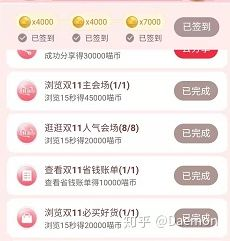
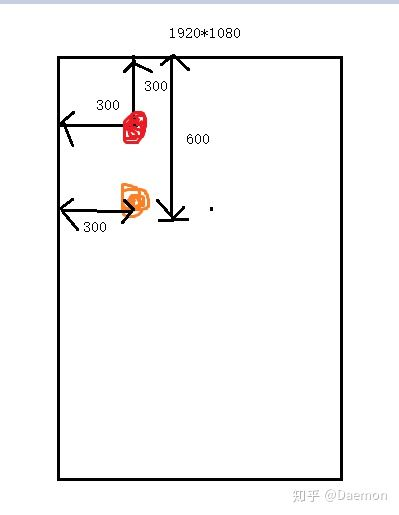
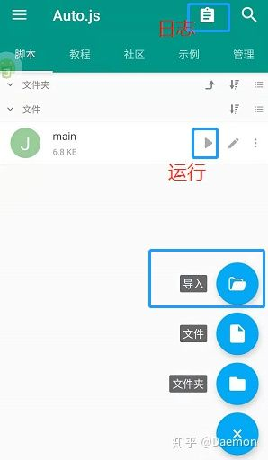
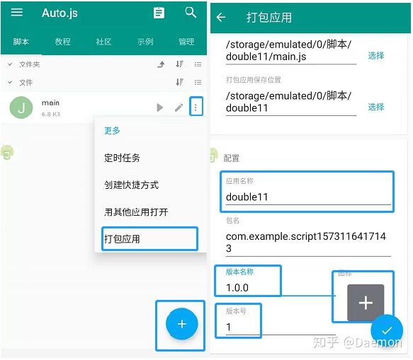

### Auto.js学习

​																											转载至https://zhuanlan.zhihu.com/p/90065914

<!--more-->

### 前言

在正文开始之前，我们要知道Auto.js是啥，根据官方文档定义：Auto.js是一款无需root权限的JavaScript自动化软件。如何理解它？

1. Auto.js是一款安卓手机应用，和微信一样，安装在手机上使用
2. Auto.js是一款自动化软件，根据脚本内容便可以自动地执行相关的操作，并且手机无需root
3. Auto.js的脚本需要使用JavaScript编写

另外，需要说明的是，文章面向**有编程基础**但不了解Auto.js的人群。文章以开发自动完成淘宝领喵币任务的脚本举例，对代码讲解，旨在让您可以快速上手开发Auto.js脚本。

### 正文

**准备阶段**

- 手机安装Auto.js应用
- 电脑上有代码编辑器，vscode最佳（Auto.js作者提供了vscode的插件便于调试）

Auto.js因某种原因全网下架，我是在某个群里找到的apk安装包及打包插件的，也不确定apk是否安全。强烈建议大家自行编译[Auto.js](https://link.zhihu.com/?target=https%3A//github.com/hyb1996/Auto.js)应用及打包插件!!!为照顾像我一样的菜鸡，我会提供我群里找到的apk，再三强调apk可能不安全！**使用本文提供的apk造成的一切后果自负**！

[Auto.js4.1.0share.weiyun.com](https://link.zhihu.com/?target=https%3A//share.weiyun.com/5a9g8ys)[Auto.js4.1.0打包插件share.weiyun.com](https://link.zhihu.com/?target=https%3A//share.weiyun.com/5yQt3kc)

Auto.js设置

接下来需要写脚本了，你可以

- 在vscode上写脚本，写好后发给手机，在Auto.js应用中加载运行
- 在vscode上写脚本，电脑与手机在同一局域网，通过安装auto.js的[vscode插件](https://link.zhihu.com/?target=https%3A//github.com/hyb1996/Auto.js-VSCode-Extension)，实现在vscode上运行，手机就会相应执行脚本
- 在手机的Auto.js应用中直接码代码（不提倡）


**实战开始**

**1.打开淘宝->点击领喵币按钮**

为了编写脚本简单，淘宝预先打开喵铺主页

1.喵铺主页

```js
auto.waitFor()
var appName = "手机淘宝";
launchApp(appName);
sleep(3000);
//寻找领喵币按钮并点击
var lingmiaobi = text("领喵币").findOnce();
if (lingmiaobi) {
    lingmiaobi.click();
    sleep(1000);
}
else {
    toast("未检查到领喵币按钮");
    //中止脚本
    exit();
}
```

详解：

1. Auto.js无需root，但是需要对该应用开启无障碍模式，开启后才可以进行屏幕点击等操作auto.waitFor()表示直到检查该应用开启无障碍后才执行其后面的代码，否则一直卡在这里，一般放到脚本的第一行
2. launchApp()可以打开对应应用，由于不同手机响应速度不同，本代码让它睡眠3s。
3. 定位组件是autojs的最常见的操作，这很类似前端的定位dom元素。在任何点击之前都需要找到对应的组件，这不同于点击某像素位置，点击组件更能适配不同分辨率的手机。在auto.js中通过各种条件选取到的控件称为[UiSelector](https://link.zhihu.com/?target=https%3A//hyb1996.github.io/AutoJs-Docs/%23/widgetsBasedAutomation%3Fid%3Duiselector)。那么筛选条件是如何确定呢？打开Auto.js应用的悬浮窗，在喵铺主页，点击Auto.js**悬浮窗**后选择出现的**蓝色按钮**，点击**布局范围分析**后选择领喵币按钮**查看控件信息**，你就能看到如图2所示的信息。
4. click()表示点击该元素。
5. toast()表示展示一个消息框。

2.领喵币按钮的控件信息截图

**2.点击去进店/去浏览**

喵币任务栏

```js
//开始执行任务
execTask();
function execTask() {
    while(true) {
        var target =  text("去进店").findOnce() || text("去浏览").findOnce();
        if (target == null) {
            toast("任务完成");
            break;
        }
        target.click();
        sleep(3000);
        //浏览网页20s
        viewWeb(20);
        back();
        sleep(1000);
    }
}
```

相信现在你看这段代码能看懂了，viewWeb是一会儿我们要写的函数，目的是模拟浏览网页20s的操作，虽说淘宝要求15s就行了，但是可能部分手机加载耗时比较多，所以多写了5s。当判断任务栏有"去进店"、"去浏览"的组件时，点击跳转至浏览广告，浏览完毕后，返回至任务栏页面，循环执行该操作直到找不到"去进店"、"去浏览"的组件结束（任务完成后按钮文字会变成"已完成"）。

任务执行完文字会变为已完成

**3.浏览广告**

```js
function viewWeb(time) {
    gesture(1000, [300, 600], [300, 300]);
    var cnt = 1;
    while(true) {
        var finish = desc("任务完成").exists() || textStartsWith("已获得").exists();
        if (finish || cnt > time) {
            break;
        }
        sleep(1000);
        cnt += 1;
    }
    //模拟返回键，返回到任务栏页面
    back();
}
```

终于到了最后的环节了，函数的参数为当前页面的最大停留时间（防止意外而一直停留该页面）。

浏览广告完成的标志：

- 当前页面出现"任务完成"或"已获得*****"的组件
- 位于当前页面的时间大于所设定的最大限制

gesture是指屏幕滑动操作，这是本文唯一涉及屏幕像素的语句。gesture(duration, [x1, y1], [x2, y2]表示用duration的时间，从(x1,y1)点滑到(x2,y2)点，代码中表示如图用1s从黄点滑向红点，故是上滑操作浏览广告。

本次淘宝的活动最开始滑动一次，之后等着时间够了即可，故代码中没有再额外滑动。在浏览广告完毕后back()模拟返回键返回值任务栏页面。

(x,y)表示距离屏幕左端x像素，距离顶端y像素

你也许会注意到这段代码定位组件用到了desc()，之所于用desc是因为该控件的desc信息是"任务完成"，还记得如何查看控件信息吧？总之，想定位控件，就先去查它的控件信息。

**4. 测试**

代码终于写完了，将脚本发到手机中，在Auto.js应用点击右下角的+号，选择导入，在文件目中寻找对应的脚本加载。



将淘宝打开至喵铺主页，返回Auto.js，点击运行即可执行脚本，在日志处可以查看脚本运行日志，我还没提到日志？在脚本中你可以使用log()函数记录日志，这等同于print，常用于调试或记录日志信息。

**5. 打包apk**

编写完代码，将代码打包成一个独立的apk。

1. 右下角+号，新建文件夹命名为double11
2. 在double11文件夹中加载对应脚本
3. 如图选择，打包apk



**你还需要知道的:**

1. **选择器筛选条件**：除使用text、desc筛选选择器外，组件的大多数属性都可以筛选，详情见[官方文档](https://link.zhihu.com/?target=https%3A//hyb1996.github.io/AutoJs-Docs/%23/widgetsBasedAutomation%3Fid%3Duiselector)。单一的筛选条件常常无法定位到元素，那么可以进行链式调用。如定位任务栏的关闭×按钮：

```js
className("android.widget.Button").depth(18).indexInParent(1).findOnce();
```

\2. **定位选择器**：findOnce()表示找到第一个满足条件的控件，找不到返回null;另外还有findOne(),findOne(time)等方法，具体的可以看[文档](https://link.zhihu.com/?target=https%3A//hyb1996.github.io/AutoJs-Docs/%23/widgetsBasedAutomation%3Fid%3Duiselectorfindone)。这里有一个坑，findOne()如果没找到匹配的组件会一直找，直至所描述的控件出现为止，故该函数不会返回null，找不到可能会卡在这里，所以谨慎使用。

\3. **click()**：当定位的元素的clickable属性为true时，才可以点击，如果你查看某控件的clickable为false，那说明此控件不能点！！你可能是想点击它的子/父控件。

------

源码参考[https://github.com/ErazerControl/2019double11](https://link.zhihu.com/?target=https%3A//github.com/ErazerControl/2019double11)，切换tag至v1.0.0