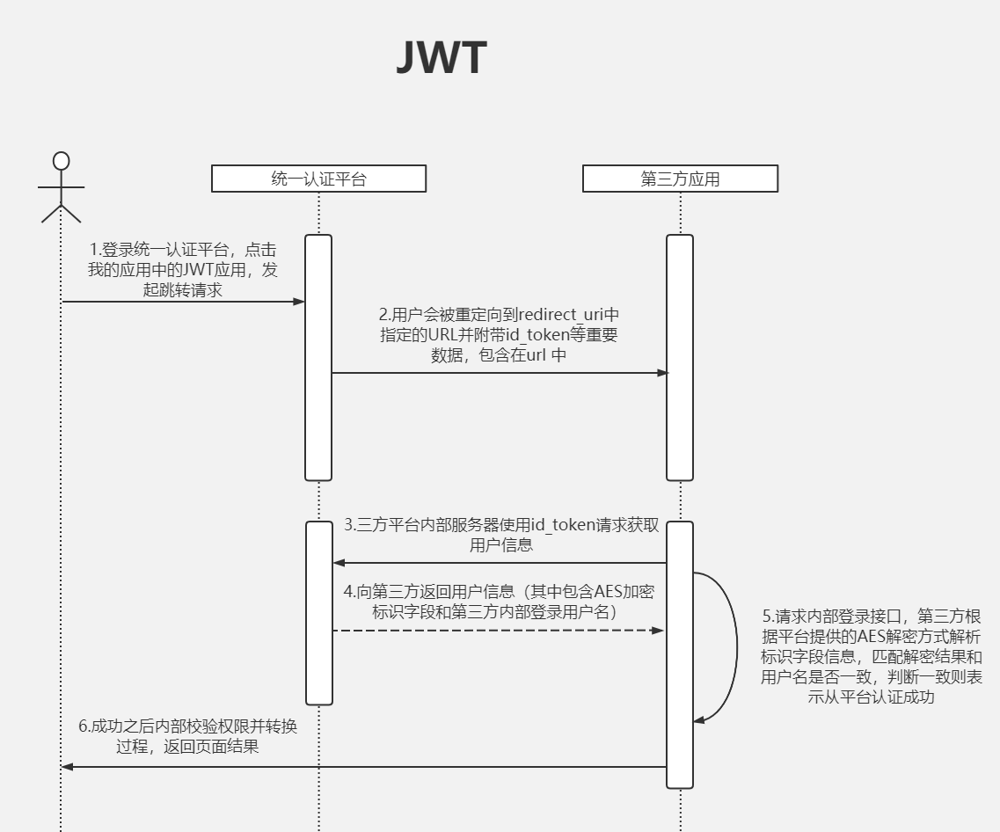
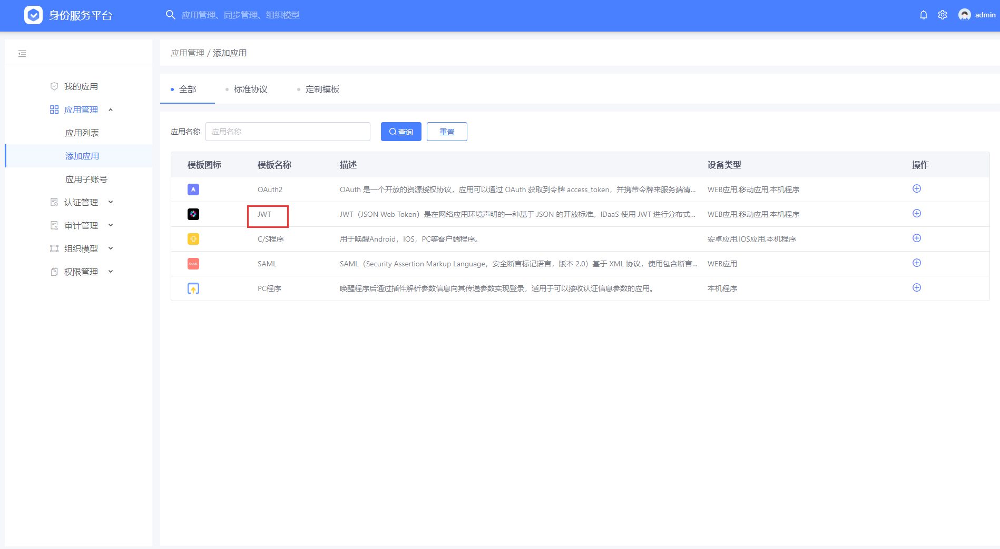
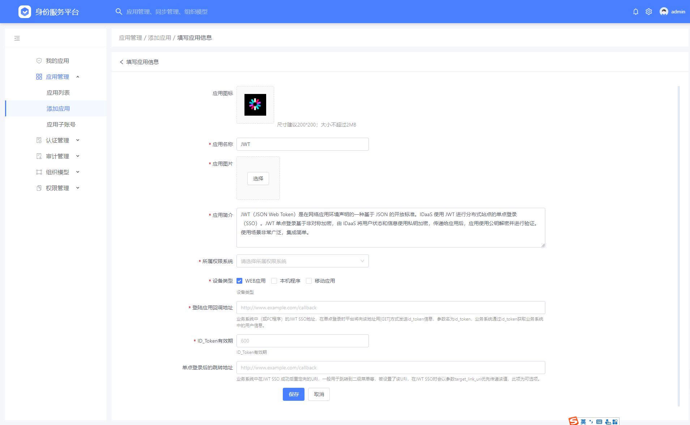
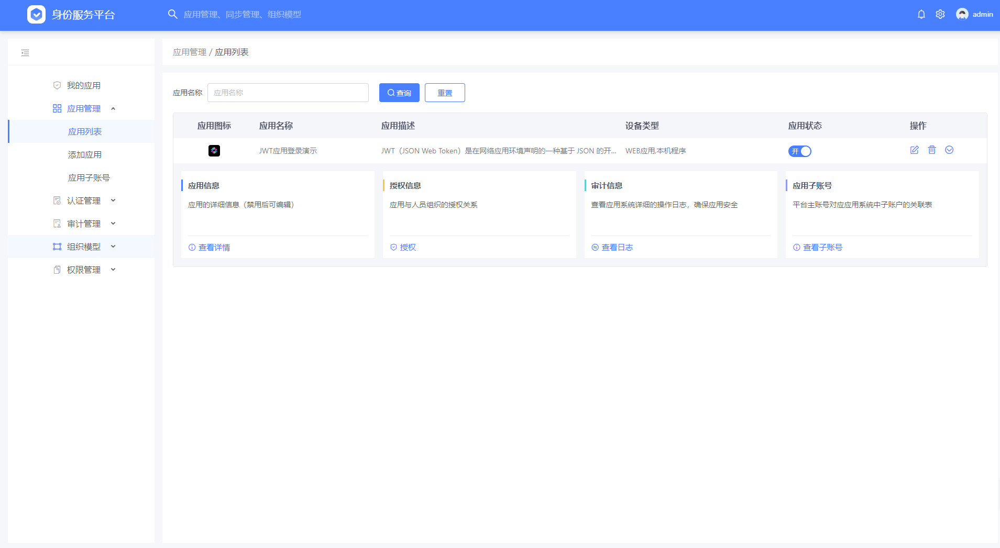
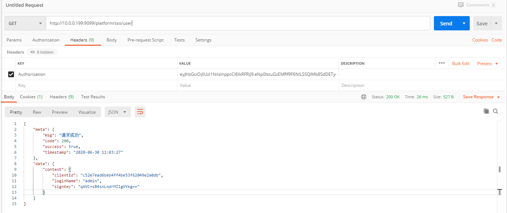

# 统一认证平台JWT接入文档

[TOC]

## 1. 引言

### 1.1. 编写目的

​		本文描述了客户应用同统一认证平台对接JWT单点登录的解决方案，文档分别从交互流程介绍、接口、错误代码等方面详细介绍了平台的工作方式和开发过程，可以帮助开发人员快速入门并掌握开发技能，同时也可以作为日后接口参数及参数类型的速查手册。

### 1.2. 阅读对象

本文档的预期读者为业务需求人员、开发经理、项目经理、架构设计师、开发人员、测试人员、设计评审人员、用户文档编写者。

### 1.3. 名词术语定义

| 序号 | 术语或缩略语       | 说明性定义                                                   |
| ---- | ------------------ | ------------------------------------------------------------ |
| 1    | SSO                | 全称Single Sign On,单点登录                                  |
| 2    | IDaaS              | 身份认证即服务(Identity as a Service)。是一种关于认证的基础设施，一般由第三方提供服务。IDaaS可以看作是云端的 SSO。 |
| 3    | 5A平台             | 提供集 统一账户（Account）、统一认证（Authentication）、集中授权（Authorization）、应用管理（Application）、透明审计（Audit）五项能力于一体的身份即服务平台（简称5A平台）。 |
| 4    | JWT                | 是为了在网络应用环境间传递声明而执行的一种基于JSON的开放标准，该token被设计为紧凑且安全的，特别适用于分布式站点的单点登录（SSO）场景。 |

## 2. 实现流程



​		整个JWT 的流程，是接收 统一认证 平台向 callback url 发出的 id_token 参数（即 JWT 令牌），并使用我们提供的（或第三方提供的） JWT 解密库/方法对 JWT 进行解析，并验证身份。  

## 3. 实现方式

### 3.1. 应用接入申请

1. 使用统一认证平台提供的管理员账号登录http://IP:9090/authing/passport/login，在统一身份认证平台“应用管理”页面下，点击“添加应用”，选择“JWT”。
2. 配置JWT应用信息

- “所属权限系统”，选择对应的应用系统。
- “登陆应用回调地址”，业务系统中（或PC程序）的JWT SSO地址，在单点登录时平台将向该地址用[GET]方式发送id_token信息，参数名为id_token，业务系统通过id_token获取业务系统中的用户信息。
- “ID_Token有效期”，ID_Token有效期，单位为秒。
- “单点登录后的跳转地址”，应用认证成功后的跳转地址，非必填。





3. 添加成功后可在应用列表中查看。



### 3.2. 接入流程

**第一步：接收统一认证平台发出的id_token参数**

第三方应用首先根据统一认证平台返回的callback url获取id_token ，

**实例** 

```
http://IP:4200/sso-transfer?client_id=c52e7ead6beb4ff4be53f62049e2a0db&id_token=eyJhbGciOiJIUzI1NiIsInppcCI6IkRFRiJ9.eNp0lstuGzEMRf9F6NILSSQlMb8SdDETy4iB5gHbAVoE-fcqi6x8uJyDC-qSEsn5TOfrNT2kJ6uzz-3Y9rnr6aT7NDm1mtVn3fJxT4d0_diXcDu-nF9_lfU9_76nh2IuOpq5HtLTZW63efyB5q5d7JAub3_mOuPxM20ft-e3y_n2bwWSobmU9HW4x3UwdsZ2h7WIakZ164h75iCDMQWRlS_Gzka4eGU1Z1mEMR85uILC9RaOLeg7K_tW9m18DVEFObbwpTnGLlkYK2O-ndz4yMAJ19udY_NjM65g8Kq8cezCuDLGdAr1pRs9CC3WmiPGllq4MhbGynggHnzkKIzZiQdqTr4HuHOQADfGXFjnLD1IhwvrXFjnnnceHEG7RkfipXXshoWpJtJyEEQYQ--4ZMrSBXvnW91YbayujIVxYLAzHuykMhbGwZHO6sy4M6ZSVR8ZsTAeBXGnLEdF30MKD-pSee-wGks1JNgNg-d3MJGxpZYTY8wrulY2mBkH_yeN1UFsnhCV93zmHygcBWLR8kJ1r51xoHbEgru4a2G1MW6M2aCwQWGDSga141-vBslnnPbCg1rE-J2wQWud8b2TNWA16G0st_FfuTXnccJLqvCG_p5gv7_-AwAA__8.BRZAF66TUn2etUNj7AA_7_7bN2oddUYNArbASiynGWQ
```


**第四步：根据id_token获取用户信息**

接口URL：http://IP:9099/platform/sso/user

请求方式：GET

调用参数: 构建URL包括一个参数 ，放到请求头当中 Authorization: 

| 参数名称 | 必选 | 类型   |
| -------- | ---- | ------ |
| id_token | true | string |

**实例** 

                             

**返回值**

返回用户信息

```
{
    "meta": {
        "msg": "请求成功",
        "code": 200,
        "success": true,
        "timestamp": "2020-06-30 11:03:27"
    },
    "data": {
        "content": {
            "clientId": "c52e7ead6beb4ff4be53f62049e2a0db",
            "loginName": "admin",
            "signKey": "qAVC+sB4snLndrMZlgVYkg=="
        }
    }
}
```

客户端根据平台提供的AES解密AESUtils工具类解析signKey字段信息，密钥为client_id的前16位,调用AESUtils.decrypt()方法进行解密，返回第三方应用内部的当前登录用户名。解密之后匹配解密结果和用户名是否一致，结果一致则表示从平台认证成功。至此身份认证完成，第三方平台通过获取到的用户信息实现自有应用内部登录。

使用样例:

```java
public static void main(String[] args) throws Exception {
   //使用client_id的前16位作为加解密key
   String key= "49b07daf70b948e9a75129048d10d3f0".substring(0,16);
   System.out.println(key);
   //加密
   String signKey = AESUtils.encrypt("admin", key);
   System.out.println(signKey);
   //解密
   String decrypt = AESUtils.decrypt(signKey, key);
   System.out.println(decrypt);
}
```


## 4. 错误代码描述

统一认证平台对JWT错误统一返回Json格式：

**实例** 

```json
{
    "meta": {
        "msg": "应用子账号规则未配置",
        "code": 4002,
        "success": false,
        "timestamp": "2020-06-30 11:08:06"
    },
    "data": {
        "content": null
    }
}
```

| **错误代码** | **描述**                                                 |
| ------------ | -------------------------------------------------------- |
| 200          | 成功                                                     |
| 5001         | 用户名或密码错误！                                       |
| 5002         | Token失效，请重新获取！                                  |
| 5003         | 授权类型不匹配，请在应用信息查看允许的授权类型！         |
| 5004         | 授权码无效！                                             |
| 5006         | 未找到匹配应用，请检查client_id或者client_secret是否正确 |
| 5007         | 无效的refresh_token，刷新Token失败                       |
| 5008         | 应用已被禁用，如需使用请联系管理员                       |
| 5009         | 无效的重定向地址，与注册值不匹配                         |
| 5005         | 系统内部异常，请联系管理员                               |
| 2002         | 应用不存在                                               |
| 7005         | 当前用户不存在                                           |
| 4002         | 应用子账号规则未配置                                     |

 