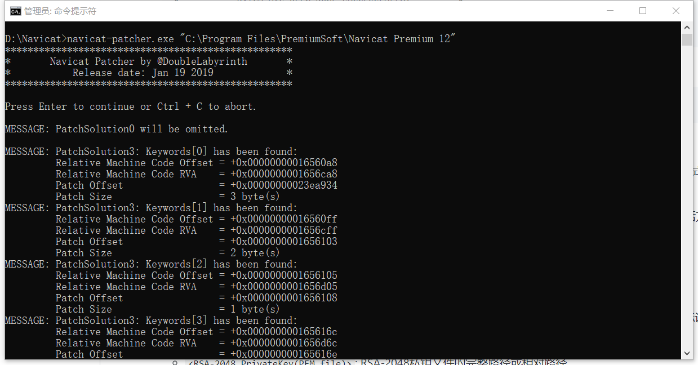

github大神的[激活项目地址](https://github.com/DoubleLabyrinth/navicat-keygen)

<!--more-->

### 激活步骤

#### 1.下载 [从这里](https://github.com/DoubleLabyrinth/navicat-keygen/releases)下载最新的release。[从这里](http://www.navicat.com.cn/download/direct-download?product=navicat_premium_cs_x64.exe&location=1)下载最新的Navicat x64版本

#### 2.安装Navicat12  一路next,没啥问题

#### 3.解压navicat-keygen之后 打开cmd.exe执行命令

navicat-patcher.exe "C:\Program Files\PremiumSoft\Navicat Premium 12" 回车 大概界面长这样 `navicat-patcher.exe`将会在当前目录生成一个新的RSA-2048私钥文件. 具体的原理看github



#### 4.接下来使用`navicat-keygen.exe`来生成序列号和激活码


```
navicat-keygen.exe -text .\RegPrivateKey.pem
```

详细参数含义查看github

你会被要求选择Navicat产品类别、语言以及输入主版本号。之后会随机生成一个序列号。

```
Select Navicat product:
0. DataModeler
1. Premium
2. MySQL
3. PostgreSQL
4. Oracle
5. SQLServer
6. SQLite
7. MariaDB
8. MongoDB
9. ReportViewer

(Input index)> 1

Select product language:
0. English
1. Simplified Chinese
2. Traditional Chinese
3. Japanese
4. Polish
5. Spanish
6. French
7. German
8. Korean
9. Russian
10. Portuguese

(Input index)> 1

(Input major version number, range: 0 ~ 15, default: 12)> 12

Serial number:
NAVO-2ORP-IN5A-GQEE

Your name: 
```

接下来你会被要求输入`用户名`和`组织名`；请随便填写，但不要太长(注意 稍微别太普通 什么test demo 张三之类的 据说时间长了会失败 因为可能用这种名字的人很多) 

```
Your name: DoubleLabyrinth
Your organization: DoubleLabyrinth
Input request code (in Base64), input empty line to end:
```

之后你会被要求填入请求码。注意 **不要关闭命令行** **不要关闭命令行** **不要关闭命令行**!

#### 5.断开网络 并打开Navicat。找到`注册`窗口，并填入keygen给你的序列号。然后点击`激活`按钮。

一般来说在线激活肯定会失败，这时候Navicat会询问你是否`手动激活`，直接选吧。

在`手动激活`窗口你会得到一个请求码，复制它并把它粘贴到keygen里。最后别忘了连按至少两下回车结束输入。

```
Your name: DoubleLabyrinth
Your organization: DoubleLabyrinth

Input request code (in Base64), input empty line to end:
t2U+0yfE2FfnbjyhCXa0lglZOHu9Ntc3qyGiPbR6xb1QoU63/9BVfdaCq0blwVycXPyT/Vqw5joIKdM5oCRR/afCPM7iRcyhQMAnvqwc+AOKCqayVV+SqKLvtR/AbREI12w++PQ6Ewfs4A8PgB8OJ9G0jKt6Q/iJRblqi2WWw9mwy+YHcYYh3UAfygTnyj/xl+MzRymbY0lkus+6LPtpDecVsFFhM7F32Ee1QPwISko7bAkHOtkt+joPfYDdn9PDGZ4HEmeLvH6UqZCXkzgaAfynB7cQZFEkId8FsW2NGkbpM7wB2Hi3fNFgOIjutTprixTdbpFKn4w6gGc28ve23A==

Request Info:
{"K":"NAVO2ORPIN5AGQEE", "DI":"R91j6WyMhxHznAKSxxxx", "P":"WIN"}

Response Info:
{"K":"NAVO2ORPIN5AGQEE","DI":"R91j6WyMhxHznAKSxxxx","N":"DoubleLabyrinth","O":"DoubleLabyrinth","T":1547826060}

License:
lRF18o+ZhBphyN0U5kFLHtAAGGXuvhqOcxNuvAk4dJcGeR0ISuw74mQvAfdNjv0T
I5NZFzqIJvrzM0XeR88q+3kmZkECuxwwWHP3zzDPhPiylcTV4DoGZ1tfoViUSYQc
LgXG0Fl7koZeP61YOKQ8GfX+Xk2ZTM64bYaF7NlhonM+GQUJCCF2JThmrP921t2p
b/E5pV6fLOYMM13881ZQcQcltMNVDZn4lzgzKRFFxCQFaTl6fJMHZdYVmICQTHtI
sNaym0zduc8/cv34mgJ+7NseXmsEPCdjrZ59wgfPsLhZLXqtfxi5hGWw4NMa3Sb2
UI8dzqFzRp/hSDEM0mEqiA==
```

#### 6.如果不出意外，你会得到一个看似用Base64编码的激活码。直接复制它，并把它粘贴到Navicat的`手动激活`窗口，最后点`激活`按钮。如果没什么意外的话应该能成功激活。


以上~