# 统一认证平台SAML2.0接入文档

[TOC]

## 1. 引言

### 1.1. 编写目的

本文描述了客户应用同统一认证平台对接SAML2.0单点登录的解决方案，文档分别从交互流程介绍、接口、错误代码等方面详细介绍了平台的工作方式和开发过程，可以帮助开发人员快速入门并掌握开发技能，同时也可以作为日后接口参数及参数类型的速查手册。

### 1.2. 阅读对象

本文档的预期读者为业务需求人员、开发经理、项目经理、架构设计师、开发人员、测试人员、设计评审人员、用户文档编写者。

### 1.3. 名词术语定义

| 序号 | 术语或缩略语       | 说明性定义                                                   |
| ---- | ------------------ | ------------------------------------------------------------ |
| 1    | SSO                | 全称Single Sign On,单点登录                                  |
| 2    | IDaaS              | 身份认证即服务(Identity as a Service)。是一种关于认证的基础设施，一般由第三方提供服务。IDaaS可以看作是云端的 SSO。 |
| 3    | 5A平台             | 提供集 统一账户（Account）、统一认证（Authentication）、集中授权（Authorization）、应用管理（Application）、透明审计（Audit）五项能力于一体的身份即服务平台（简称5A平台）。 |
| 4    | SAML2.0            | 全称为Security Assertion Markup Language，是一种用于安全性断言的标记语言，目前最新版本是2.0。 |
| 5    | IDP                | Identity Provider 身份提供方，如统一认证平台作为IDP，主要就是完成认证。 |
| 6    | SP                 | Service Provider 服务提供方，待接入的应用。                  |
| 7    | Browser            | 用户方的浏览器，用户通过浏览器进行资源的访问和相关跳转完成身份的认证。 |
| 8    | 用户登录地址       | 应用的SAML协议登录路径。                                     |
| 9    | relayState地址     | 应用认证成功后的跳转地址。                                   |
| 10   | 消费者断言(ACS)Url | 应用接收统一身份认证平台SAML协议回调接口url，如统一认证平台https://IP:9099/platform/saml/sso， 这个是固定值。 |
| 11   | entityId           | 分配给IDP该应用的唯一标识，可填写与登录地址一致。            |

## 2. 实现流程

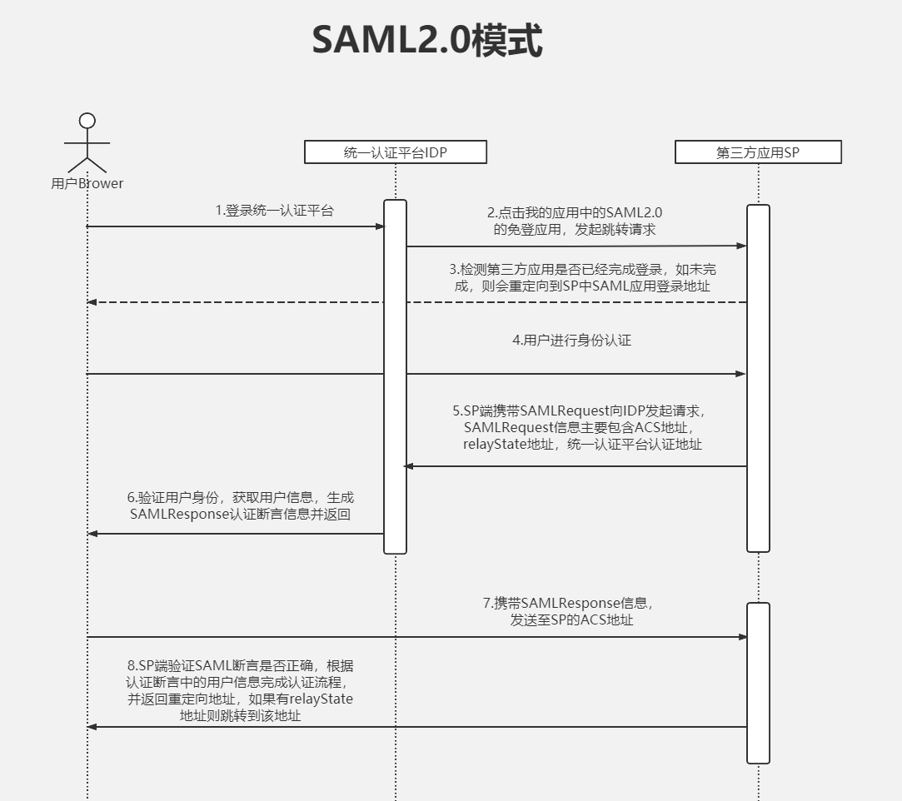

​		文档介绍的是SAML2.0单点登录模式。SAML协议的核心是: IDP和SP通过用户的浏览器的重定向访问来实现交换数据，可以实现基于网络跨域的单点登录（SSO），以便于减少向一个用户分发多个身份验证令牌的管理开销。本文档旨在帮助开发商调整自己的程序，方便接入统一认证平台。

## 3. 实现方式

### 3.1. 应用接入申请

1. 使用统一认证平台提供的管理员账号登录http://IP:9090/authing/passport/login，在统一身份认证平台“应用管理”页面下，点击“添加应用”，选择“SAML”。
2. 配置SAML应用信息

- “所属权限系统”，选择对应的应用系统。
- “设备类型”，SAML2.0仅支持浏览器中的单点登录。
- “应用登录地址”，应用SAML协议登录路径，或应用的SAML登录入口地址
- “relayState地址”，应用认证成功后的跳转地址。
- “消费者断言Url地址”，应用接收统一身份认证平台SAML协议回调接口url
- “断言有效期”，SAML断言有效期，单位为秒。
- “entityId”，分配给IDP该应用的唯一标识，可填写与登录地址一致。


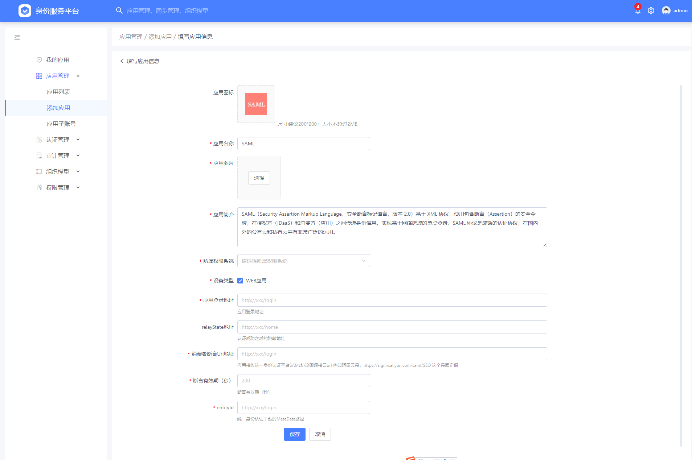


3. 添加成功后可在应用列表中查看。

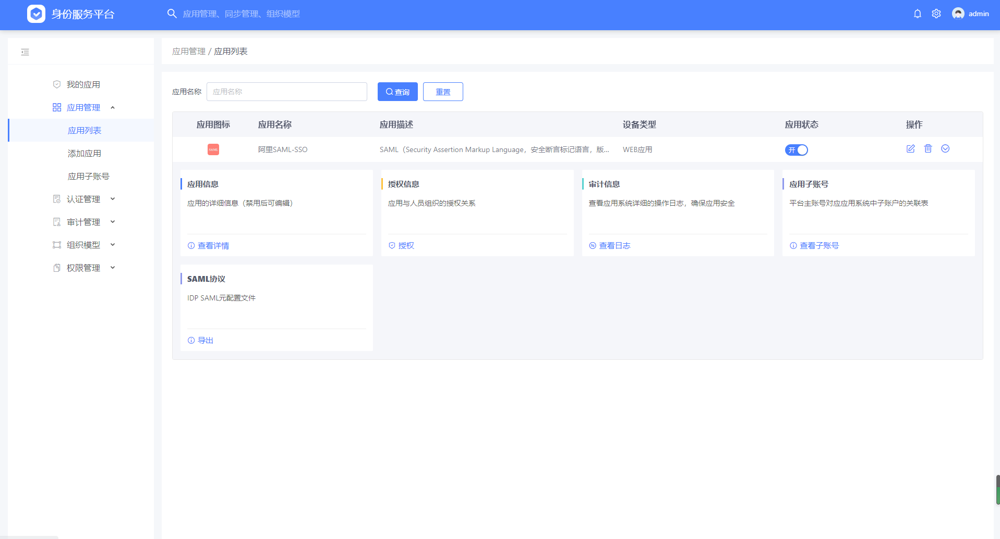

4. 下载MetaData元数据

创建SAML应用成功后，在应用下方SAML协议面板中点击“导出”。

MetaData元数据是一个XML格式的文件，其中包含了在应用侧配置SAML的关键信息：

- entityId，如https://signin.aliyun.com/xxx.onaliyun.com/login.htm
- SAML公钥，签名使用X509格式，哈希算法为SHA-256；
- 统一身份认证平台接收SAML协议请求的回调路径。如http://IP:9099/platform/saml/sso

（其中，回调路径使用的端口号为9099，路径默认为/platform/saml/sso，域名或IP为统一认证平台实际部署的服务器IP地址或域名）

### 3.2. 配置SAML应用

根据SAML应用的配置页面要求的配置方式有两种配置方式：

1. 将Metadata文件上传到配置页面；
2. 打开Metadata文件，提取中提供的entityId、SAML公钥、以及统一身份认证平台接收SAML协议请求的接口路径填写到配置页面中。

1. - 配置SAML协议使用的签名算法为RSA，密钥长度2048位
   - 配置SAML协议使用的哈希算法为SHA-256
   - 将从Metadata文件中提取的公钥配置到应用中
   - 将从Metadata文件中提取的SAML协议的回调路径配置到应用中，如http://IP:9099/platform/saml/sso

**SAML认证断言示例**

```xml
<?xml version="1.0" encoding="utf-8"?>
<md:EntityDescriptor xmlns:md="urn:oasis:names:tc:SAML:2.0:metadata" entityID="https://signin.aliyun.com/1121404245935802.onaliyun.com/login.htm">
  <md:IDPSSODescriptor WantAuthnRequestsSigned="false" protocolSupportEnumeration="urn:oasis:names:tc:SAML:2.0:protocol">
    <md:KeyDescriptor use="signing">
      <ds:KeyInfo xmlns:ds="http://www.w3.org/2000/09/xmldsig#">
        <ds:X509Data>
  <ds:X509Certificate>MIIDJzCCAg+gAwIBAgIFAOGKNlswDQYJKoZIhvcNAQELBQAwVTEQMA4GA1UEAwwHc2NyaXB0eDEM MAoGA1UECwwDd3BzMQwwCgYDVQQKDAN3cHMxCzAJBgNVBAcMAkJKMQswCQYDVQQIDAJCSjELMAkG A1UEBhMCQ04wHhcNMjAwNjI5MDMyMDIzWhcNMjEwNjI5MDMyMDIzWjBVMRAwDgYDVQQDDAdzY3Jp cHR4MQwwCgYDVQQLDAN3cHMxDDAKBgNVBAoMA3dwczELMAkGA1UEBwwCQkoxCzAJBgNVBAgMAkJK MQswCQYDVQQGEwJDTjCCASIwDQYJKoZIhvcNAQEBBQADggEPADCCAQoCggEBAMEd+M1/ZG8OxlUl ss9N7aWxa/bXGLLeYFItWtAiaXxVodY+4Hwb3NBeIG1Sl9n1pGzzO6NwQshsF25kbFslLs3eVFiS GIYPTfu0AeyLIigRPMg6dVgjNgvUh/4coATb7JIFoD1H0prNwKjFBuMqQhW87MV2QOzvJ9yrTAip G2JH6QZebAmI7LMI/fxUlDs6Ur8Km0y3Ykvh2x9DWPdwuC8oJzqFMzX59cjNsfRMYpvOAbA87T1+ H9WMCr16jgzkveMNba77UXbBqkvTQY75CEt6EhrYxYJdnNsBK0O1Z1V3Dw3pGHPtSzf6GA8v08a4 hGAqVkpvINYA4pqTxyeX3iMCAwEAATANBgkqhkiG9w0BAQsFAAOCAQEAMgEN06gdBqEV3rtj2lqW HQBgfQtio4h0pHcS3B0yuFgYfpNrjrf59oCY7nWryEUcUV51u8Qnv/IJNq3ZpRw2FN2KrzMsifKg /69W4JAtAJoc2niIjpy159dAyx+OzzobgNEgKJqc/P7RFQF+7wK/SWSSlobc/U/eqhBNLpigMK7D dXI2Pz+Fx3TCPu3pWSyLOPR9/yTEOLaIOTp6zgrvjgL1FSJIWFaxp3jziQzNfSknP77VAmLhx9ks o9u7tXm/PwsZsmA+D/hJNFfVuCCqDwww4xiWhyz1E8RoKg2M+FpAtdGXWB5noGe+117RzmT4Nh/R muaChXtYPsfSWfFtiw==</ds:X509Certificate>
        </ds:X509Data>
      </ds:KeyInfo>
    </md:KeyDescriptor>
    <md:NameIDFormat>urn:oasis:names:tc:SAML:1.1:nameid-format:unspecified</md:NameIDFormat>
    <md:SingleSignOnService Binding="urn:oasis:names:tc:SAML:2.0:bindings:HTTP-POST" Location="http://IP:9099/platform/saml/sso"/>
  </md:IDPSSODescriptor>
</md:EntityDescriptor>

```

## 4.阿里云集成配置

### 3.1. 进入【应用管理】--【添加应用】

选择创建新的“SAML”应用

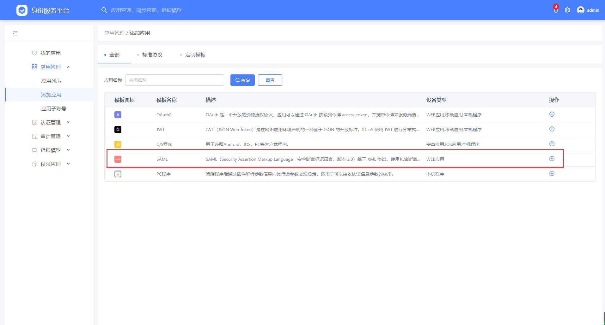


### 3.2. 配置SAML应用信息：

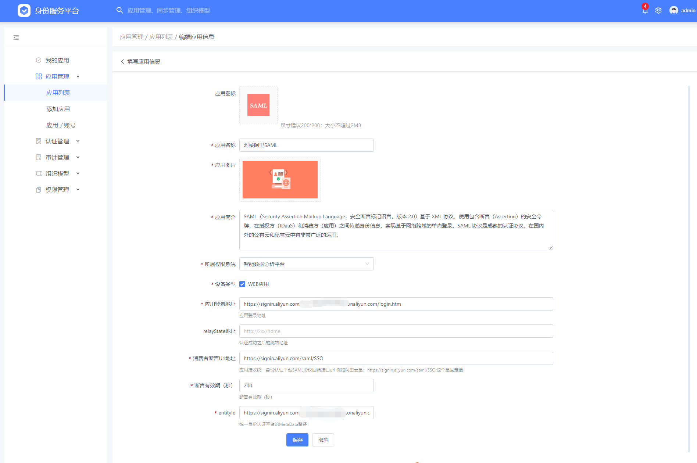


- 应用登录地址填写 [https://signin.aliyun.com/12302xxxxxxx8674.onaliyun.com/login.htm](https://signin.aliyun.com/1230211415828674.onaliyun.com/login.htm)

​    该地址通过登录阿里云控制台-访问控制获得。参考下文的阿里云控制台配置。

- relayState地址：阿里云应用无需配置
- 消费者断言Url地址，填写阿里云接收认证返回Response的地址，例如阿里云的ACS地址为：https://signin.aliyun.com/saml/SSO

- 断言有效期：200秒
- entityId为分配给该应用IDP唯一标识，可填写与登录地址一致：

   [https://signin.aliyun.com/12302xxxxxxx8674.onaliyun.com/login.htm](https://signin.aliyun.com/1230211415828674.onaliyun.com/login.htm)

### 3.3. 下载元数据Metadata

  保存以上配置。点击SAML协议的导出模块，将元配置文件下载到本地，备用。


### 3.4.  配置子账户

点击【查看子账号】标签，填写统一认证平台账号和阿里云从账号（阿里云从账号从阿里云控制台获取，获取方式参考下文的阿里云控制台配置），保存。

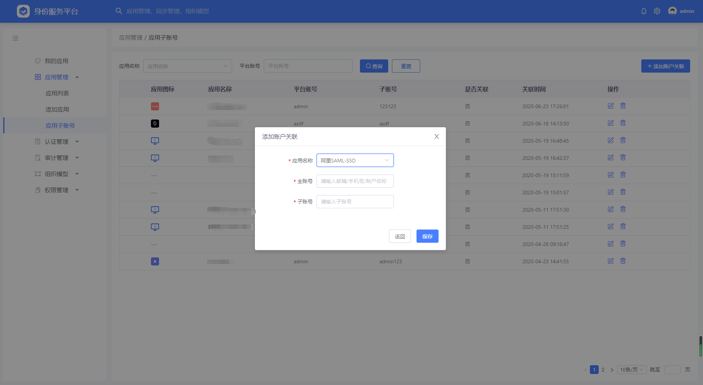


3.5. 授权

继续从应用列表操作【授权】标签，用户可以根据实际情况将应用授权给登录用户。此处演示的为授权给成员，先选择组织机构下的成员，然后从所有应用中选择刚才要授权的SAML应用。右上角出现黄色“√”则表示授权成功。

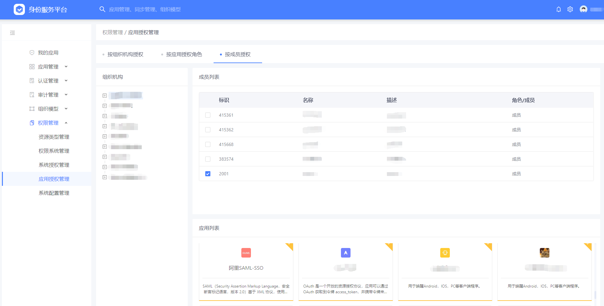

### 3.6. 阿里云控制台配置：

#### 3.6.1. 阿里云控制台上传元数据文件

阿里云控制台-【右上角头像】--【访问控制】

如下图。（如果阿里云控制台不是该界面，是因为阿里云控制台的版本问题，点击屏幕右下角，体验新版，可以切换到新版控制台界面）

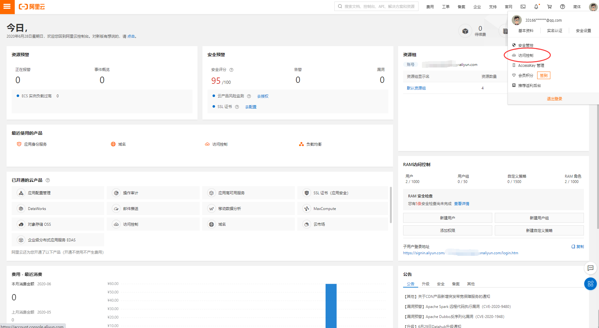

#### 3.6.2. 阿里云控制台获取用户登录名

点击【访问控制】--【用户】点击添加权限，如可以配置ECS的管理权限。

#### 3.6.3. 阿里云控制台上传元数据

【SSO】管理--【用户SSO】--【编辑】--【开启】--【上传文件】，将刚才下载好的元配置文件上传到阿里云

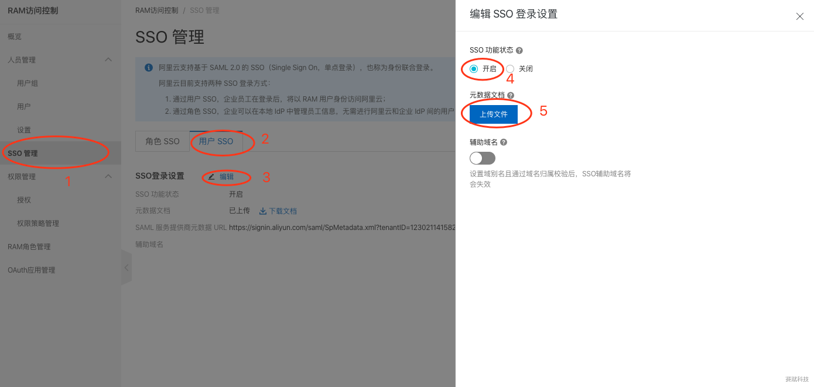

### 3.7. 使用单点登录功能：

此时，登录到统一认证平台门户，点击SAML应用，可以直接跳转到阿里云


点击使用企业账户登录后即可进入阿里云配置的从账户控制台

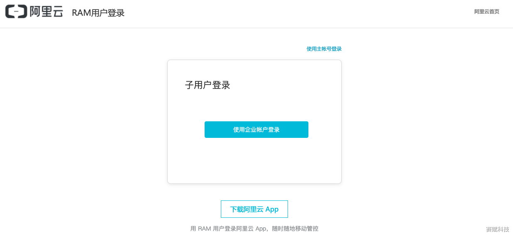

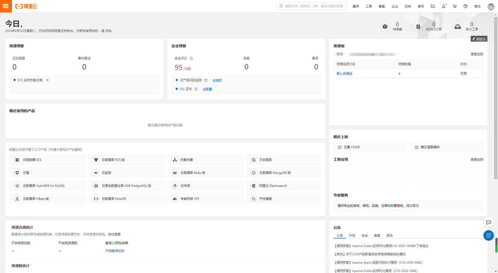