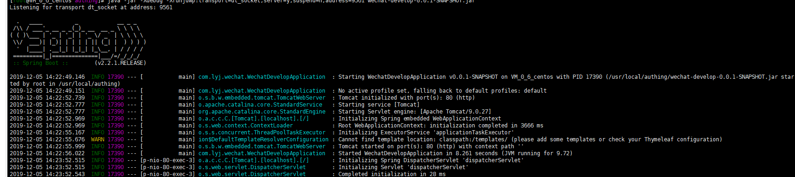
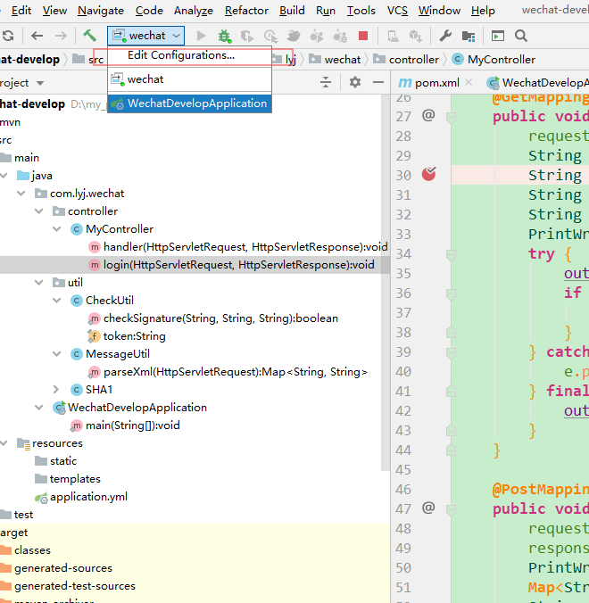
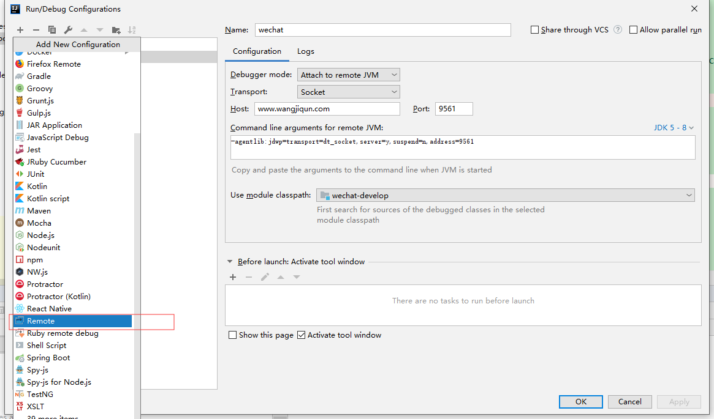

**远程的时候我们往往可能不知道问题出自哪儿，通过这个方法可以使用本地代码调试远程的程序。**

<!--more-->

### 1. 在远程服务器执行jar

```bash
java -jar -Xdebug -Xrunjdwp:transport=dt_socket,server=y,suspend=n,address=9561 wechat-develop-0.0.1-SNAPSHOT.jar
使用nohup启动
nohup java -jar -Xdebug -Xrunjdwp:transport=dt_socket,server=y,suspend=n,address=9561 wechat-develop-0.0.1-SNAPSHOT.jar > nohup-wechat.out 2>&1 &
```

address 是开启远程端口，本地通过监听这个端口来实现远程调试。

远程端口需要防火墙开启或者开放端口

```bash
iptables -I INPUT 4 -p tcp -m state --state NEW -m tcp --dport 9561 -j ACCEPT
```



### 2. 本地调试

#### 2.1 Run -> Edit Configuration



#### 2.2 点击加号，选择Remote

#### 2.3 填写远程主机Host和端口Port，其他都默认,此处的端口要和第1步执行命令中的address一致。



### 3. 启动调试

在远程服务器启动jar包后，启动本地调试

控制台Console输出以下内容，说明启动成功

```bash
Connected to the target VM, address: '1.1.1.1:9561', transport: 'socket'
```

> 如果提示连接超时的错误，那么检查一下远程端口是否能访问？远程服务器是否开启了防火墙？

### 4. 测试断点

在本地代码中打个断点，然后测试。
 发现远程项目运行时，真的走了本地的断点呢！！！

> 打断点时，本地代码要和远程项目代码一致。
> 远程调试时，修改本地代码对远程项目无效。（要想实现修改的本地代码实时更新到远程项目，请参考这篇文章[SpringBoot笔记3：devtools 的远程应用](https://www.jianshu.com/p/21a6f3f92d53)）