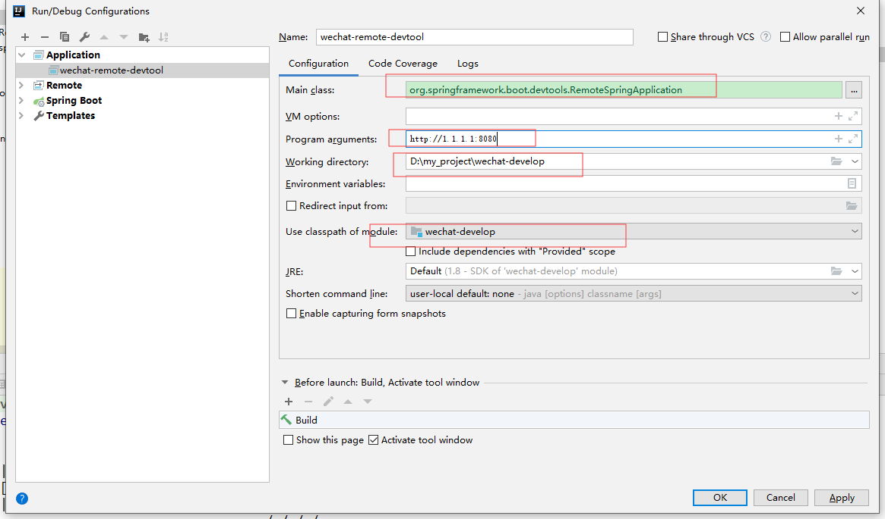

转载至https://www.jianshu.com/p/21a6f3f92d53

`SpringBoot devtools 的远程应用` 这句话什么意思？

> Spring Boot开发者工具并不仅限于本地开发，在运行远程应用时你也可以使用一些特性。
> 远程支持是可选的，你需要确保开发者工具被包含在重新打包的归档文件中。

即对于本地代码的修改，能够实时的更新到远程应用中，从而实现本地代码和远程应用的联合调试。

<!--more-->

### 1. 将`devtools`打到jar包中


```xml
<build>
    <plugins>
        <plugin>
            <groupId>org.springframework.boot</groupId>
            <artifactId>spring-boot-maven-plugin</artifactId>
            <configuration>
                <excludeDevtools>false</excludeDevtools>
            </configuration>
        </plugin>
    </plugins>
</build>
```

### 2. 设置`spring.devtools.remote.secret`属性

在`application.properties`中配置


```properties
spring.devtools.remote.secret=mysecrt
```

或在`application.yml`中配置


```yml
spring:
  devtools:
    remote:
      secret: mysecret
```

### 3. 打好jar包，并在远程服务器运行


远程调试启动截图2.jpg

### 4. 创建并启动客户端程序

【Run】-> 【Edit Configuration】-> 点击加号 -> 选择 Application，如下图填写 ，最后OK。



最后运行它。
 运行结果如下：


```php
C:\develop\jdk\jdk1.8\bin\java.exe -agentlib:jdwp=transport=dt_socket,address=127.0.0.1:4725,suspend=y,server=n -javaagent:D:\develop\IDEA201823\lib\rt\debugger-agent.jar=file:/C:/Users/xu/AppData/Local/Temp/capture.props -Dfile.encoding=UTF-8 -classpath C:\develop\jdk\jdk1.8\jre\lib\charsets.jar;C:\develop\jdk\jdk1.8\jre\lib\deploy.jar;C:\develop\jdk\jdk1.8\jre\lib\ext\access-bridge-64.jar;C:\develop\jdk\jdk1.8\jre\lib\ext\cldrdata.jar;C:\develop\jdk\jdk1.8\jre\lib\ext\dnsns.jar;C:\develop\jdk\jdk1.8\jre\lib\ext\jaccess.jar;C:\develop\jdk\jdk1.8\jre\lib\ext\jfxrt.jar;C:\develop\jdk\jdk1.8\jre\lib\ext\localedata.jar;C:\develop\jdk\jdk1.8\jre\lib\ext\nashorn.jar;C:\develop\jdk\jdk1.8\jre\lib\ext\sunec.jar;C:\develop\jdk\jdk1.8\jre\lib\ext\sunjce_provider.jar;C:\develop\jdk\jdk1.8\jre\lib\ext\sunmscapi.jar;C:\develop\jdk\jdk1.8\jre\lib\ext\sunpkcs11.jar;C:\develop\jdk\jdk1.8\jre\lib\ext\zipfs.jar;C:\develop\jdk\jdk1.8\jre\lib\javaws.jar;C:\develop\jdk\jdk1.8\jre\lib\jce.jar;C:\develop\jdk\jdk1.8\jre\lib\jfr.jar;C:\develop\jdk\jdk1.8\jre\lib\jfxswt.jar;C:\develop\jdk\jdk1.8\jre\lib\jsse.jar;C:\develop\jdk\jdk1.8\jre\lib\management-agent.jar;C:\develop\jdk\jdk1.8\jre\lib\plugin.jar;C:\develop\jdk\jdk1.8\jre\lib\resources.jar;C:\develop\jdk\jdk1.8\jre\lib\rt.jar;D:\liuchuanwei_study\spring\spring-boot\SpringBoot-Example\springboot03\target\classes;C:\Users\xu\.m2\repository\org\springframework\boot\spring-boot-starter\2.1.2.RELEASE\spring-boot-starter-2.1.2.RELEASE.jar;C:\Users\xu\.m2\repository\org\springframework\boot\spring-boot\2.1.2.RELEASE\spring-boot-2.1.2.RELEASE.jar;C:\Users\xu\.m2\repository\org\springframework\spring-context\5.1.4.RELEASE\spring-context-5.1.4.RELEASE.jar;C:\Users\xu\.m2\repository\org\springframework\boot\spring-boot-autoconfigure\2.1.2.RELEASE\spring-boot-autoconfigure-2.1.2.RELEASE.jar;C:\Users\xu\.m2\repository\org\springframework\boot\spring-boot-starter-logging\2.1.2.RELEASE\spring-boot-starter-logging-2.1.2.RELEASE.jar;C:\Users\xu\.m2\repository\ch\qos\logback\logback-classic\1.2.3\logback-classic-1.2.3.jar;C:\Users\xu\.m2\repository\ch\qos\logback\logback-core\1.2.3\logback-core-1.2.3.jar;C:\Users\xu\.m2\repository\org\apache\logging\log4j\log4j-to-slf4j\2.11.1\log4j-to-slf4j-2.11.1.jar;C:\Users\xu\.m2\repository\org\apache\logging\log4j\log4j-api\2.11.1\log4j-api-2.11.1.jar;C:\Users\xu\.m2\repository\org\slf4j\jul-to-slf4j\1.7.25\jul-to-slf4j-1.7.25.jar;C:\Users\xu\.m2\repository\javax\annotation\javax.annotation-api\1.3.2\javax.annotation-api-1.3.2.jar;C:\Users\xu\.m2\repository\org\springframework\spring-core\5.1.4.RELEASE\spring-core-5.1.4.RELEASE.jar;C:\Users\xu\.m2\repository\org\springframework\spring-jcl\5.1.4.RELEASE\spring-jcl-5.1.4.RELEASE.jar;C:\Users\xu\.m2\repository\org\yaml\snakeyaml\1.23\snakeyaml-1.23.jar;C:\Users\xu\.m2\repository\org\springframework\boot\spring-boot-starter-web\2.1.2.RELEASE\spring-boot-starter-web-2.1.2.RELEASE.jar;C:\Users\xu\.m2\repository\org\springframework\boot\spring-boot-starter-json\2.1.2.RELEASE\spring-boot-starter-json-2.1.2.RELEASE.jar;C:\Users\xu\.m2\repository\com\fasterxml\jackson\core\jackson-databind\2.9.8\jackson-databind-2.9.8.jar;C:\Users\xu\.m2\repository\com\fasterxml\jackson\core\jackson-annotations\2.9.0\jackson-annotations-2.9.0.jar;C:\Users\xu\.m2\repository\com\fasterxml\jackson\core\jackson-core\2.9.8\jackson-core-2.9.8.jar;C:\Users\xu\.m2\repository\com\fasterxml\jackson\datatype\jackson-datatype-jdk8\2.9.8\jackson-datatype-jdk8-2.9.8.jar;C:\Users\xu\.m2\repository\com\fasterxml\jackson\datatype\jackson-datatype-jsr310\2.9.8\jackson-datatype-jsr310-2.9.8.jar;C:\Users\xu\.m2\repository\com\fasterxml\jackson\module\jackson-module-parameter-names\2.9.8\jackson-module-parameter-names-2.9.8.jar;C:\Users\xu\.m2\repository\org\springframework\boot\spring-boot-starter-tomcat\2.1.2.RELEASE\spring-boot-starter-tomcat-2.1.2.RELEASE.jar;C:\Users\xu\.m2\repository\org\apache\tomcat\embed\tomcat-embed-core\9.0.14\tomcat-embed-core-9.0.14.jar;C:\Users\xu\.m2\repository\org\apache\tomcat\embed\tomcat-embed-el\9.0.14\tomcat-embed-el-9.0.14.jar;C:\Users\xu\.m2\repository\org\apache\tomcat\embed\tomcat-embed-websocket\9.0.14\tomcat-embed-websocket-9.0.14.jar;C:\Users\xu\.m2\repository\org\hibernate\validator\hibernate-validator\6.0.14.Final\hibernate-validator-6.0.14.Final.jar;C:\Users\xu\.m2\repository\javax\validation\validation-api\2.0.1.Final\validation-api-2.0.1.Final.jar;C:\Users\xu\.m2\repository\org\jboss\logging\jboss-logging\3.3.2.Final\jboss-logging-3.3.2.Final.jar;C:\Users\xu\.m2\repository\com\fasterxml\classmate\1.4.0\classmate-1.4.0.jar;C:\Users\xu\.m2\repository\org\springframework\spring-web\5.1.4.RELEASE\spring-web-5.1.4.RELEASE.jar;C:\Users\xu\.m2\repository\org\springframework\spring-beans\5.1.4.RELEASE\spring-beans-5.1.4.RELEASE.jar;C:\Users\xu\.m2\repository\org\springframework\spring-webmvc\5.1.4.RELEASE\spring-webmvc-5.1.4.RELEASE.jar;C:\Users\xu\.m2\repository\org\springframework\spring-aop\5.1.4.RELEASE\spring-aop-5.1.4.RELEASE.jar;C:\Users\xu\.m2\repository\org\springframework\spring-expression\5.1.4.RELEASE\spring-expression-5.1.4.RELEASE.jar;C:\Users\xu\.m2\repository\org\springframework\boot\spring-boot-starter-thymeleaf\2.1.2.RELEASE\spring-boot-starter-thymeleaf-2.1.2.RELEASE.jar;C:\Users\xu\.m2\repository\org\thymeleaf\thymeleaf-spring5\3.0.11.RELEASE\thymeleaf-spring5-3.0.11.RELEASE.jar;C:\Users\xu\.m2\repository\org\thymeleaf\thymeleaf\3.0.11.RELEASE\thymeleaf-3.0.11.RELEASE.jar;C:\Users\xu\.m2\repository\org\attoparser\attoparser\2.0.5.RELEASE\attoparser-2.0.5.RELEASE.jar;C:\Users\xu\.m2\repository\org\unbescape\unbescape\1.1.6.RELEASE\unbescape-1.1.6.RELEASE.jar;C:\Users\xu\.m2\repository\org\slf4j\slf4j-api\1.7.25\slf4j-api-1.7.25.jar;C:\Users\xu\.m2\repository\org\thymeleaf\extras\thymeleaf-extras-java8time\3.0.2.RELEASE\thymeleaf-extras-java8time-3.0.2.RELEASE.jar;C:\Users\xu\.m2\repository\org\springframework\boot\spring-boot-devtools\2.1.2.RELEASE\spring-boot-devtools-2.1.2.RELEASE.jar;D:\develop\IDEA201823\lib\idea_rt.jar org.springframework.boot.devtools.RemoteSpringApplication http://192.168.0.152:8090
Connected to the target VM, address: '127.0.0.1:4725', transport: 'socket'
  .   ____          _                                              __ _ _
 /\\ / ___'_ __ _ _(_)_ __  __ _          ___               _      \ \ \ \
( ( )\___ | '_ | '_| | '_ \/ _` |        | _ \___ _ __  ___| |_ ___ \ \ \ \
 \\/  ___)| |_)| | | | | || (_| []::::::[]   / -_) '  \/ _ \  _/ -_) ) ) ) )
  '  |____| .__|_| |_|_| |_\__, |        |_|_\___|_|_|_\___/\__\___|/ / / /
 =========|_|==============|___/===================================/_/_/_/
 :: Spring Boot Remote ::  (v2.1.2.RELEASE)

2019-01-15 19:01:28.932  INFO 27296 --- [           main] o.s.b.devtools.RemoteSpringApplication   : Starting RemoteSpringApplication v2.1.2.RELEASE on DESKTOP-75IE5AL with PID 27296 (C:\Users\xu\.m2\repository\org\springframework\boot\spring-boot-devtools\2.1.2.RELEASE\spring-boot-devtools-2.1.2.RELEASE.jar started by xu in D:\liuchuanwei_study\spring\spring-boot\SpringBoot-Example\springboot03)
2019-01-15 19:01:28.936  INFO 27296 --- [           main] o.s.b.devtools.RemoteSpringApplication   : No active profile set, falling back to default profiles: default
2019-01-15 19:01:29.284  WARN 27296 --- [           main] o.s.b.d.r.c.RemoteClientConfiguration    : The connection to http://192.168.0.152:8090 is insecure. You should use a URL starting with 'https://'.
2019-01-15 19:01:29.357  INFO 27296 --- [           main] o.s.b.d.a.OptionalLiveReloadServer       : LiveReload server is running on port 35729
2019-01-15 19:01:29.371  INFO 27296 --- [           main] o.s.b.devtools.RemoteSpringApplication   : Started RemoteSpringApplication in 1.096 seconds (JVM running for 1.941)
```

### 5. 修改本地项目代码，编译项目。

#### 未修改HelloController之前

```java
@Controller
public class HelloController {
    @RequestMapping("/hello")
    public String hello() {
        System.out.println("Hello!");
        return "hello";
    }
}
```

访问 [http://192.168.0.152:8090/hello](https://links.jianshu.com/go?to=http%3A%2F%2F192.168.0.152%3A8090%2Fhello)，控制台输出：

```python
...
2019-01-15 19:03:51.096  INFO 19286 --- [nio-8090-exec-1] o.a.c.c.C.[Tomcat].[localhost].[/]       : Initializing Spring DispatcherServlet 'dispatcherServlet'
2019-01-15 19:03:51.096  INFO 19286 --- [nio-8090-exec-1] o.s.web.servlet.DispatcherServlet        : Initializing Servlet 'dispatcherServlet'
2019-01-15 19:03:51.104  INFO 19286 --- [nio-8090-exec-1] o.s.web.servlet.DispatcherServlet        : Completed initialization in 8 ms
Hello!
```

### 修改HelloController

```java
@Controller
public class HelloController {
    @RequestMapping("/hello")
    public String hello() {
        System.out.println("Hello World !");
        return "hello";
    }
}
```

然后重新编译，在IDEA中【Build Project】。
 客户端程序控制台会输出

```css
2019-01-15 19:10:52.590  INFO 27296 --- [   File Watcher] o.s.b.d.r.c.ClassPathChangeUploader      : Uploaded 1 class resource
2019-01-15 19:10:53.607  INFO 27296 --- [pool-1-thread-1] o.s.b.d.r.c.DelayedLiveReloadTrigger     : Remote server has changed, triggering LiveReload
```

而服务器则自动重启了


```swift
2019-01-15 19:03:51.096  INFO 19286 --- [nio-8090-exec-1] o.a.c.c.C.[Tomcat].[localhost].[/]       : Initializing Spring DispatcherServlet 'dispatcherServlet'
2019-01-15 19:03:51.096  INFO 19286 --- [nio-8090-exec-1] o.s.web.servlet.DispatcherServlet        : Initializing Servlet 'dispatcherServlet'
2019-01-15 19:03:51.104  INFO 19286 --- [nio-8090-exec-1] o.s.web.servlet.DispatcherServlet        : Completed initialization in 8 ms
Hello!
2019-01-15 19:10:51.223  INFO 19286 --- [       Thread-0] o.s.s.concurrent.ThreadPoolTaskExecutor  : Shutting down ExecutorService 'applicationTaskExecutor'

  .   ____          _            __ _ _
 /\\ / ___'_ __ _ _(_)_ __  __ _ \ \ \ \
( ( )\___ | '_ | '_| | '_ \/ _` | \ \ \ \
 \\/  ___)| |_)| | | | | || (_| |  ) ) ) )
  '  |____| .__|_| |_|_| |_\__, | / / / /
 =========|_|==============|___/=/_/_/_/
 :: Spring Boot ::        (v2.1.2.RELEASE)

2019-01-15 19:10:51.412  INFO 19286 --- [  restartedMain] c.l.s.Springboot03Application            : Starting Springboot03Application v0.0.1-SNAPSHOT on centos56 with PID 19286 (/home/software/www/springboot03-0.0.1-SNAPSHOT.jar started by root in /home/software/www)
2019-01-15 19:10:51.414  INFO 19286 --- [  restartedMain] c.l.s.Springboot03Application            : No active profile set, falling back to default profiles: default
2019-01-15 19:10:51.712  INFO 19286 --- [  restartedMain] o.s.b.w.embedded.tomcat.TomcatWebServer  : Tomcat initialized with port(s): 8090 (http)
2019-01-15 19:10:51.713  INFO 19286 --- [  restartedMain] o.apache.catalina.core.StandardService   : Starting service [Tomcat]
2019-01-15 19:10:51.714  INFO 19286 --- [  restartedMain] org.apache.catalina.core.StandardEngine  : Starting Servlet engine: [Apache Tomcat/9.0.14]
2019-01-15 19:10:51.718  INFO 19286 --- [  restartedMain] o.a.c.c.C.[Tomcat].[localhost].[/]       : Initializing Spring embedded WebApplicationContext
2019-01-15 19:10:51.719  INFO 19286 --- [  restartedMain] o.s.web.context.ContextLoader            : Root WebApplicationContext: initialization completed in 299 ms
2019-01-15 19:10:51.746  WARN 19286 --- [  restartedMain] .s.b.d.a.RemoteDevToolsAutoConfiguration : Listening for remote restart updates on /.~~spring-boot!~/restart
2019-01-15 19:10:51.867  INFO 19286 --- [  restartedMain] o.s.s.concurrent.ThreadPoolTaskExecutor  : Initializing ExecutorService 'applicationTaskExecutor'
2019-01-15 19:10:51.937  INFO 19286 --- [  restartedMain] o.s.b.w.embedded.tomcat.TomcatWebServer  : Tomcat started on port(s): 8090 (http) with context path ''
2019-01-15 19:10:51.938  INFO 19286 --- [  restartedMain] c.l.s.Springboot03Application            : Started Springboot03Application in 0.565 seconds (JVM running for 972.991)
2019-01-15 19:10:52.235  INFO 19286 --- [nio-8090-exec-1] o.a.c.c.C.[Tomcat].[localhost].[/]       : Initializing Spring DispatcherServlet 'dispatcherServlet'
2019-01-15 19:10:52.235  INFO 19286 --- [nio-8090-exec-1] o.s.web.servlet.DispatcherServlet        : Initializing Servlet 'dispatcherServlet'
2019-01-15 19:10:52.238  INFO 19286 --- [nio-8090-exec-1] o.s.web.servlet.DispatcherServlet        : Completed initialization in 3 ms
```

这个过程是不是就像在本地热部署一样啊！！