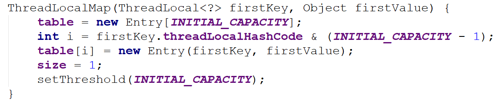

**ThreadLocal是什么**

​		ThreadLocal提供线程局部变量。这些变量与普通的变量不同之处在于，每个访问这种变量的线程（通过它的get或set方法）都有自己的、独立初始化的变量副本。

<!--more-->

ThreadLocal实例通常是希望将状态关联到一个线程的类的私有静态字段（比如，user ID 或者 Transaction ID 等等）。

（

画外音：这段话表达了三个意思

1. ThreadLocal是一种变量类型，我们称之为“线程局部变量”
2. 每个线程访问这种变量的时候都会创建该变量的副本，这个变量副本为线程私有
3. ThreadLocal类型的变量一般用private static加以修饰

）

例如，下面的例子中这个类为每个线程生成唯一标识。一个线程的id是它第一次调用ThreadId.get()方法指定的。

```java
package com.cjs.example;

import java.util.concurrent.atomic.AtomicInteger;

public class ThreadId {

    private static final AtomicInteger nextId = new AtomicInteger(0);

    private static final ThreadLocal<Integer> threadId = new ThreadLocal<Integer>() {
        @Override
        protected Integer initialValue() {
            return nextId.getAndIncrement();
        }
    };

    public static int get() {
        return threadId.get();
    }

    public static void main(String[] args) {
        for (int i = 0; i < 10; i++) {
            new Thread(new Runnable() {
                @Override
                public void run() {
                    System.out.println(Thread.currentThread().getId());
                }
            }).start();
        }
    }
}
```

#### ThreadLocal主要操作

```java
/**
 * 返回当前线程对ThreadLocal变量的“初始值”
 * 这个方法将在线程第一次访问变量（通过调用get方法）时被调用，如果之前已经调用过了就不会再调了
 *
 * @return the initial value for this thread-local
 */
protected T initialValue() {
    return null;
}

/**
 * 设置当前线程的ThreadLocal变量的副本为指定的值
 *
 * @param value the value to be stored in the current thread's copy of this thread-local.
 */
public void set(T value) {
    Thread t = Thread.currentThread();
    ThreadLocalMap map = getMap(t);
    if (map != null)
        map.set(this, value);
    else
        createMap(t, value);
}

/**
 * 返回当前线程的ThreadLocal变量副本的值
 *
 * @return the current thread's value of this thread-local
 */
public T get() {
    Thread t = Thread.currentThread();
    ThreadLocalMap map = getMap(t);
    if (map != null) {
        ThreadLocalMap.Entry e = map.getEntry(this);
        if (e != null) {
            @SuppressWarnings("unchecked")
            T result = (T)e.value;
            return result;
        }
    }
    return setInitialValue();
}

/**
 * 删除当前线程的ThreadLocal变量副本的值
 */
public void remove() {
    ThreadLocalMap m = getMap(Thread.currentThread());
    if (m != null)
        m.remove(this);
}
```


### Thread 变量 threadLocals

线程类Thread内部有一个名为`threadLocals` 的 `ThreadLocal.ThreadLocalMap` 变量，它定义如下：

```java
/* ThreadLocal values pertaining to this thread. This map is maintained
     * by the ThreadLocal class. */
    ThreadLocal.ThreadLocalMap threadLocals = null;
```

### ThreadLocal.ThreadLocalMap

`ThreadLocal.ThreadLocalMap` 是 `ThreadLocal` 的内部类

```java
    /**
     * ThreadLocalMap is a customized hash map suitable only for
     * maintaining thread local values. No operations are exported
     * outside of the ThreadLocal class. The class is package private to
     * allow declaration of fields in class Thread.  To help deal with
     * very large and long-lived usages, the hash table entries use
     * WeakReferences for keys. However, since reference queues are not
     * used, stale entries are guaranteed to be removed only when
     * the table starts running out of space.
     */
    static class ThreadLocalMap {
        // ...
    }
```

看注释的第一句话 `ThreadLocalMap is a customized hash map suitable only for maintaining thread local values.` 意思是 ThreadLocalMap 是一个自定义 HashMap，只适用于线程局部变量。完全可以把它看做是一个 HashMap。

类`ThreadLocal`的结构如下：


重要的方法只有两个：**set 和 get**

#### ThreadLocal.set(value)

`ThreadLocal.set(value)` 向 `Thread` 内部的 `threadLocals` 变量添加值，它的实现如下：




可以看到，ThreadLocalMap底层是一个数组，数组中元素类型是Entry类型

set操作是向当前线程的ThreadLocal.ThreadLocalMap类型的成员变量threadLocals中设置值，key是this，value是我们指定的值

注意，这里传的this代表的是那个ThreadLocal类型的变量（或者说叫对象）

也就是说，每个线程都维护了一个ThreadLocal.ThreadLocalMap类型的对象，而set操作其实就是以ThreadLocal变量为key，以我们指定的值为value，最后将这个键值对封装成Entry对象放到该线程的ThreadLocal.ThreadLocalMap对象中。每个ThreadLocal变量在该线程中都是ThreadLocal.ThreadLocalMap对象中的一个Entry。既然每个ThreadLocal变量都对应ThreadLocal.ThreadLocalMap中的一个元素，那么就可以对这些元素进行读写删除操作。

#### ThreadLocal.get()


get()方法就是从当前线程的ThreadLocal.ThreadLocalMap对象中取出对应的ThreadLocal变量所对应的值

同理，remove()方法就是清除这个值

用图形表示的话，大概是这样的：


或者是这样的：


### ThreadLocal使用场景主要是在线程生命周期内传值

**一切都归功于ThreadLocalMap**

#### 小结

> `ThreadLocal`和`Synchronized`都是为了解决多线程中相同变量的访问冲突问题，不同的是：
>
> -  `Synchronized` 是通过线程等待，牺牲时间来解决访问冲突
> -  `ThreadLocal` 是通过每个线程单独一份存储空间，牺牲空间来解决冲突，并且相比于`Synchronized`，`ThreadLocal` 具有线程隔离的效果，只有在线程内才能获取到对应的值，线程外则不能访问到想要的值。

正因为`ThreadLocal`的线程隔离特性，使他的应用场景相对来说更为特殊一些。在android中Looper、ActivityThread以及AMS中都用到了ThreadLocal。当某些数据是以线程为作用域并且不同线程具有不同的数据副本的时候，就可以考虑采用ThreadLocal。