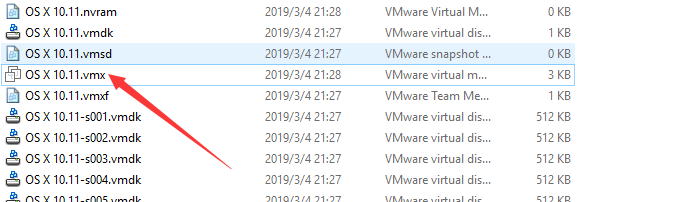
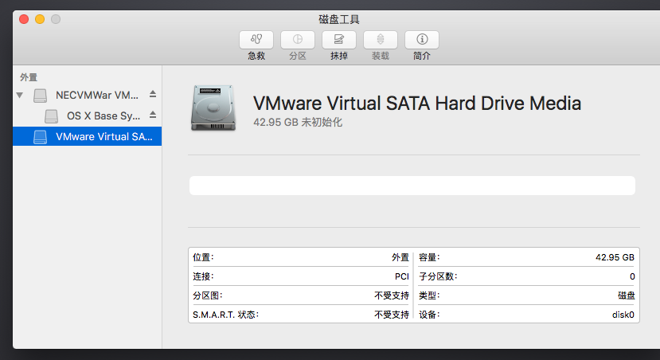
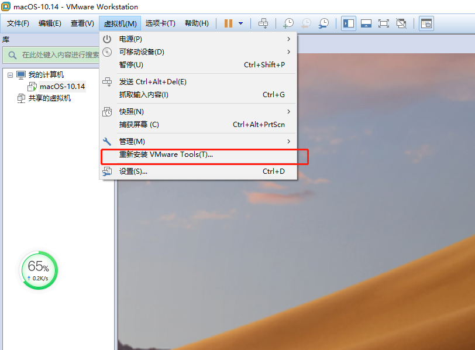

**VMware安装黑苹果以及踩坑记录**

<!--more-->

#### 准备软件:

**VMware14或者15 自行下载 **

**MacOS Unlocker for VMware**, 简称 Unlocker。能够让 VMware 选择 Mac 系统进行安装的补丁，[Unlocker 在 github 的下载地址](https://github.com/theJaxon/unlocker/releases)  windows 选择第一个 unlocker302.zip 进行下载即可

**Mac OS X 10镜像**:  cdr [推荐], 懒人安装包, 因为易装, 麻烦少. dmg, 原始镜像, 没有试过这个格式的安装, 不了解填这个坑 我这里提供的是cdr 和MacOS Unlocker for VMware, 简称 Unlocker

unlocker和Mac os下载地址 链接：https://pan.baidu.com/s/1e2TCqEdWECDd3zFJBaUiIg  提取码：uzry

#### 安装 VMware Mac补丁

打开任务管理器：win+R，输入services.msc，将VMware 的服务全部停止运行。
[

下载VMware14unlocker解压，右键选择以管理员身份运行win-install这个文件。

主要的问题在这里 如果这里安装好了 其他的就跟着走就行了

[](https://img2018.cnblogs.com/blog/1267816/201903/1267816-20190304212438109-752218180.png)

看到终端有 Successfully, Finished 等词, 先不要高兴太早, 因为那整句话是否定的.

报错内容有:

-  文件权限问题

  > 哪一个文件的权限出了问题, 就找到它并给它添加权限就可以了.
  >
  > 操作步骤: 右击选择属性 --> 选择安全选项卡 --> 点击编辑 --> 选择 Everyone (组或用户名) --> 允许完全控制.

- 没有找到 `drawn*.*` 文件

  > 看了一下终端是访问了 `http://***` 链接之后才报的错误, 认为是访问超时了结果重试了几次都不行, 然后打开浏览器进行访问该链接, 结果浏览器返回 not found. 一脸懵逼, 简直坑爹啊
  >
  > **填叁号坑**: 解决办法 - 修改源码后重新编译打包exe
  > 修改文件: gettools.py, 修改后的完整代码放在最后, 有中文注释.
  > 思路: 访问问题, 那就修改访问的链接; 由于VMware 服务器识别 UA, 所以伪装 UA.
  > 打包exe: 需要 python3.x 环境, 依赖包: requests, PyInstaller; 打包命令 `pyinstaller -F gettools.py`
  > 替换 gettools.exe 文件: 打包 exe 后, 会生成 dist 文件夹, 找到里面的 exe 文件, 替换 unlocker 文件夹中的 gettools.exe 文件
  >
  > 补充: 安装依赖包的命令: `pip3 install requests`; `pip3 install PyInstaller`; 打包exe 前, 需要打开终端并切换目录到 gettools.py 文件所在目录下.

gettools.py

```
from __future__ import print_function

import os
import shutil
import sys
import tarfile
import zipfile

# 添加处, 方便伪装 User-Agent
import requests


# 添加处
def download_drawn(url, path):
    headers = {
        'User-Agent': 'Mozilla/5.0 (Windows NT 10.0; Win64; x64) AppleWebKit/537.36 (KHTML, like Gecko) Chrome/76.0.3809.132 Safari/537.36',
    }
    resp = requests.get(url, headers=headers, timeout=180)
    with open(path, "wb") as fp:
        fp.write(resp.content)


def convertpath(path):
    # OS path separator replacement funciton
    return path.replace(os.path.sep, '\\')  # 修改处


def main():
    # Check minimal Python version is 2.7
    if sys.version_info < (2, 7):
        sys.stderr.write('You need Python 2.7 or later\n')
        sys.exit(1)

    # Setup url and file paths
    url = 'http://softwareupdate.vmware.com/cds/vmw-desktop/fusion/'
    dest = os.path.dirname(os.path.abspath(__file__))

    # Re-create the tools folder
    shutil.rmtree(dest + '/tools', True)
    os.mkdir(dest + '/tools')

    # 删改处
    urlpost15 = url + '11.1.0/13668589' + '/packages/com.vmware.fusion.tools.darwin.zip.tar'
    urlpre15 = url + '11.1.0/13668589' + '/packages/com.vmware.fusion.tools.darwinPre15.zip.tar'

    # Download the darwin.iso tgz file
    print('Retrieving Darwin tools from: ' + urlpost15)
    # 修改处
    download_drawn(urlpost15, convertpath(dest + '/tools/com.vmware.fusion.tools.darwin.zip.tar'))

    # Extract the tar to zip
    tar = tarfile.open(convertpath(dest + '/tools/com.vmware.fusion.tools.darwin.zip.tar'), 'r')
    tar.extract('com.vmware.fusion.tools.darwin.zip', path=convertpath(dest + '/tools/'))
    tar.close()

    # Extract the iso and sig files from zip
    cdszip = zipfile.ZipFile(convertpath(dest + '/tools/com.vmware.fusion.tools.darwin.zip'), 'r')
    cdszip.extract('payload/darwin.iso', path=convertpath(dest + '/tools/'))
    cdszip.extract('payload/darwin.iso.sig', path=convertpath(dest + '/tools/'))
    cdszip.close()

    # Move the iso and sig files to tools folder
    shutil.move(convertpath(dest + '/tools/payload/darwin.iso'), convertpath(dest + '/tools/darwin.iso'))
    shutil.move(convertpath(dest + '/tools/payload/darwin.iso.sig'), convertpath(dest + '/tools/darwin.iso.sig'))

    # Cleanup working files and folders
    shutil.rmtree(convertpath(dest + '/tools/payload'), True)
    os.remove(convertpath(dest + '/tools/com.vmware.fusion.tools.darwin.zip.tar'))
    os.remove(convertpath(dest + '/tools/com.vmware.fusion.tools.darwin.zip'))

    # Download the darwinPre15.iso tgz file
    print('Retrieving DarwinPre15 tools from: ' + urlpre15)
    # 修改处
    download_drawn(urlpre15, convertpath(dest + '/tools/com.vmware.fusion.tools.darwinPre15.zip.tar'))

    # Extract the tar to zip
    tar = tarfile.open(convertpath(dest + '/tools/com.vmware.fusion.tools.darwinPre15.zip.tar'), 'r')
    tar.extract('com.vmware.fusion.tools.darwinPre15.zip', path=convertpath(dest + '/tools/'))
    tar.close()

    # Extract the iso and sig files from zip
    cdszip = zipfile.ZipFile(convertpath(dest + '/tools/com.vmware.fusion.tools.darwinPre15.zip'), 'r')
    cdszip.extract('payload/darwinPre15.iso', path=convertpath(dest + '/tools/'))
    cdszip.extract('payload/darwinPre15.iso.sig', path=convertpath(dest + '/tools/'))
    cdszip.close()

    # Move the iso and sig files to tools folder
    shutil.move(convertpath(dest + '/tools/payload/darwinPre15.iso'), convertpath(dest + '/tools/darwinPre15.iso'))
    shutil.move(convertpath(dest + '/tools/payload/darwinPre15.iso.sig'), convertpath(dest + '/tools/darwinPre15.iso.sig'))

    # Cleanup working files and folders
    shutil.rmtree(convertpath(dest + '/tools/payload'), True)
    os.remove(convertpath(dest + '/tools/com.vmware.fusion.tools.darwinPre15.zip.tar'))
    os.remove(convertpath(dest + '/tools/com.vmware.fusion.tools.darwinPre15.zip'))


if __name__ == '__main__':
    main()
```

#### 解决VMware开机不可恢复错误

安装好了Mac虚拟机后，这时点击VMware虚拟机开机会提示如下错误：

解决办法就是到安装目录，找到VMX文件这个配置文件。


用记事本打开它，然后在`smc.present = "TRUE"`后面加一行：`smc.version = 0`，保存即可


#### Mac OS系统安装

按照上面的操作，接下来再用VMware开机的话，你就可以看到经典的Mac OS开机画面了。

点击左侧列出的磁盘，如果无法分区，请点击格式化。
现在再次点击格式化，分区保持默认即可。
配置完成后，我们点击左上角红色的叉叉退出磁盘工具，点击继续进入到下一步。

同意协议，选择你要将Mac OS安装到的磁盘，也就是刚刚我们格式化掉的磁盘。
耐心等待个十几分钟，全新的Mac OS就会安装完成了

#### 网络问题

我选了个默认的DHCP,然后填了两个DNS就好了 如果这里不行就查一下吧

#### 安装 VMTools

VMWare Tools工具是开启文件共享的。如果这个是灰色的,,,请先把mac虚拟机打开再看



如果没解决 ,右键虚拟机打开虚拟机设置, 在 CD/DVD 处选择 自动检测

其实我也不知道我装了咋用  linux有xshell   这个...难道只能通过虚拟机?   试过teamview 不理想 哈哈哈 以后再说吧

感谢大佬的教程

安装 https://www.cnblogs.com/L1079991001/p/10473846.html

问题  http://www.voidcn.com/article/p-cmqiimub-byz.html

