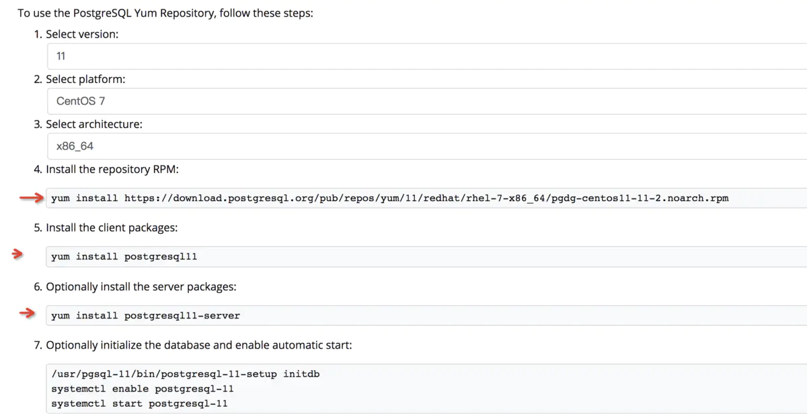

2年前买了个3年的基础1核2G服务器，一直在用，但是偶尔重装系统的时候总得各种软件安装命令，今天整合一下，避免以后浪费时间

<!--more-->

## 环境要求：

镜像：CentOs7.6*64

工具软件：vim，zip，sz，rz，ftp，iftop。。。

环境软件：jdk1.8，tomcat8.5，Nginx，MySQL8.0，Postgresql11，Redis，Docker。。。

OK，开始！

## 环境准备

防火墙firewalld基础操作  如果关闭firewalld直接设置安全组即可

1、firewalld的基本使用

启动： systemctl start firewalld

查看状态： systemctl status firewalld 

停止： systemctl disable firewalld

禁用： systemctl stop firewalld

2.systemctl是CentOS7的服务管理工具中主要的工具，它融合之前service和chkconfig的功能于一体。

启动一个服务：systemctl start firewalld.service
关闭一个服务：systemctl stop firewalld.service
重启一个服务：systemctl restart firewalld.service
显示一个服务的状态：systemctl status firewalld.service
在开机时启用一个服务：systemctl enable firewalld.service
在开机时禁用一个服务：systemctl disable firewalld.service
查看服务是否开机启动：systemctl is-enabled firewalld.service
查看已启动的服务列表：systemctl list-unit-files|grep enabled
查看启动失败的服务列表：systemctl --failed

3.配置firewalld-cmd

查看版本： firewall-cmd --version

查看帮助： firewall-cmd --help

显示状态： firewall-cmd --state

查看所有打开的端口： firewall-cmd --zone=public --list-ports

更新防火墙规则： firewall-cmd --reload

查看区域信息:  firewall-cmd --get-active-zones

查看指定接口所属区域： firewall-cmd --get-zone-of-interface=eth0

拒绝所有包：firewall-cmd --panic-on

取消拒绝状态： firewall-cmd --panic-off

查看是否拒绝： firewall-cmd --query-panic

开启一个端口

添加

firewall-cmd --zone=public --add-port=3306/tcp --permanent    （--permanent永久生效，没有此参数重启后失效）

重新载入

firewall-cmd --reload

查看

firewall-cmd --zone= public --query-port=80/tcp

删除

firewall-cmd --zone= public --remove-port=80/tcp --permanent

### yum安装

一些基础软件用yum就可以安装了，省去到处找包。

```
yum -y install unzip zip
yum -y install tree
yum -y install vim
yum -y install wget
#虚拟机上传下载组件( 支持从windows直接拖拽文件，相当好用)
yum -y install lrzsz 
```

#### 搭建ftp

https://cloud.tencent.com/document/product/213/10912

##### 步骤2：安装 vsftpd

1. 执行以下命令，安装 vsftpd。

   ```
   yum install -y vsftpd
   ```

2. 执行以下命令，设置 vsftpd 开机自启动。

   ```
   systemctl enable vsftpd
   ```

3. 执行以下命令，启动 FTP 服务。

   ```
   systemctl start vsftpd
   ```

4. 执行以下命令，确认服务是否启动。

   ```
   netstat -antup | grep ftp
   ```

   显示结果如下，则说明 FTP 服务已成功启动。

   此时，vsftpd 已默认开启匿名访问模式，无需通过用户名和密码即可登录 FTP 服务器。使用此方式登录 FTP 服务器的用户没有权修改或上传文件的权限。

##### 步骤3：配置 vsftpd

1. 执行以下命令，为 FTP 服务创建用户，本文以 ftpuser 为例。

   ```
   useradd ftpuser
   ```

2. 执行以下命令，设置 ftpuser 用户的密码。

   ```
   passwd ftpuser
   ```

   输入密码后请按 Enter 确认设置，密码默认不显示

3. 执行以下命令，创建 FTP 服务使用的文件目录，本文以/var/ftp/test为例。

   ```
   mkdir /var/ftp/test
   ```

4. 执行以下命令，修改目录权限。

   ```
   chown -R ftpuser:ftpuser /var/ftp/test
   ```

5. 执行以下命令，打开vsftpd.conf文件。

   ```
   vim /etc/vsftpd/vsftpd.conf
   ```

6. 按i切换至编辑模式，根据实际需求选择 FTP 模式，修改配置文件vsftpd.conf

   > 注意：
   >
   > FTP 可通过主动模式和被动模式与客户端机器进行连接并传输数据。由于大多数客户端机器的防火墙设置及无法获取真实 IP 等原因，建议您选择**被动模式**搭建 FTP 服务。如下修改以设置被动模式为例，您如需选择主动模式，请前往 [设置 FTP 主动模式](https://cloud.tencent.com/document/product/213/10912#port)。

   1. 修改以下配置参数，设置匿名用户和本地用户的登录权限，设置指定例外用户列表文件的路径，并开启监听 IPv4 sockets。

      ```
      anonymous_enable=NO
      local_enable=YES
      chroot_local_user=YES
      chroot_list_enable=YES
      chroot_list_file=/etc/vsftpd/chroot_list
      listen=YES
      ```

   2. 在行首添加#注释listen_ipv6=YES配置参数，关闭监听 IPv6 sockets。

      ```
      #listen_ipv6=YES
      ```

   3. 添加以下配置参数，开启被动模式，设置本地用户登录后所在目录，以及云服务器建立数据传输可使用的端口范围值。

      ```
      local_root=/var/ftp/test
      allow_writeable_chroot=YES
      pasv_enable=YES
      pasv_address=xxx.xx.xxx.xx #请修改为您的 Linux 云服务器公网 IP
      pasv_min_port=40000
      pasv_max_port=45000
      ```

7. 按 **Esc** 后输入 **:wq** 保存后退出。

8. 执行以下命令，创建并编辑chroot_list文件。

   ```
   vim /etc/vsftpd/chroot_list
   ```

9. 按 **i** 进入编辑模式，输入用户名，一个用户名占据一行，设置完成后按 **Esc** 并输入 **:wq** 保存后退出。
   您若没有设置例外用户的需求，可跳过此步骤，输入 **:wq** 退出文件。

10. 执行以下命令，重启 FTP 服务。

    ```
    systemctl restart vsftpd
    ```

##### 步骤4：设置安全组

搭建好 FTP 服务后，您需要根据实际使用的 FTP 模式给 Linux 云服务器放通**入站规则**，详情请参见 [添加安全组规则](https://cloud.tencent.com/document/product/213/39740)。
大多数客户端机器在局域网中，IP 地址是经过转换的。如果您选择了 FTP 主动模式，请确保客户端机器已获取真实的 IP 地址，否则可能会导致客户端无法登录 FTP 服务器。

- 主动模式：放通端口21。
- 被动模式：放通端口21，及 [修改配置文件](https://cloud.tencent.com/document/product/213/10912#config) 中设置的 `pasv_min_port` 到 `pasv_max_port` 之间的所有端口，本文放通端口为40000 - 45000。

##### 步骤5：验证 FTP 服务

您可通过 FTP 客户端软件、浏览器或文件资源管理器等工具验证 FTP 服务，本文以客户端的文件资源管理器为例。

1. 打开客户端的 IE 浏览器，选择【工具】>【Internet 选项】>【高级】，根据您选择的 FTP 模式进行修改：

   - 主动模式：取消勾选【使用被动 FTP】。
   - 被动模式：勾选【使用被动 FTP】。

2. 打开客户端的计算机，在路径栏中访问以下地址。如下图所示：

   ```
   ftp://云服务器公网IP:21
   ```

3. 在弹出的“登录身份”窗口中输入 [配置 vsftpd](https://cloud.tencent.com/document/product/213/10912#user) 中已设置的用户名及密码。
   本文使用的用户名为 `ftpuser`，密码为 `tf7295TFY`。

4. 成功登录后，即可上传及下载文件。

##### 附录

##### 设置 FTP 主动模式

主动模式需修改的配置如下，其余配置保持默认设置：

```
anonymous_enable=NO      #禁止匿名用户登录
local_enable=YES         #支持本地用户登录
chroot_local_user=YES    #全部用户被限制在主目录
chroot_list_enable=YES   #启用例外用户名单
chroot_list_file=/etc/vsftpd/chroot_list  #指定用户列表文件，该列表中的用户不被锁定在主目录
listen=YES               #监听IPv4 sockets
#在行首添加#注释掉以下参数
#listen_ipv6=YES         #关闭监听IPv6 sockets
#添加下列参数
allow_writeable_chroot=YES
local_root=/var/ftp/test #设置本地用户登录后所在的目录
```

按 **Esc** 后输入 **:wq** 保存后退出，并前往 [步骤8](https://cloud.tencent.com/document/product/213/10912#create) 完成 vsftpd 配置。

##### FTP 客户端上传文件失败

##### 问题描述

Linux 系统环境下，通过 vsftp 上传文件时，提示如下报错信息。

```
553 Could not create file
```

##### 解决方法

1. 执行以下命令，检查服务器磁盘空间的使用率。

   ```
   df -h
   ```

   - 如果磁盘空间不足，将会导致文件无法上传，建议删除磁盘容量较大的文件。
   - 如果磁盘空间正常，请执行下一步。

2. 执行以下命令，检查 FTP 目录是否有写的权限。

   ```
   ls -l /home/test      
   # /home/test 为 FTP 目录，请修改为您实际的 FTP 目录。
   ```

   - 若返回结果中没有 `w`，则表示该用户没有写的权限，请执行下一步。
   - 若返回结果中已有 `w`，请 [提交工单](https://console.cloud.tencent.com/workorder/category) 进行反馈。

3. 执行以下命令，对 FTP 目录加上写的权限。

   ```
   chmod +w /home/test 
   # /home/test 为 FTP 目录，请修改为您实际的 FTP 目录。
   ```

4. 执行以下命令，重新检查写的权限是否设置成功。

   ```
   ls -l /home/test   
   # /home/test 为 FTP 目录，请修改为您实际的 FTP 目录。
   ```

#### 安装Docker

1、查看服务器是否安装docker版本命令 命令行输入：

docker 

命令无效说明未安装docker

若已经安装docker，卸载安装过后的docker

**sudo** **yum remove** docker \
                  docker-client \
                  docker-client-latest \
                  docker-common \
                  docker-latest \
                  docker-latest-logrotate \
                  docker-logrotate \
                  docker-engine

移除docker完全之后，

2、安装一些必要的系统工具：

yum -y install yum-utils device-mapper-persistent-data lvm2

3、添加软件源信息：

yum-config-manager --add-repo http://mirrors.aliyun.com/docker-ce/linux/centos/docker-ce.repo

4、更新 yum 缓存：

yum makecache fast

5、安装 Docker-ce：

yum -y install docker-ce

6、启动 Docker 后台服务：

systemctl start docker

停止docker

[root@mail ~]# systemctl stop docker 

设置开机启动

[root@mail ~]# systemctl enable docker

查看docker运行状态

[root@mail ~]# systemctl status docker

7、测试运行 hello-world：

docker run hello-world

8、安装centos，并以后台启动的方式运行centos：

docker run -itd centos /bin/bash

9、进入centos镜像：

```
[root@myserver ~]# docker ps
CONTAINER ID  IMAGE     COMMAND    CREATED     STATUS    PORTS              NAMES
f57d4703adc3  centos    "/bin/bash"   About a minute ago  Up About a minute jolly_dhawan
[root@myserver ~]# docker exec -it f57d4703adc3 /bin/bash
[root@f57d4703adc3 /]#
[root@f57d4703adc3 /]# cat /etc/[RedHat](https://www.linuxidc.com/topicnews.aspx?tid=10)-release   or /etc/centos-release
CentOS Linux release 7.6.1810 (Core)
[root@f57d4703adc3 /]#exit
[root@myserver ~]#docker images 
```

执行有效，docker安装成功

#### 安装Mysql8.0

##### 1、添加包

```
wget https://dev.mysql.com/get/mysql80-community-release-el7-3.noarch.rpm
rpm -ivh mysql80-community-release-el7-3.noarch.rpm
```

##### 2、更新 yum 命令

```
yum clean all && yum makecache
```

##### 3、安装

```
yum install -y  mysql-community-server
```

##### 4、配置文件

```
#修改配置文件
vim /etc/my.cnf
[mysqld]
port = 3306
character-set-server=utf8mb4
collation-server=utf8mb4_general_ci
# 表名不区分大小写(启动前配置)
lower_case_table_names=1
#设置日志时区和系统一致
log_timestamps=SYSTEM
[client]
default-character-set=utf8mb4
```

##### 5、启动服务

```
#启动服务
systemctl start mysqld
#查看版本信息
mysql -V
#查看状态
systemctl status mysqld
##开机启动
systemctl enable mysqld
systemctl daemon-reload
```

##### 6、修改账号密码

```
#1、查看MySQL为Root账号生成的临时密码
grep "A temporary password" /var/log/mysqld.log

#2、进入MySQL shell
mysql -u root -p

#3、修改密码
ALTER USER 'root'@'localhost' IDENTIFIED BY 'MyNewPass4!';
```

##### 7 、开启 MySQL 远程连接

```
#选择 mysql 数据库：
USE mysql;

#在 mysql 数据库的 user 表中查看当前 root 用户的相关信息：
SELECT host, user, authentication_string, plugin FROM user;

#设置root 用户远程访问：
update user set host = '%' where user ='root';

#刷新权限：
FLUSH PRIVILEGES;

#授权的所有权限
GRANT ALL PRIVILEGES ON *.* TO 'root'@'%';

#更新 root 用户密码及加密规则（如果客户端不支持加密插件）：
ALTER USER 'root'@'%' IDENTIFIED WITH mysql_native_password BY 'MyNewPass4!';

#刷新权限：
FLUSH PRIVILEGES;
```

##### 8、新建远程用户

```
如果你希望你的root可以在localhost以外的其他机子远程访问，你可以将localhost替换为%，后面的<your new password>替换为你希望设置的新密码，必须同时包含大小写字母、数字和字符

#1、新建远程用户
CREATE USER 'devops'@'%' IDENTIFIED BY 'MyNewPass3!';
#2、赋予指定账户指定(数据库名称.表名)远程访问权限
GRANT ALL PRIVILEGES ON mydb_name.* TO 'devops'@'%';
#3、查看权限
SHOW GRANTS FOR 'devops'@'%';
#4、收回权限
REVOKE ALL PRIVILEGES ON *.* FROM 'devops'@'%';
#5、删除用户
DROP USER 'devops'@'%';
#6、刷新权限
FLUSH PRIVILEGES;
```

##### 9、 找回密码

如果忘记了MySQL root密码，可以用以下方法重新设置：

```
#1.关闭MySQL
service mysql stop

#2.用以下命令启动MySQL，以不检查权限的方式启动；
service mysql start --skip-grant-tables

#3.然后用空密码方式使用root用户登录 MySQL；
mysql -u root
```

##### 10、启动失败

```
#权限问题
chown mysql:mysql -R /var/run/mysqld
/usr/sbin/mysqld --user=mysql &
```

#### 安装redis

```
下载fedora的epel仓库
yum install epel-release
安装redis数据库
yum install redis
```

##### 1.修改redis默认端口和密码

vi /etc/redis.conf

修改默认端口，查找 port 6379 修改为相应端口即可


修改默认密码，查找 requirepass foobared 将 foobared 修改为你的密码


启动redis    service redis start

停止redis    service redis stop

查看redis运行状态    service redis status

查看redis进程    ps -ef | grep redis

设置redis为开机自动启动

chkconfig redis on

进入redis服务

进入本机redis   redis-cli

列出所有key   keys *

##### 防火墙开放相应端口 

防火墙关掉之后去安全组设置即可

##### 使用redis desktop manager远程连接redis

如果长时间连接不上，可能有两种可能性

　　a）bind了127.0.01：只允许在本机连接redis

　　b）protected-mode设置了yes（使用redis desktop manager工具需要配置，其余不用）

解决办法：# 打开redis配置文件vi /etc/redis.conf# 找到 bind 127.0.0.1 将其注释# 找到 protected-mode yes 将其改为protected-mode no

重启redis	service redis stop service redis start

再次连接即可

打开iptables 3306端口

如果您的操作系统为CentOS系列：

iptables -I INPUT 4 -p tcp -m state --state NEW -m tcp --dport 3306 -j ACCEPT 

service iptables save 

### 安装Postgresql11

1 进入postresql官网下载页面，提示了centos相关下载安装等信息。
https://www.postgresql.org/download/linux/redhat/
  

```shell
yum update -y
yum install https://download.postgresql.org/pub/repos/yum/reporpms/EL-7-x86_64/pgdg-redhat-repo-latest.noarch.rpm
yum -y install postgresql11
yum -y install postgresql11-server
/usr/pgsql-11/bin/postgresql-11-setup initdb

#开通PostgreSQL端口：
firewall-cmd --zone=public --add-port=5432/tcp --permanent
firewall-cmd --reload
firewall-cmd --list-ports
systemctl start postgresql-11
#修改密码
[root@CentOS-1804-MySQL-4 ~]# su - postgres
-bash-4.2$ psql -U postgres
psql (11.0)
Type "help" for help.
 
查看当前角色列表
\du 
执行创建数据库用户gpadmin ，并设置密码。
CREATE USER gpadmin WITH PASSWORD 'gpadmin123';
创建用户数据库， 并指定所有者为gpadmin。
CREATE DATABASE edw OWNER gpadmin;
第四件事是将edw 数据库的所有权限都赋予gpadmin，否则gpadmin只能登录控制台，没有任何数据库操作权限。
GRANT ALL PRIVILEGES ON DATABASE edw to gpadmin;
超级用户权限
alter user gpadmin superuser login;
 展示所有数据库
\l 
效果为:
gscloud=# \l
List of databases
Name | Owner | Encoding | Collate | Ctype | Access privileges
---------------+---------------+----------+-------------+-------------+---------------------------------
GSCloud1903 | GSCloud1903 | UTF8 | en_US.UTF-8 | en_US.UTF-8 | =Tc/GSCloud1903 +
| | | | | GSCloud1903=CTc/GSCloud1903

展示所有用户
\dg
gscloud=# \dg
List of roles
Role name | Attributes | Member of
---------------+------------------------------------------------------------+-----------
GSCloud1903 | Superuser, Replication | {}
创建用户
create role gpadmin;
设置密码
alter role zhaobsh with password ‘Test6530‘;
or
\password zhaobsh
修改属主
alter database "GSCloud1903" owner to zhaobsh;
增加权限
grant all on database "GSCloud1903" to zhaobsh;
设置是 supseruser 以及 登录权限
alter user zhaobsh superuser login
 

最后，使用\q命令退出控制台（也可以直接按ctrl+D）。
\q

postgres=# ALTER USER postgres with encrypted password 'postgres';
ALTER ROLE
postgres=# \q
-bash-4.2$ exit
logout
#远程访问
vim /var/lib/pgsql/11/data/postgresql.conf
#要监听的IP地址；以逗号分隔的地址列表；默认为'localhost'；对所有人使用'*'。
listen_addresses = '*'
#修改 文件 
vim /var/lib/pgsql/11/data/pg_hba.conf
#增加
host    all             all             0.0.0.0/0               md5

systemctl enable postgresql-11
systemctl start postgresql-11
systemctl restart postgresql-11
```

#### 安装 JDK

1. 下载 JDK 源码包，您可前往

   > 说明：
   >
   > 请先将 JDK 源码包下载到本地，再上传至云服务器，否则会出现解压错误。
   >
   > - 若您使用机器为 Windows 操作系统，可通过 [WinSCP 上传文件](https://cloud.tencent.com/document/product/213/2131)。
   > - 若您使用机器为 Mac 或 Linux 操作系统，可通过 [SCP 上传文件](https://cloud.tencent.com/document/product/213/2133)。
   > - jdk8链接：https://pan.baidu.com/s/1BeH8ge_cZoKQMKZRd67YXw 
   >   提取码：2foi

2. 执行以下命令，新建 JDK 安装目录。

   ```
   mkdir /usr/java
   ```

3. 执行以下命令，将 JDK 源码包解压到指定位置。

   ```
   tar xzf jdk-8u221-linux-x64.tar.gz -C /usr/java
   ```

4. 执行以下命令

   ```
   vim /etc/profile 
   export JAVA_HOME=/usr/java/jdk1.8.0_221（您的 JDK 版本）
   export CLASSPATH=$JAVA_HOME/lib/tools.jar:$JAVA_HOME/lib/dt.jar:$JAVA_HOME/lib
   export PATH=$JAVA_HOME/bin:$PATH
   ```

   ```
   source /etc/profile
   ```

5. 执行以下命令，查看 JDK 是否已经安装成功。

   ```
   java -version
   ```

#### 安装 Tomcat

1. 执行以下命令，下载 Tomcat 源码包，您可根据实际需求下载不同版本 Tomcat。

   > 说明：
   >
   > 本文使用 Apache 官网提供下载网址，若出现下载链接失效等错误或需要其他 Tomcat 版本时，可前往 [Apache 官网](https://tomcat.apache.org/) 获取更多安装信息。

   ```
   wget https://mirrors.tuna.tsinghua.edu.cn/apache/tomcat/tomcat-8/v8.5.55/bin/apache-tomcat-8.5.55.tar.gz
   ```

2. 执行以下命令，解压 Tomcat 源码包。

   ```
   tar xzf apache-tomcat-8.5.55.tar.gz
   ```

3. 执行以下命令，将解压后的文件夹下的文件移动到/usr/local/tomcat/目录下

   ```
   mv apache-tomcat-8.5.55 /usr/local/tomcat/
   ```

4. 执行以下命令，打开server.xml文件。

   ```
   vim /usr/local/tomcat/conf/server.xml
   ```

5. 找到<Host ... appBase="webapps"> 将appBase="webapps"替换为以下内容：

   ```
   appBase="/usr/local/tomcat/webapps"
   ```

6. 执行以下命令，新建setenv.sh文件。

   ```
   vi /usr/local/tomcat/bin/setenv.sh
   ```

   输入以下内容，设置 JVM 的内存参数。

   ```
   JAVA_OPTS='-Djava.security.egd=file:/dev/./urandom -server -Xms256m -Xmx496m -Dfile.encoding=UTF-8' 
   ```

7. 执行以下命令，启动 Tomcat。

   ```
   /usr/local/tomcat/bin/startup.sh
   ```

##### 验证环境配置

1. 执行以下命令，创建测试文件。

   ```
   echo Hello World! > /usr/local/tomcat/webapps/ROOT/index.jsp
   ```

2. 在本地浏览器中访问如下地址，查看环境配置是否成功。

   ```
   http://云服务器实例的公网 IP：8080
   ```

   显示结果如下，则说明环境配置成功。

   

   

#### 安装Nginx

##### 安装 yum-utils

```bash
yum install yum-utils
```

##### 配置nginx的repo源

新建nginx的repo源

```bash
touch /etc/yum.repos.d/nginx.repo
```

往 nginx.repo 文件里输入

```bash
vim /etc/yum.repos.d/nginx.repo
[nginx-stable]
name=nginx stable repo
baseurl=http://nginx.org/packages/centos/$releasever/$basearch/
gpgcheck=1
enabled=1
gpgkey=https://nginx.org/keys/nginx_signing.key

[nginx-mainline]
name=nginx mainline repo
baseurl=http://nginx.org/packages/mainline/centos/$releasever/$basearch/
gpgcheck=1
enabled=0
gpgkey=https://nginx.org/keys/nginx_signing.key
```

##### 安装nginx

```bash
yum -y install nginx
```

##### 启动nginx服务器

启动nginx服务

```bash
systemctl start nginx
```

检查其运行状态

```bash
systemctl status nginx
```

输出：

```bash
● nginx.service - nginx - high performance web server
   Loaded: loaded (/usr/lib/systemd/system/nginx.service; disabled; vendor preset: disabled)
   Active: active (running) since Sat 2019-03-16 21:08:16 CST; 15s ago
     Docs: http://nginx.org/en/docs/
  Process: 2606 ExecStart=/usr/sbin/nginx -c /etc/nginx/nginx.conf (code=exited, status=0/SUCCESS)
 Main PID: 2607 (nginx)
   CGroup: /system.slice/nginx.service
           ├─2607 nginx: master process /usr/sbin/nginx -c /etc/nginx/nginx.conf
           └─2608 nginx: worker process

3月 16 21:08:16 bogon systemd[1]: Starting nginx - high performance web server...
3月 16 21:08:16 bogon systemd[1]: PID file /var/run/nginx.pid not readable (yet?) after start.
3月 16 21:08:16 bogon systemd[1]: Started nginx - high performance web server.
```

开机启动nginx服务

```bash
systemctl enable nginx
```

如果您正在运行防火墙(**firewalld**)，则还需要打开HTTP和HTTPS端口80和443：

```bash
firewall-cmd --permanent --zone=public --add-service=http
firewall-cmd --permanent --zone=public --add-service=https
firewall-cmd --reload
```

##### 验证安装

要验证安装，在您所选择的浏览器中打开您的服务器IP地址，您将看到默认的nginx欢迎页面，如下所示：


##### 使用systemctl管理nginx服务

我们可以像任何其他系统单元一样管理nginx服务。

要停止nginx服务，请运行：

```bash
systemctl stop nginx
```

要再次启动，请键入：

```bash
systemctl start nginx
```

重新启动nginx服务：

```bash
systemctl restart nginx
```

在进行一些配置更改后重新加载nginx服务：

```bash
systemctl reload nginx
```

如果您想禁用nginx服务以在启动时启动：

```bash
systemctl disable nginx
```

并重新启用它：

```bash
systemctl enable nginx
```

##### 配置nginx

nginx配置文件路径位于：`/etc/nginx`

##### nginx.conf

nginx配置文件位于：`/etc/nginx/nginx.conf`

##### 虚拟主机

关于虚拟主机项目配置文件，位于`/etc/nginx/conf.d`目录，建议一个域名一个配置文件 虚拟主机配置文件规范：[域名].conf 虚拟主机配置文件范例：

```bash
server {
    listen       80;
    server_name  [域名];
    set $root [项目目录];
    #charset koi8-r;
    #access_log  /var/log/nginx/host.access.log  main;
    location ~ \.php {
        root /;
        fastcgi_pass 127.0.0.1:9000;
        fastcgi_split_path_info ^((?U).+.php)(/?.+)$;
        fastcgi_param PATH_INFO $fastcgi_path_info;
        fastcgi_param PATH_TRANSLATED $document_root$fastcgi_path_info;
        fastcgi_param    SCRIPT_FILENAME    $root$fastcgi_script_name;
        include        fastcgi_params;
    }

    location / {
        root    $root;
        index    index.html index.php;
        if ( -f $request_filename) {
            break;
        }
        if ( !-e $request_filename) {
            rewrite ^(.*)$ /index.php/$1 last;
            break;
        }
    }

    location ~ /\.ht {
        deny  all;
    }
}
```

##### 安全配置

##### 隐藏HTTP请求头web服务器信息

没作任何设置前，查看web服务器请求文件头：

```text
Connection:Keep-Alive
Date:Sat, 16 Mar 2019 14:18:04 GMT
ETag:"18-583bffda946f5"
Keep-Alive:timeout=5, max=100
Server:nginx/1.14.2
```

几乎把web服务器详细信息都暴露出来了，如果哪个版本的nginx和php爆出严重漏洞，会给攻击者提供最有攻击价值的安全信息，这是非常危险的。

在nginx的 `nginx.conf` 配置文件的 `http` 区段插入 `server_tokens off;` 重新载入配置文件：

```bash
user  nginx;
worker_processes  1;

error_log  /var/log/nginx/error.log warn;
pid        /var/run/nginx.pid;

events {
    worker_connections  1024;
}

http {
    include       /etc/nginx/mime.types;
    default_type  application/octet-stream;

    log_format  main  '$remote_addr - $remote_user [$time_local] "$request" '
                      '$status $body_bytes_sent "$http_referer" '
                      '"$http_user_agent" "$http_x_forwarded_for"';

    access_log  /var/log/nginx/access.log  main;

    sendfile        on;
    #tcp_nopush     on;

    keepalive_timeout  65;
    # 隐藏版本号
    server_tokens  off;
    #gzip  on;
    include /etc/nginx/conf.d/*.conf;
}
```

编辑php-fpm配置文件，打开 `/etc/nginx/fastcgi_params` 文件

找到：

```bash
fastcgi_param SERVER_SOFTWARE nginx/$nginx_version;
```

改为：

```bash
fastcgi_param SERVER_SOFTWARE nginx;
```

然后重启nginx服务：

```bash
systemctl restart nginx
```

再次发出请求：

```text
Connection:keep-alive
Content-Length:564
Content-Type:text/html
Date:Sat, 16 Mar 2019 14:23:24 GMT
Server:nginx
```

可以看到nginx版本号于已经没有了。


