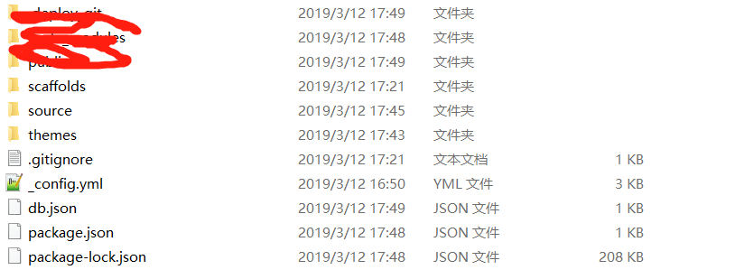
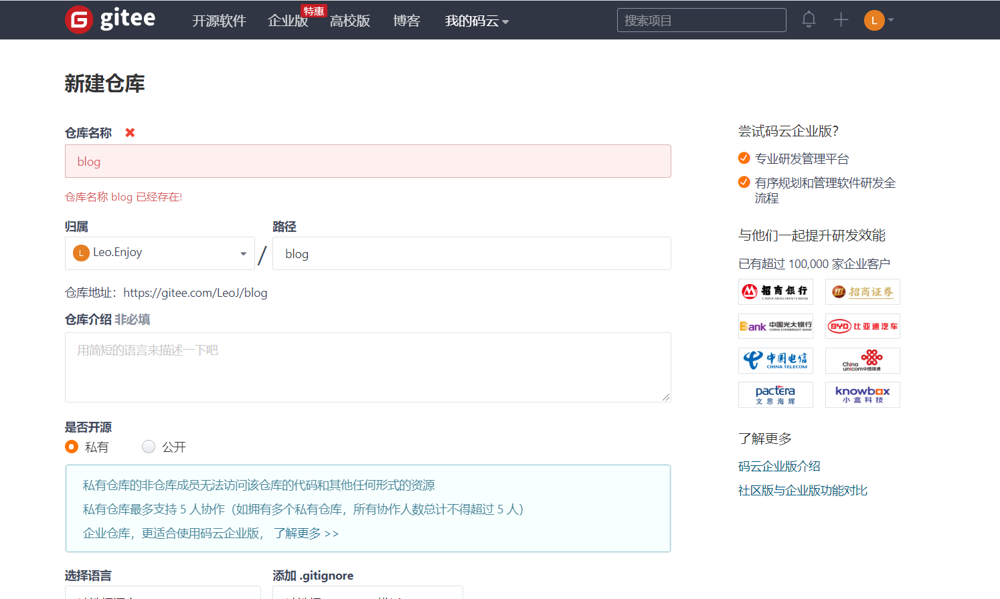
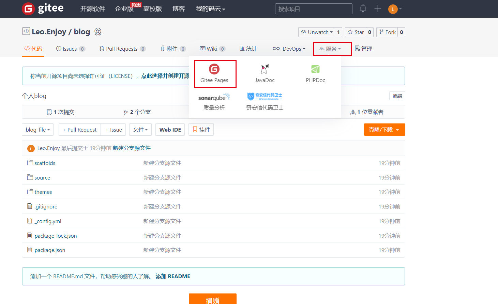
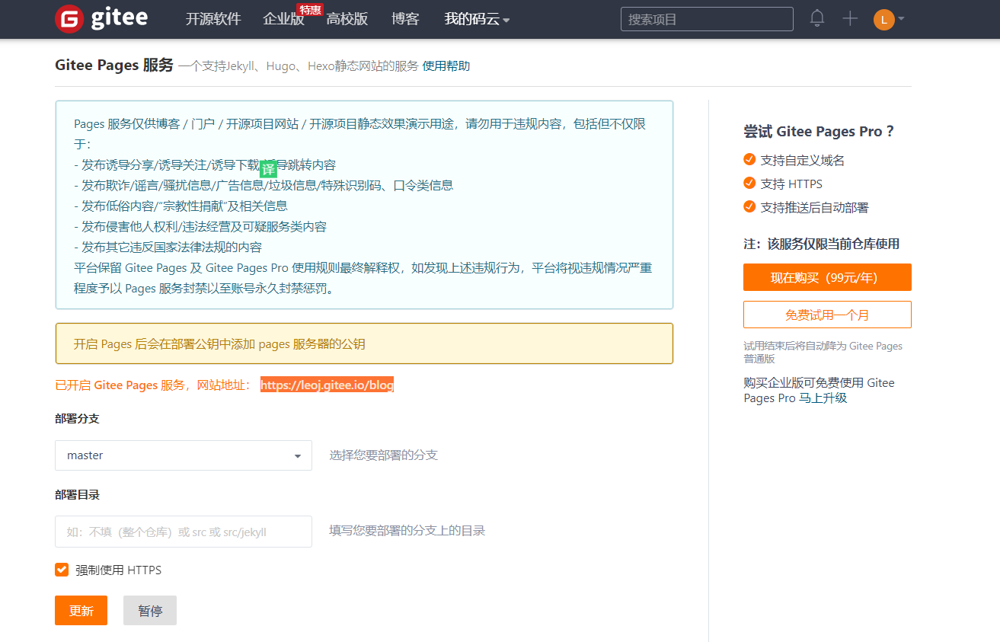

### 介绍

Hexo 是一个非常流行的静态站点生成工具，它可以把 Markdown 文档快速的解析成漂亮的静态页面，支持各种主题，让用户专注在写作上。我们可以使用 Hexo + Github 搭建自己的博客（免费的），还可以绑定自己的域名。

<!--more-->

### 搭建步骤：

1. 安装Git,Node.js,Hexo
2. GitHub创建个人仓库
3. 将hexo部署到GitHub
4. 发布文章

#### 1.安装Git,Node.js,Hexo

##### windows

安装Git：win下载地址https://git-scm.com/download/win 
一路next, 安装后，注册 Github 账号，配置 SSH, 如果需要了解这方面的知识自行百度
•打开 Git Bash,本地生成公钥私钥  ssh-keygen -t rsa -C "你的邮件地址"
•添加公钥到 Github 根据上一步的提示，找到公钥文件（默认为id_rsa.pub），用记事本打开，全选并复制。(或许乱码，那就换一种打开方式)
•登录 Github，右上角 头像 -> Settings —> SSH keys —> Add SSH key。把公钥粘贴到key中，填好title并点击 Add key。git bash中输入命令ssh -T git@github.com，选yes，等待片刻可看到成功提示。
安装Node.js   下载地址https://nodejs.org/en/
安装 Hexo : $ npm install -g hexo-cli

##### Centos

```shell
$ sudo yum install git-core
$ curl https://raw.github.com/creationix/nvm/v0.33.11/install.sh | sh
$ wget -qO- https://raw.github.com/creationix/nvm/v0.33.11/install.sh | sh
$ nvm install stable
$ npm install -g hexo-cli
```

##### 创建项目

```shell
# myblog 为空，初始化文件夹 myblog
$ hexo init myblog
$ cd myblog
$ npm install
```


新建Github仓库：仓库名必须为你的Github名.github.io，要不然就不能使用Github Pages服务了。。。

##### 本地预览

相当于 hexo generate,生成的静态站点放在 public 目录下面

```shell
$ hexo g
```

##### 查看目录结构

```shell
$ tree -L 1
.
├── _config.yml  # 网站配置文件
├── db.json
├── node_modules
├── package-lock.json
├── package.json  # 应用程序信息
├── public  # 静态站点存放于此
├── scaffolds  # 模板文件夹，新建文章时会使用此文件夹下的文件作为模板
├── source # 存放用户资源的地方
├── themes  # 主题
```

启动服务，相当于 hexo server，本地预览

```shell
$ hexo s
INFO  Start processing
INFO  Hexo is running at http://localhost:4000/. Press Ctrl+C to stop.
```


#### 2.创建 Github Pages

很多人都使用 [GitHub Pages](https://pages.github.com/) 来搭建博客，原因是它的空间免费而且稳定

在 Github 上[创建](https://github.com/new)一个仓库，名字为 username.github.io，请注意，username 是你 GitHub 的用户名。

#### 3.将hexo部署到GitHub

把 Hexo 生成的静态页面推送到 Github

修改 _config.xml：

```yaml
deploy:
  type: git
  repo: https://github.com/ejeonline/ejeonline.github.io.git
  branch: master
```

执行部署命令

安装插件 **hexo-deployer-git**

```
$ npm install hexo-deployer-git --save
$ hexo d
```

完成之后访问 https://ejeonline.github.io  效果如下


如何绑定自己域名有很多样例 , 可以自己百度

#### 4.发布文章

```shell
# 新建一篇文章,名为 test，默认会放到 source/_posts/ 下。

$ hexo new test
INFO  Created: /Volumes/warehouse/myblog/source/_posts/test.md

# 查看 test.md 

## $ cat source/_posts/test.md

title: test
date: 2018-01-02 19:40:10

## tags:

# 编辑 test.md ，添加 ## 我是用来测试的 

# vim source/_posts/test.md

## $ cat source/_posts/test.md

title: test
date: 2018-01-02 19:40:10
tags:

我是用来测试的

$ hexo g  
$ hexo s  #预览
$ hexo d  #发布
```

效果如下：


### hexo的基本配置，更换主题

#### 基本配置

在文件根目录下的`_config.yml`，就是整个hexo框架的配置文件了。可以在里面修改大部分的配置。下面为[官方的配置](https://hexo.io/zh-cn/docs/configuration)描述。

##### 网站

| 参数          | 描述                                                         |
| ------------- | ------------------------------------------------------------ |
| `title`       | 网站标题                                                     |
| `subtitle`    | 网站副标题                                                   |
| `description` | 网站描述                                                     |
| `author`      | 您的名字                                                     |
| `language`    | 网站使用的语言                                               |
| `timezone`    | 网站时区。Hexo 默认使用您电脑的时区。[时区列表](https://en.wikipedia.org/wiki/List_of_tz_database_time_zones)。比如说：`America/New_York`, `Japan`, 和 `UTC` 。 |

其中，`description`主要用于SEO，告诉搜索引擎一个关于您站点的简单描述，通常建议在其中包含您网站的关键词。`author`参数用于主题显示文章的作者。

##### 网址

| 参数                 | 描述                                                         | 默认值                      |
| -------------------- | ------------------------------------------------------------ | --------------------------- |
| `url`                | 网址                                                         |                             |
| `root`               | 网站根目录                                                   |                             |
| `permalink`          | 文章的 [永久链接](https://hexo.io/zh-cn/docs/permalinks) 格式 | `:year/:month/:day/:title/` |
| `permalink_defaults` | 永久链接中各部分的默认值                                     |                             |

> 网站存放在子目录
>
> 如果您的网站存放在子目录中，例如 `http://yoursite.com/blog`，则请将您的 `url` 设为 `http://yoursite.com/blog` 并把 `root` 设为 `/blog/`。

##### 目录

| 参数           | 描述                                                         | 默认值           |
| -------------- | ------------------------------------------------------------ | ---------------- |
| `source_dir`   | 资源文件夹，这个文件夹用来存放内容。                         | `source`         |
| `public_dir`   | 公共文件夹，这个文件夹用于存放生成的站点文件。               | `public`         |
| `tag_dir`      | 标签文件夹                                                   | `tags`           |
| `archive_dir`  | 归档文件夹                                                   | `archives`       |
| `category_dir` | 分类文件夹                                                   | `categories`     |
| `code_dir`     | Include code 文件夹                                          | `downloads/code` |
| `i18n_dir`     | 国际化（i18n）文件夹                                         | `:lang`          |
| `skip_render`  | 跳过指定文件的渲染，您可使用 [glob 表达式](https://github.com/isaacs/node-glob)来匹配路径。 |                  |

> 提示
>
> 如果您刚刚开始接触Hexo，通常没有必要修改这一部分的值。

##### 文章

| 参数                | 描述                                                         | 默认值    |
| ------------------- | ------------------------------------------------------------ | --------- |
| `new_post_name`     | 新文章的文件名称                                             | :title.md |
| `default_layout`    | 预设布局                                                     | post      |
| `auto_spacing`      | 在中文和英文之间加入空格                                     | false     |
| `titlecase`         | 把标题转换为 title case                                      | false     |
| `external_link`     | 在新标签中打开链接                                           | true      |
| `filename_case`     | 把文件名称转换为 (1) 小写或 (2) 大写                         | 0         |
| `render_drafts`     | 显示草稿                                                     | false     |
| `post_asset_folder` | 启动 [Asset 文件夹](https://hexo.io/zh-cn/docs/asset-folders) | false     |
| `relative_link`     | 把链接改为与根目录的相对位址                                 | false     |
| `future`            | 显示未来的文章                                               | true      |
| `highlight`         | 代码块的设置                                                 |           |

> 相对地址
>
> 默认情况下，Hexo生成的超链接都是绝对地址。例如，如果您的网站域名为`example.com`,您有一篇文章名为`hello`，那么绝对链接可能像这样：`http://example.com/hello.html`，它是**绝对**于域名的。相对链接像这样：`/hello.html`，也就是说，无论用什么域名访问该站点，都没有关系，这在进行反向代理时可能用到。通常情况下，建议使用绝对地址。

##### 分类 & 标签

| 参数               | 描述     | 默认值          |
| ------------------ | -------- | --------------- |
| `default_category` | 默认分类 | `uncategorized` |
| `category_map`     | 分类别名 |                 |
| `tag_map`          | 标签别名 |                 |

##### 日期 / 时间格式

Hexo 使用 [Moment.js](http://momentjs.com/) 来解析和显示时间。

| 参数          | 描述     | 默认值       |
| ------------- | -------- | ------------ |
| `date_format` | 日期格式 | `YYYY-MM-DD` |
| `time_format` | 时间格式 | `H:mm:ss`    |

##### 分页

| 参数             | 描述                                | 默认值 |
| ---------------- | ----------------------------------- | ------ |
| `per_page`       | 每页显示的文章量 (0 = 关闭分页功能) | `10`   |
| `pagination_dir` | 分页目录                            | `page` |

##### 扩展

| 参数     | 描述                                |
| -------- | ----------------------------------- |
| `theme`  | 当前主题名称。值为`false`时禁用主题 |
| `deploy` | 部署部分的设置                      |

#### Front-matter

新建文件之后 文件的基本格式包含 Front-matter部分 , 就是文件最上方以 `---` 分隔的区域，用于指定个别文件的变量，举例来说：

```
---
title: Hello World
date: 2019/03/12 16:26:09
---
```

下面是一些预先定义的参数，您可在模板中使用这些参数值并加以利用。

> 参数	描述
> layout	布局
> title	标题
> date	建立日期
> updated	更新日期
> comments	开启文章的评论功能
> tags	标签（不适用于分页）
> categories	分类（不适用于分页）
> permalink	覆盖文章网址

#### layout（布局）

当你每一次使用代码

```
hexo new paper
```

它其实默认使用的是post这个布局，也就是在source文件夹下的_post里面。

Hexo 有三种默认布局：post、page 和 draft，它们分别对应不同的路径，而您自定义的其他布局和 post 相同，都将储存到 source/_posts 文件夹。

```
布局	路径
post	source/_posts
page	source
draft	source/_drafts
```

而new这个命令其实是：

```
hexo new [layout] <标题>
```

只不过这个layout默认是post罢了。

page
如果你想另起一页，那么可以使用

```
hexo new page board
```

系统会自动给你在source文件夹下创建一个board文件夹，以及board文件夹中的index.md，这样你访问的board对应的链接就是http://xxx.xxx/board

draft
draft是草稿的意思，也就是你如果想写文章，又不希望被看到，那么可以

```
hexo new draft newpage
```

这样会在source/_draft中新建一个newpage.md文件，如果草稿文件写的过程中，想要预览一下，那么可以使用

```
hexo server --draft
```

在本地端口中开启服务预览。

如果你的草稿文件写完了，想要发表到post中，

```
hexo publish draft newpage
```

就会自动把newpage.md发送到post中。

#### 更换主题

官方主题地址 https://hexo.io/themes/

我选的是**maupassant** 理由是简洁,使用方便,耐看,觉得不好看来怼我    

github地址是 https://github.com/tufu9441/maupassant-hexo


使用极其方便 跟着向导走就可以  https://www.haomwei.com/technology/maupassant-hexo.html

防止以后找不到 自己记一下 主目录执行

```shell
$ git clone https://github.com/tufu9441/maupassant-hexo.git themes/maupassant
$ npm install hexo-renderer-pug --save
$ npm install hexo-renderer-sass --save
```

编辑Hexo目录下的 `_config.yml`，将`theme`的值改为`maupassant`。

注：若`npm install hexo-renderer-sass`安装时报错，可能是国内网络问题，请尝试使用代理或者切换至[淘宝NPM镜像](http://npm.taobao.org/)安装，感谢光头强提供的[方法](http://www.rockcoding.com/2016/03/02/hexo/)。

#### 主题配置说明

- fancybox - 是否启用[Fancybox](http://fancyapps.com/fancybox/)图片灯箱效果
- disqus - [Disqus评论](https://disqus.com/) shortnam
- uyan - [友言评论](http://www.uyan.cc/) id
- livere - [来必力评论](https://livere.com/) data-uid
- changyan - [畅言评论](http://changyan.kuaizhan.com/) appid
- gitment - [Gitment评论](https://github.com/imsun/gitment)相关参数
- gitalk - [Gitalk评论](https://github.com/gitalk/gitalk)相关参数
- valine - [Valine评论](https://valine.js.org/)相关参数
- google_search - 默认使用Google搜索引擎
- baidu_search - 若想使用百度搜索，将其设定为`true`。
- swiftype - [Swiftype](https://swiftype.com/) 站内搜索key
- tinysou - [微搜索](http://tinysou.com/) key
- self_search - 基于jQuery的[本地搜索引擎](http://hahack.com/codes/local-search-engine-for-hexo)，需要安装[hexo-generator-search](https://github.com/PaicHyperionDev/hexo-generator-search)插件使用。
- google_analytics - [Google Analytics](https://www.google.com/analytics/) 跟踪ID
- baidu_analytics - [百度统计](http://tongji.baidu.com/) 跟踪ID
- show_category_count - 是否显示侧边栏分类数目
- toc_number - 是否显示文章中目录列表自动编号
- shareto - 是否使用分享按鈕，需要安装[hexo-helper-qrcode](https://github.com/yscoder/hexo-helper-qrcode)插件使用
- busuanzi - 是否使用[不蒜子](http://busuanzi.ibruce.info/)页面访问计数
- widgets_on_small_screens - 是否在移动设备屏幕底部显示侧边栏
- [canvas_nest](https://github.com/hustcc/canvas-nest.js/blob/master/README-zh.md) - 是否使用canvas动态背景
- donate - 是否启用捐赠按钮
- menu - 自定义页面及菜单，依照已有格式填写。填写后请在`source`目录下建立相应名称的文件夹，并包含`index.md`文件，以正确显示页面。导航菜单中集成了[FontAwesome](http://fontawesome.io/)图标字体，可以在[这里](http://fontawesome.io/icons/)选择新的图标，并按照相关说明使用。
- widgets - 选择和排列希望使用的侧边栏小工具。
- links - 友情链接，请依照格式填写。
- timeline - 网站历史时间线，在页面`front-matter`中设置`layout: timeline`可显示。
- Static files - 静态文件存储路径，方便设置CDN缓存。
- Theme version - 主题版本，便于静态文件更新后刷新CDN缓存。

##### 添加页面

在`source`目录下建立相应名称的文件夹，然后在文件夹中建立`index.md`文件，并在`index.md`的`front-matter`中设置layout为`layout: page`。若需要单栏页面，就将layout设置为 `layout: single-column`。

##### 文章目录

在文章的`front-matter`中添加`toc: true`即可让该篇文章显示目录。

##### 文章评论

文章和页面的评论功能可以通过在`front-matter`中设置`comments: true`或`comments: false`来进行开启或关闭（默认开启）。

##### 语法高亮

要启用代码高亮，请在Hexo目录的`_config.yml`中将`highlight`选项按照如下设置：

```yaml
highlight:
  enable: true
  auto_detect: true
  line_number: true
  tab_replace:
```

都配置好之后，使用命令查看效果 

```shell
hexo clean
hexo g
hexo s
```

 美滋滋...

### 更换电脑发布博客方法

你以为这就完了, 先别美滋滋,最关键的地方来了 下班了 ,电脑不想带回去 , 我想更新博客 , 怎么办???  按上面重来一次弄环境 ? 嘿嘿  这时候我看到网上说可以使用github将源文件上传到分支 主干负责美貌美如花可以了 nb 方法  我怎么就想不到呢

具体的思路是：在生成的已经推到github上的hexo静态代码出建立一个分支，利用这个分支来管理自己hexo的源文件。如果能在刚刚配置hexo的时候就想好以后的迁移的问题就太好了，可以省掉很多麻烦，可实际使用中，刚刚配置hexo的时候，好多人都是初学，不会想到以后的问题，我就是这样的。所以说可以先操作这个过程 然后再执行上面的操作

具体的操作：

克隆gitHub上面生成的静态文件到本地

```
git clone https://github.com/ejeonline/ejeonline.github.io.git
```

把克隆到本地的文件除了git的文件都删掉，找不到git的文件的话就到删了吧。不要用`hexo init`初始化。



把上面图中文件复制到这边的文件夹中  

创建一个叫blog_file的分支

```
git checkout -b blog_file
```

提交复制过来的文件到暂存区

```
git add --all
```

提交

```
git commit -m "新建分支源文件"
```

推送分支到github

```
git push --set-upstream origin blog_file
```

到这里基本上就搞定了，以后再推就可以直接`git push`了，hexo的操作跟以前一样。

### Gitee（码云）操作方法

目前国内访问GitHub速度慢，还可能被墙，所以Gitee来构建个人博客。Gitee类似国内版的GitHub，访问速度有保证。注意：gitee绑定域名收费，和github不一样 码云需要使用Gitee Pages 服务进行手动构建。所以想绑定域名的小伙伴推荐使用github+cdn 或者coding

#### 1. 创建Gitee账号

到码云：[https://gitee.com/](https://links.jianshu.com/go?to=https%3A%2F%2Fgitee.com%2F) 上申请注册账号，码云类似国内版的GitHub，所以操作界面跟GitHub差不多，多了一些国产化的东西，这里不做更多介绍了，自己研究下。

#### 2. 创建项目



创建完成后，在项目中复制项目地址。

#### 3. 在_config.yml中配置Git

```go
deploy:
  type: git
  repo: https://gitee.com/LeoJ/blog
  branch: master
```

注意：冒号后面一定要有空格，否则不能正确识别。

#### 4. 发布到Gitee

输入命令`npm install hexo-deployer-git --save` 安装自动部署发布工具
 输入命令`hexo clean && hexo g && hexo d` 发布博客，首次发布需要在shell中输入账号和密码。

#### 5. Gitee Pages设置 

和github不一样 码云需要使用Gitee Pages 服务进行构建，在项目的服务中选择Pages选项



Pages  --> 选择 master分支，点击 部署/更新



部署 稍等一会儿博客就发布成功啦，访问博客地址: https://leoj.gitee.io/blog，就可预览在线博客啦！！！

如果博客的样式不对，则需要在_config.yml中配置下博客地址和路径：

```cpp
url: https://leoj.gitee.io/blog
root: /blog
```

再执行命令`hexo clean && hexo g && hexo d` 就可以了。

个人博客效果参考：https://leoj.gitee.io/blog/


