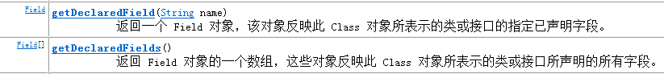
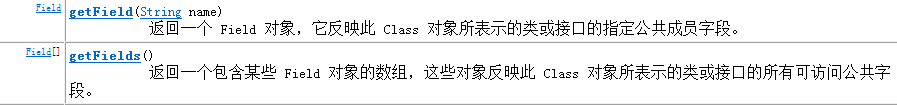
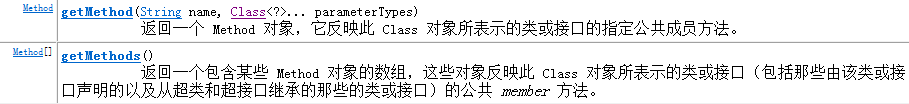

**Java反射原理（使用的前提条件：必须先得到代表的字节码的Class，Class类用于表示.class文件（字节码）） **

<!--more-->

1.将Java文件保存到本地硬盘

2.编译Java文件，生成.class文件

3.使用Java虚拟机（JVM）将字节码文件加载到内存

4.字节码文件在内存中使用Class类表示

5.使用反射的时候，首先获取到Class类，就可以得到class文件里的所有内容，包含属性、构造方法、普通方法

6.属性通过Filed类表示

7.构造方法通过Constructor表示

8.普通方法通过Method表示

即JAVA语言编译之后会生成一个.class文件，反射就是通过字节码文件找到某一个类、类中的方法以及属性等。

#### 1、获取类对象：

通过类名获取Class对象，Class<T> c = Class.forName("类的完全路径");

通过Class对象获取具体的类对象：Object o = (Object) c.newInstance();

#### 2、获取类中的构造方法：


#### 3、获取类中的属性：





#### 4、获取类中的方法：




获取class的三种方式
先定义一个实体类Person：

Package reflex;

public class Person {

```java
//私有属性
private String name = "Tom";
//公有属性
public int age = 18;
//构造方法
public Person() {   
}
//私有方法
private void say(){
    System.out.println("private say()...");
}
//公有方法
public void work(){
    System.out.println("public work()...");
}
```

}

获取class方法

##### 1、对象调用 getClass() 方法来获取,通常应用在：比如你传过来一个 Object

//  类型的对象，而我不知道你具体是什么类，用这种方法

```java
Person p1 = new Person();
Class c1 = p1.getClass();
```

​       

##### 2、类名.class 的方式得到,该方法最为安全可靠，程序性能更高

//  这说明任何一个类都有一个隐含的静态成员变量 class

```java
Class c2 = Person.class;
```

​        

##### 3、通过 Class 对象的 forName() 静态方法来获取，用的最多，

//   但可能抛出 ClassNotFoundException 异常

```java
Class c3 = Class.forName("reflex.Person");
```

需要注意的是：一个类在 JVM 中只会有一个 Class 实例,即我们对上面获取的 c1,c2,c3进行 equals 比较，发现都是true。代码如下：

```java
Class class1 = Person.class;
Person person = new Person();
Class class2= person.getClass();
if(class1.equals(class2)){
    System.out.println("class1.equals(class2)");
}
```


Class具有的部分方法如下：

getName()：获得类的完整名字。

　　getFields()：获得类的public类型的属性。

　　getDeclaredFields()：获得类的所有属性。包括private 声明的和继承类

　　getMethods()：获得类的public类型的方法。

　　getDeclaredMethods()：获得类的所有方法。包括private 声明的和继承类

　　getMethod(String name, Class[] parameterTypes)：获得类的特定方法，name参数指定方法的名字，parameterTypes 参数指定方法的参数类型。

　　getConstructors()：获得类的public类型的构造方法。

　　getConstructor(Class[] parameterTypes)：获得类的特定构造方法，parameterTypes 参数指定构造方法的参数类型。

　　newInstance()：通过类的不带参数的构造方法创建这个类的一个对象。

Class能实现的功能
1判断对象属于哪个类

```java
Person person = new Person();
Class class2= person.getClass();
System.out.println("class2："+class2);
```

输出：class2：class reflect.Person

2获取类信息

```java
Class class1 = Person.class;   
Method[] methods = class1.getMethods();
Method[] declaredMethods = class1.getDeclaredMethods();
Field[] declaredFields = class1.getDeclaredFields();
```

3构建对象

```java
Person person = new Person();
Class class2= person.getClass();
Object o = class2.newInstance();
//强转前先用instanceof判断
if(o instanceof Person){
    ((Person) o).work();
}
```

4动态执行方法

```java
Class class1 = Person.class;
Method work = class1.getDeclaredMethod("work");
Person person = new Person();
work.invoke(person);
```

 


5动态操作属性

```java
Class class1 = Person.class;
Person person = new Person();
Field field = class1.getDeclaredField("age");
```

//age默认值是18

```java
field.set(person,22);
System.out.println(person.age);
```

6动态代理