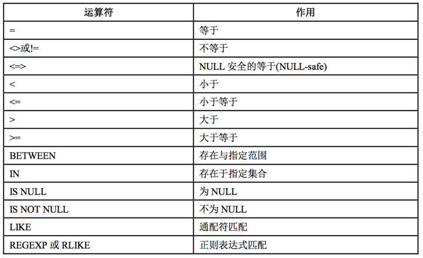

<!--more-->

## 什么是数据库？

数据库（Database）是按照数据结构来组织、存储和管理数据的仓库。

每个数据库都有一个或多个不同的 API 用于创建，访问，管理，搜索和复制所保存的数据。

我们也可以将数据存储在文件中，但是在文件中读写数据速度相对较慢。

所以，现在我们使用关系型数据库管理系统（RDBMS）来存储和管理的大数据量。所谓的关系型数据库，是建立在关系模型基础上的数据库，借助于集合代数等数学概念和方法来处理数据库中的数据。

RDBMS 即关系数据库管理系统(Relational Database Management System)的特点：

- 1.数据以表格的形式出现
- 2.每行为各种记录名称
- 3.每列为记录名称所对应的数据域
- 4.许多的行和列组成一张表单
- 5.若干的表单组成database

## RDBMS 术语

在我们开始学习MySQL 数据库前，让我们先了解下RDBMS的一些术语：

- **数据库:** 数据库是一些关联表的集合。
- **数据表:** 表是数据的矩阵。在一个数据库中的表看起来像一个简单的电子表格。
- **列:** 一列(数据元素) 包含了相同的数据, 例如邮政编码的数据。
- **行：**一行（=元组，或记录）是一组相关的数据，例如一条用户订阅的数据。
- **冗余**：存储两倍数据，冗余降低了性能，但提高了数据的安全性。
- **主键**：主键是唯一的。一个数据表中只能包含一个主键。你可以使用主键来查询数据。
- **外键：**外键用于关联两个表。
- **复合键**：复合键（组合键）将多个列作为一个索引键，一般用于复合索引。
- **索引：**使用索引可快速访问数据库表中的特定信息。索引是对数据库表中一列或多列的值进行排序的一种结构。类似于书籍的目录。
- **参照完整性:** 参照的完整性要求关系中不允许引用不存在的实体。与实体完整性是关系模型必须满足的完整性约束条件，目的是保证数据的一致性。

## MySQL常用命令

1、如何登陆mysql数据库

```
mysql -u username -p
```

1.1、指定IP、端口

```
mysql -uroot -h 192.168.1.213 -P3306 -p123456
```

-P（大写）：指定端口；
-p（小写）：指定密码；

2、如何开启/关闭mysql服务

```
service mysql start/stop
```

3、查看mysql的状态

```
service mysql status
```

4、如何显示数所有数据库

```
show databases
```

5、如何获取表内所有字段对象的名称和类型

```
describe table_name;
```

## SQL分类
SQL全程为Structure Query Language(结构化查询语言)。

SQL 语句主要可以划分为以下 3 个类别：

1、DDL(Data Definition Languages)语句:数据定义语言，这些语句定义了不同的数据段、 数据库、表、列、索引等数据库对象的定义。常用的语句关键字主要包括 create、drop、alter 等。

2、DML(Data Manipulation Language)语句:数据操纵语句，用于添加、删除、更新和查询数据库记录，并检查数据完整性，常用的语句关键字主要包括 insert、delete、update 和 select 等。

3、DCL(Data Control Language)语句:数据控制语句，用于控制不同数据段直接的许可和 访问级别的语句。这些语句定义了数据库、表、字段、用户的访问权限和安全级别。主要的语句关键字包括 grant、revoke 等。

## MySQL支持的数据类型
1、数值类型


常见的数值类型如下：


注：这里的最小值和最大值代表的是宽度。

**对于这几种常见的数值类型，我们应该知道存储的所占的字节，我们还要知道INT最大的长度为10位数字，那么我们设置11为，如：int(11)也是无用的，最多只能为10位数字。TINYINT最大支持3位，那么我们设置tinyint(4)也是无用的。**

2、日期时间类型


上图可以看出，每种日期时间类型都有一个有效值范围，如果超出这个范围，在默认的SQLMode下，系统会进行错误示，并将以零值来进行存储。不同日期类型零值的表示如下：


提示：

（1）日期格式中只有TIMESTAMP 可以使用MySQL提供的函数，实现自动设置时间和自动更新时间，脚本如下：

```
`create_time` timestamp NOT NULL DEFAULT CURRENT_TIMESTAMP COMMENT '创建时间',
`update_time` timestamp NOT NULL DEFAULT CURRENT_TIMESTAMP ON UPDATE CURRENT_TIMESTAMP COMMENT '更新时间',
```

（2）Navicat for MqlSQL设置如下：


（3）、使用TIMESTAMP 要认识到，他会停止在2038年的一个时刻，但MySQL官方应该后期会提供相应的支持。

（4）DATETIME、TIMESTAMP都可以精确到秒，但是TIMESTAMP只占4个字节，因此可以有效考虑使用；

3、字符串类型


1、常见的char和varchar区别：


（1）**char(N)用于存放固定长度的字符串，长度最大为255**，比指定长度大的值将被截断，而比指定长度小的值将会用空格进行填补；

（2）**varchar(N)用于保存可变长度的字符串，长度最大为65535**，只存储字符串实际需要的长度，它会增加一个额外字节来保存字符串本身的长度，varchar使用额外的12字节来存储值得长度，如果列的最大长度小于或等于255，则使用1字节，否则就是使用2字节；（1个字节占8位，2的8次方是256（-128127）；2个字节占16位，2的16次方为65536）

（3）char和varchar跟字符编码也有密切联系，lantin1占用1个字节，gbk占用2个字节，utf8占用3个字节。示例如下：

lantin1、1个字符1个字节：


gbk、1个字符2个字节：


utf8、1个字符3个字节：

2、如何选择char和varchar    只给与真正需要的空间，因为更长的列会消耗更多的内存.

## MySQL数据类型的选择和优化案例

**1、手机号存储**

**使用BIGINT代替CHAR或者VARCHAR存放手机号码。**

这是因为CHAR或者VARCHAR，占用空间大，影响查询性能。
例如：11位手机号CHAR存储，utf8编码，则占用33个字节；
使用如果使用INT的话，INT最大只能保存10为数据，而手机号为11位，会出现溢出，所以使用BIGINT占用8个字节，支持11为数据存储。

## MySQL中的常用运算符

1、算术运算符


2、比较运算符



## MySQL事务

mysql事务可以理解为一系列操作，要么成功执行，要么失败。

1. 原子性（Atomicity）：事务开始后所有操作，要么全部做完，要么全部不做，不可能停滞在中间环节。事务执行过程中出错，会回滚到事务开始前的状态，所有的操作就像没有发生一样。也就是说事务是一个不可分割的整体，就像化学中学过的原子，是物质构成的基本单位。
2. 一致性（Consistency）：事务开始前和结束后，数据库的完整性约束没有被破坏 。比如A向B转账，不可能A扣了钱，B却没收到。
3. 隔离性（Isolation）：同一时间，只允许一个事务请求同一数据，不同的事务之间彼此没有任何干扰。比如A正在从一张银行卡中取钱，在A取钱的过程结束前，B不能向这张卡转账。
4. 持久性（Durability）：事务完成后，事务对数据库的所有更新将被保存到数据库，不能回滚。

### 2. 事务的并发问题

1. 脏读：事务A读取了事务B更新的数据，然后B回滚操作，那么A读取到的数据是脏数据
2. 不可重复读：事务 A 多次读取同一数据，事务 B 在事务A多次读取的过程中，对数据作了更新并提交，导致事务A多次读取同一数据时，结果 不一致。
3. 幻读：系统管理员A将数据库中所有学生的成绩从具体分数改为ABCDE等级，但是系统管理员B就在这个时候插入了一条具体分数的记录，当系统管理员A改结束后发现还有一条记录没有改过来，就好像发生了幻觉一样，这就叫幻读。

　　小结：不可重复读的和幻读很容易混淆，不可重复读侧重于修改，幻读侧重于新增或删除。解决不可重复读的问题只需锁住满足条件的行，解决幻读需要锁表

## MySQL几种表的比较


MyISAM： 节约空间，读取响应速度快,表应用于读的场景比较多，支持FULLTEXT类型的索引

InnoDB： 如果应用程序需要用到事务,使用外键或需要更高的安全性,以及需要允许很多用户同时 修改某个数据表里的数据,则InnoDB数据表更值得考虑。支持行锁（某些情况下还是锁整表，如 update table set a=1 where user like '%lee%'

Memory: 存储在内存中，所以没有持久化。可以用于test中假数据的读写

实例：公司以前的一张表用的是MyISAM，突然有一天这张表不能读写几个小时。公司上下折腾了好久。最后原因是这张表用的是MyISAM，同时正好有人向表中新加入一列，同时进行索引，由于表很大，所以一直在做索引。因此整张表一直处于锁的状态。

## MySQL中的常用函数

1、字符串函数


2、数值函数


3、日期和时间函数


## 常见查看MySQL状态命令

1、查看状态

```
mysql> show status;
```

2、查看可设置的变量

```
mysql> show variables\G;
```

3、查看最大的连接

```
mysql> show variables like '%max_con%';
```

4、查看进程的连接

```
mysql> show full processlist;
```

6、sql执行性能分析命令`explain`

```
explain select * from table;
```

