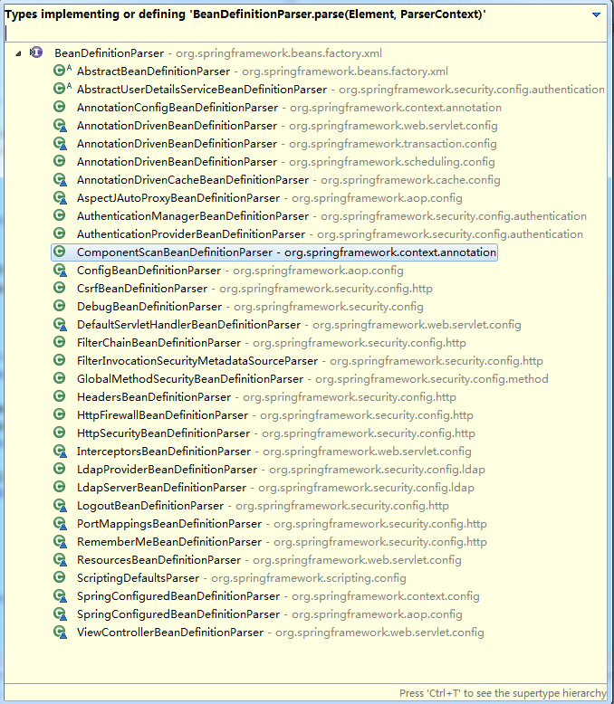

相当长  现在看不懂 以后有机会看一下 转载地址<https://www.cnblogs.com/hjy9420/p/4218140.html>

<!--more-->

使用spring，我们在web.xml都会配置ContextLoaderListener

```xml
  <listener>
    <listener-class>
            org.springframework.web.context.ContextLoaderListener
        </listener-class>
  </listener>
```

```java
public class ContextLoaderListener extends ContextLoader implements ServletContextListener {
//由于他继承自ContextLoader，加载的时候当然会先加载他啦，那我们来看看这个类
}
```

ContextLoader这个类有一段静态代码块

```java
private static final String DEFAULT_STRATEGIES_PATH = "ContextLoader.properties";//这个文件是在org.springframework.web.context.ContextLoader.properties他里面是
org.springframework.web.context.WebApplicationContext=org.springframework.web.context.support.XmlWebApplicationContext //这个后面再研究 以后就会把spring所有重要的东西都能看到了。

private static final Properties defaultStrategies;
static {
    // Load default strategy implementations from properties file.
    // This is currently strictly internal and not meant to be customized
    // by application developers.
    try {
        ClassPathResource resource = new ClassPathResource(DEFAULT_STRATEGIES_PATH, ContextLoader.class);
        defaultStrategies = PropertiesLoaderUtils.loadProperties(resource);//根据上面的properties文件，就能得到一个默认的properties了。
    }
    catch (IOException ex) {
        throw new IllegalStateException("Could not load 'ContextLoader.properties': " + ex.getMessage());
    }
}
```
第一步：我们在看看ContextLoaderListener的这个方法，在容器启动的时候，他会扫描web.xml的listener配置，然后自动调用Listener的contextInitialized初始化方法。

```java
public void contextInitialized(ServletContextEvent event) {
    this.contextLoader = createContextLoader();
    if (this.contextLoader == null) {
        this.contextLoader = this;
    }
    this.contextLoader.initWebApplicationContext(event.getServletContext());
}
```

 第二步：initWebApplicationContext初始化web应用上下文

```java
public WebApplicationContext initWebApplicationContext(ServletContext servletContext) {
        if (servletContext.getAttribute(WebApplicationContext.ROOT_WEB_APPLICATION_CONTEXT_ATTRIBUTE) != null) 		{
            throw new IllegalStateException("Cannot initialize context because there is already a root application context present - " + "check whether you have multiple ContextLoader* definitions in your web.xml!");
        }
        Log logger = LogFactory.getLog(ContextLoader.class);
        servletContext.log("Initializing Spring root WebApplicationContext");
        if (logger.isInfoEnabled()) {
            logger.info("Root WebApplicationContext: initialization started");
        }
        long startTime = System.currentTimeMillis();

        try {
            // Store context in local instance variable, to guarantee that
            // it is available on ServletContext shutdown.
            if (this.context == null) {
                this.context = createWebApplicationContext(servletContext);
                //判断是否有WebApplicationContext，没有则创建，创建得到的是ConfigurableWebApplicationContext
            }
            if (this.context instanceof ConfigurableWebApplicationContext) {
                ConfigurableWebApplicationContext cwac = (ConfigurableWebApplicationContext) this.context;
                if (!cwac.isActive()) {  //上下文尚未活动
                    // The context has not yet been refreshed -> provide services such as
                    // setting the parent context, setting the application context id, etc
                    if (cwac.getParent() == null) {
                        // The context instance was injected without an explicit parent ->
                        // determine parent for root web application context, if any.
                        ApplicationContext parent = loadParentContext(servletContext);
                       //决定根Web应用程序环境是否存在父应用程序环境，一般是返回null
                        cwac.setParent(parent);
                    }
                    configureAndRefreshWebApplicationContext(cwac, servletContext);
                    //在这里是初始化web应用上下文的入口 ,spring的依赖注入也从这里开始了。
                }
            } 																	         servletContext.setAttribute(WebApplicationContext.ROOT_WEB_APPLICATION_CONTEXT_ATTRIBUTE, this.context);
            //把创建的根Web应用程序环境保存到Servlet环境中，每个派遣器Servlet加载的子环境会应用这个环境作为父环境    

            ClassLoader ccl = Thread.currentThread().getContextClassLoader();
            //取得线程的类加载器
            if (ccl == ContextLoader.class.getClassLoader()) {
                currentContext = this.context;
                //如果线程和本类拥有相同的类加载器，则使用静态变量保存即可，因为同一类加载器加载同一份静态变量    
            }
            else if (ccl != null) {
                currentContextPerThread.put(ccl, this.context);
                //如果线程和本类拥有不同的类加载器，则使用线程的类加载器作为键值保存在一个映射对象里，保证析构时能拿到Web应用程序环境进行关闭操作
            }
            if (logger.isDebugEnabled()) {
                logger.debug("Published root WebApplicationContext as ServletContext attribute with name [" +WebApplicationContext.ROOT_WEB_APPLICATION_CONTEXT_ATTRIBUTE + "]");
            }
            if (logger.isInfoEnabled()) {
                long elapsedTime = System.currentTimeMillis() - startTime;
                logger.info("Root WebApplicationContext: initialization completed in " + elapsedTime + " ms");
            }
            return this.context;
        }
        catch (RuntimeException ex) {
            logger.error("Context initialization failed", ex); servletContext.setAttribute(WebApplicationContext.ROOT_WEB_APPLICATION_CONTEXT_ATTRIBUTE, ex);
            //如果产生任何异常，则保存异常对象到Servlet环境里 
            throw ex;
        }
        catch (Error err) {
            logger.error("Context initialization failed", err); servletContext.setAttribute(WebApplicationContext.ROOT_WEB_APPLICATION_CONTEXT_ATTRIBUTE, err);
            //如果产生任何错误，则保存错误对象到Servlet环境里
            throw err;
        }
    }
```
第三步：得到具体的应用上下文

```java
public static final String CONTEXT_CLASS_PARAM = "contextClass";

private static final String DEFAULT_STRATEGIES_PATH = "ContextLoader.properties";

private static final Properties defaultStrategies;

//这个静态代码块，会去加载相同目录下的ContextLoader.properties，这个目录是org.springframework.web.context，这个配置文件的配置信息就只有org.springframework.web.context.WebApplicationContext=org.springframework.web.context.support.XmlWebApplicationContext
    static {
        // Load default strategy implementations from properties file.
        // This is currently strictly internal and not meant to be customized
        // by application developers.
        try {
            ClassPathResource resource = new ClassPathResource(DEFAULT_STRATEGIES_PATH, ContextLoader.class);
            defaultStrategies = PropertiesLoaderUtils.loadProperties(resource);
        }
        catch (IOException ex) {
            throw new IllegalStateException("Could not load 'ContextLoader.properties': " + ex.getMessage());
        }
}

protected WebApplicationContext createWebApplicationContext(ServletContext sc) {
        Class<?> contextClass = determineContextClass(sc);//决定要得到哪个ContextClass
        if (!ConfigurableWebApplicationContext.class.isAssignableFrom(contextClass)) {
            throw new ApplicationContextException("Custom context class [" + contextClass.getName() + "] is not of type [" + ConfigurableWebApplicationContext.class.getName() + "]");
        }
        return (ConfigurableWebApplicationContext) BeanUtils.instantiateClass(contextClass);   //实例化Web应用程序环境类 
}  
protected Class<?> determineContextClass(ServletContext servletContext) {
        String contextClassName = servletContext.getInitParameter(CONTEXT_CLASS_PARAM);//获取web.xml配置的contextClass
        if (contextClassName != null) {//配置了contextClass,返回具体的Class
            try {
                return ClassUtils.forName(contextClassName, ClassUtils.getDefaultClassLoader());
            }
            catch (ClassNotFoundException ex) {
                throw new ApplicationContextException(
                        "Failed to load custom context class [" + contextClassName + "]", ex);
            }
        }
        else {
            contextClassName = defaultStrategies.getProperty(WebApplicationContext.class.getName());//在上面的静态代码块中已经加载了XmlWebApplicationContext，返回的是XmlWebApplicationContext的全路径名：org.springframework.web.context.support.XmlWebApplicationContext
            try {
                return ClassUtils.forName(contextClassName, ContextLoader.class.getClassLoader());//没有配置contextClass,则通过配置文件，返回了XmlWebApplicationContext的class
            }
            catch (ClassNotFoundException ex) {
                throw new ApplicationContextException(
                        "Failed to load default context class [" + contextClassName + "]", ex);
            }
        }
}
```

第四步：用于封装ApplicationContext数据并且初始化所有相关Bean对象。它会从web.xml中读取名为contextConfigLocation的配置，这就是spring xml数据源设置，然后放到ApplicationContext中，最后调用传说中的refresh方法执行所有Java对象的创建。

public static final String CONFIG_LOCATION_PARAM = "contextConfigLocation";  在wen.xml中配置的位置
    
```java
protected void configureAndRefreshWebApplicationContext(ConfigurableWebApplicationContext wac, ServletContext sc) {
    if (ObjectUtils.identityToString(wac).equals(wac.getId())) {
        // The application context id is still set to its original default value
        // -> assign a more useful id based on available information
        String idParam = sc.getInitParameter(CONTEXT_ID_PARAM);
        //设置Web应用程序环境的ID  
        if (idParam != null) {
            wac.setId(idParam);
        }
        else {
            // Generate default id...
             //如果 Servlet规范 <= 2.4，则使用web.xml里定义的应用程序名字定义Web应用程序名
            if (sc.getMajorVersion() == 2 && sc.getMinorVersion() < 5) {
                // Servlet <= 2.4: resort to name specified in web.xml, if any.
                wac.setId(ConfigurableWebApplicationContext.APPLICATION_CONTEXT_ID_PREFIX +
                        ObjectUtils.getDisplayString(sc.getServletContextName()));
            }
            else {
            // 如果Servlet规范是 2.5， 则使用配置的ContextPath定义Web应用程序名 
                wac.setId(ConfigurableWebApplicationContext.APPLICATION_CONTEXT_ID_PREFIX +
                        ObjectUtils.getDisplayString(sc.getContextPath()));
            }
        }
    }
    //保存Servlet环境    
    wac.setServletContext(sc);
    String initParameter = sc.getInitParameter(CONFIG_LOCATION_PARAM);//这里得到"contextConfigLocation"配置的值:classpath*:spring-config.xml,
    if (initParameter != null) {
        wac.setConfigLocation(initParameter);//设置保存ConfigLocation，待后面加载的时候，扫描里面的配置
    }
    customizeContext(sc, wac);//提供子类可互换Web应用程序环境的机会 占位符方法  
    wac.refresh();//刷新Web应用程序环境以加载Bean定义,这里才是把我们XML里定义的bean放入容器的时候  
}
```

  "contextConfigLocation"在web.xml的配置

```xml
<context-param>
     <param-name>contextConfigLocation</param-name>
    <param-value>classpath*:spring-config.xml</param-value>
</context-param>
```

第五步：bean的注入

```java
public void refresh() throws BeansException, IllegalStateException {
        synchronized (this.startupShutdownMonitor) {
            // Prepare this context for refreshing.
            prepareRefresh();

            // Tell the subclass to refresh the internal bean factory.
            ConfigurableListableBeanFactory beanFactory = obtainFreshBeanFactory();//告诉子类刷新内部bean工厂。

            // Prepare the bean factory for use in this context.
            prepareBeanFactory(beanFactory);//准备bean工厂给上下文使用

            try {
                // Allows post-processing of the bean factory in context subclasses.
                postProcessBeanFactory(beanFactory);//允许在上下文后处理bean工厂的子类

                // Invoke factory processors registered as beans in the context.
                invokeBeanFactoryPostProcessors(beanFactory);//调用处理器工厂注册的bean上下文

                // Register bean processors that intercept bean creation.
                registerBeanPostProcessors(beanFactory);注册bean拦截器拦截bean的创建

                // Initialize message source for this context.
                initMessageSource();//给上下文初始化消息来源

                // Initialize event multicaster for this context.
                initApplicationEventMulticaster();//给上下文初始化事件多播

                // Initialize other special beans in specific context subclasses.//在特定上下文初始化其他特殊bean子类
                onRefresh();

                // Check for listener beans and register them.
                registerListeners();//检查监听器bean并注册他们

                // Instantiate all remaining (non-lazy-init) singletons.
                finishBeanFactoryInitialization(beanFactory);//实例化所有剩余(non-lazy-init)单例对象

                // Last step: publish corresponding event.
                finishRefresh();//发布相应的事件
            }

            catch (BeansException ex) {
                // Destroy already created singletons to avoid dangling resources.
                destroyBeans();//销毁已经创建的单例，避免悬挂的资源

                // Reset 'active' flag.
                cancelRefresh(ex);//重置“活跃”标志

                // Propagate exception to caller.
                throw ex;
            }
        }
    }
```

第六步:

```java
public abstract class AbstractApplicationContext extends DefaultResourceLoader
        implements ConfigurableApplicationContext, DisposableBean {

protected ConfigurableListableBeanFactory obtainFreshBeanFactory() {
        refreshBeanFactory();//具体实现调用子类容器的refreshBeanFactory()方法 
        ConfigurableListableBeanFactory beanFactory = getBeanFactory();
        if (logger.isDebugEnabled()) {
            logger.debug("Bean factory for " + getDisplayName() + ": " + beanFactory);
        }
        return beanFactory;
    }

...

protected abstract void refreshBeanFactory() throws BeansException, IllegalStateException;    
}
```

第七步：

```java
public abstract class AbstractRefreshableApplicationContext extends AbstractApplicationContext {

/** Bean factory for this context */
    private DefaultListableBeanFactory beanFactory;

    protected final void refreshBeanFactory() throws BeansException {
        //如果已经有beanfactory了，则销毁所有的bean,关闭beanfactory
        if (hasBeanFactory()) {  
            destroyBeans();
            closeBeanFactory();
        }
        try {
            //得到一个默认的DefaultListableBeanFactory
            DefaultListableBeanFactory beanFactory = createBeanFactory();
            beanFactory.setSerializationId(getId());
            //对IoC容器进行定制化，如设置启动参数，开启注解的自动装配等 
            customizeBeanFactory(beanFactory);
            //调用载入Bean定义的方法，主要这里又使用了一个委派模式，在当前类中只定义了抽象的loadBeanDefinitions方法，具体的实现调用子类容器  
            loadBeanDefinitions(beanFactory);
            synchronized (this.beanFactoryMonitor) {
                this.beanFactory = beanFactory;
            }
        }
        catch (IOException ex) {
            throw new ApplicationContextException("I/O error parsing bean definition source for " + getDisplayName(), ex);
        }
    }
    
    //创建beanfactory
    protected DefaultListableBeanFactory createBeanFactory() {
        return new DefaultListableBeanFactory(getInternalParentBeanFactory());
    }
    
    ...

    protected abstract void loadBeanDefinitions(DefaultListableBeanFactory beanFactory)
            throws BeansException, IOException;
    
}
```

第八步：

```java
public class XmlWebApplicationContext extends AbstractRefreshableWebApplicationContext {


    /** Default config location for the root context */
    public static final String DEFAULT_CONFIG_LOCATION = "/WEB-INF/applicationContext.xml";

    /** Default prefix for building a config location for a namespace */
    public static final String DEFAULT_CONFIG_LOCATION_PREFIX = "/WEB-INF/";

    /** Default suffix for building a config location for a namespace */
    public static final String DEFAULT_CONFIG_LOCATION_SUFFIX = ".xml";
    
    @Override
    protected void loadBeanDefinitions(DefaultListableBeanFactory beanFactory) throws BeansException, IOException {
        // Create a new XmlBeanDefinitionReader for the given BeanFactory.
         //创建XmlBeanDefinitionReader，即创建Bean读取器，并通过回调设置到容器中去，容器使用该读取器读取Bean定义资源  
        XmlBeanDefinitionReader beanDefinitionReader = new XmlBeanDefinitionReader(beanFactory);

        // Configure the bean definition reader with this context's
        // resource loading environment.
        //设置环境
        beanDefinitionReader.setEnvironment(this.getEnvironment());
        //为Bean读取器设置Spring资源加载器，AbstractXmlApplicationContext的祖先父类AbstractApplicationContext，他继承DefaultResourceLoader，因此容器本身也是一个资源加载器  
        beanDefinitionReader.setResourceLoader(this);
        //为Bean读取器设置SAX xml解析器 
        beanDefinitionReader.setEntityResolver(new ResourceEntityResolver(this));

        // Allow a subclass to provide custom initialization of the reader,
        // then proceed with actually loading the bean definitions.
        //当Bean读取器读取Bean定义的Xml资源文件时，启用Xml的校验机制 
        initBeanDefinitionReader(beanDefinitionReader);
        //Bean读取器真正实现加载的方法 
        loadBeanDefinitions(beanDefinitionReader);
    }
    ...
    protected void loadBeanDefinitions(XmlBeanDefinitionReader reader) throws IOException {
        //获取配置资源的定位 
        String[] configLocations = getConfigLocations();
        if (configLocations != null) {
            for (String configLocation : configLocations) {
            //XmlBean读取器调用其父类AbstractBeanDefinitionReader读取定位的Bean定义资源  
                reader.loadBeanDefinitions(configLocation);
            }
        }
    }
    
}
```

第九步：

```java
public abstract class AbstractBeanDefinitionReader implements EnvironmentCapable, BeanDefinitionReader {


//从指定的资源加载bean定义，返回bean定义的数量
public int loadBeanDefinitions(String location, Set<Resource> actualResources) throws BeanDefinitionStoreException {
        ResourceLoader resourceLoader = getResourceLoader();//得到资源加载器
        if (resourceLoader == null) {
            throw new BeanDefinitionStoreException(
                    "Cannot import bean definitions from location [" + location + "]: no ResourceLoader available");
        }

        if (resourceLoader instanceof ResourcePatternResolver) {
            // Resource pattern matching available.
            try {
                Resource[] resources = ((ResourcePatternResolver) resourceLoader).getResources(location);
                int loadCount = loadBeanDefinitions(resources);//得到加载bean定义的数量，而且在这里将bean定义注入进了spring容器中
                if (actualResources != null) {
                    for (Resource resource : resources) {
                        actualResources.add(resource);
                    }
                }
                if (logger.isDebugEnabled()) {
                    logger.debug("Loaded " + loadCount + " bean definitions from location pattern [" + location + "]");
                }
                return loadCount;
            }
            catch (IOException ex) {
                throw new BeanDefinitionStoreException(
                        "Could not resolve bean definition resource pattern [" + location + "]", ex);
            }
        }
        else {
            // Can only load single resources by absolute URL.
            Resource resource = resourceLoader.getResource(location);
            int loadCount = loadBeanDefinitions(resource);
            if (actualResources != null) {
                actualResources.add(resource);
            }
            if (logger.isDebugEnabled()) {
                logger.debug("Loaded " + loadCount + " bean definitions from location [" + location + "]");
            }
            return loadCount;
        }
    }

    
    public int loadBeanDefinitions(Resource... resources) throws BeanDefinitionStoreException {
        Assert.notNull(resources, "Resource array must not be null");
        int counter = 0;
        for (Resource resource : resources) {
            counter += loadBeanDefinitions(resource);//加载不同的资源类型，使用不同的具体子类来加载，这里使用的是xml。所以他的子类是XmlBeanDefinitionReader，还有一个子类是PropertiesBeanDefinitionReader
        }
        return counter;
    }
    
}
```

第十步：

```java
public class XmlBeanDefinitionReader extends AbstractBeanDefinitionReader {

    /**
     * Load bean definitions from the specified XML file.
     * @param resource the resource descriptor for the XML file
     * @return the number of bean definitions found
     * @throws BeanDefinitionStoreException in case of loading or parsing errors
     */
     //这里是调用的入口
    public int loadBeanDefinitions(Resource resource) throws BeanDefinitionStoreException {
        return loadBeanDefinitions(new EncodedResource(resource));
    }

    /**
     * Load bean definitions from the specified XML file.
     * @param encodedResource the resource descriptor for the XML file,
     * allowing to specify an encoding to use for parsing the file
     * @return the number of bean definitions found
     * @throws BeanDefinitionStoreException in case of loading or parsing errors
     */
     //这里是载入XML形式的BeanDefinition的地方
    public int loadBeanDefinitions(EncodedResource encodedResource) throws BeanDefinitionStoreException {
        Assert.notNull(encodedResource, "EncodedResource must not be null");
        if (logger.isInfoEnabled()) {
            logger.info("Loading XML bean definitions from " + encodedResource.getResource());
        }

        Set<EncodedResource> currentResources = this.resourcesCurrentlyBeingLoaded.get();
        if (currentResources == null) {
            currentResources = new HashSet<EncodedResource>(4);
            this.resourcesCurrentlyBeingLoaded.set(currentResources);
        }
        if (!currentResources.add(encodedResource)) {
            throw new BeanDefinitionStoreException(
                    "Detected cyclic loading of " + encodedResource + " - check your import definitions!");
        }
        try {
            //这里得到XML文件，并得到IO的InputStream准备进行读取
            InputStream inputStream = encodedResource.getResource().getInputStream();
            try {
                InputSource inputSource = new InputSource(inputStream);
                if (encodedResource.getEncoding() != null) {
                    inputSource.setEncoding(encodedResource.getEncoding());
                }
                return doLoadBeanDefinitions(inputSource, encodedResource.getResource());
            }
            finally {
                inputStream.close();
            }
        }
        catch (IOException ex) {
            throw new BeanDefinitionStoreException(
                    "IOException parsing XML document from " + encodedResource.getResource(), ex);
        }
        finally {
            currentResources.remove(encodedResource);
            if (currentResources.isEmpty()) {
                this.resourcesCurrentlyBeingLoaded.remove();
            }
        }
    }
    
    
    ...
}
```

第十一步：

```java
/**
     * Actually load bean definitions from the specified XML file.
     * @param inputSource the SAX InputSource to read from
     * @param resource the resource descriptor for the XML file
     * @return the number of bean definitions found
     * @throws BeanDefinitionStoreException in case of loading or parsing errors
     */
     //具体的读取过程。这是从特定的XML文件中实际载入的BeanDefinition的地方
    protected int doLoadBeanDefinitions(InputSource inputSource, Resource resource)
            throws BeanDefinitionStoreException {
        try {
            int validationMode = getValidationModeForResource(resource);
            //取得XML文件的Document对象，这个解析过程由DocumentLoader完成，这个DocumentLoader是DefaultDocumentLoader,在定义DocumentLoader的地方创建
            Document doc = this.documentLoader.loadDocument(
                    inputSource, getEntityResolver(), this.errorHandler, validationMode, isNamespaceAware());
            //启动对BeanDefinition解析的详细过程，这个解析会使用到Spring的Bean配置规则。
            return registerBeanDefinitions(doc, resource);
        }
        catch (BeanDefinitionStoreException ex) {
            throw ex;
        }
        catch (SAXParseException ex) {
            throw new XmlBeanDefinitionStoreException(resource.getDescription(),
                    "Line " + ex.getLineNumber() + " in XML document from " + resource + " is invalid", ex);
        }
        catch (SAXException ex) {
            throw new XmlBeanDefinitionStoreException(resource.getDescription(),
                    "XML document from " + resource + " is invalid", ex);
        }
        catch (ParserConfigurationException ex) {
            throw new BeanDefinitionStoreException(resource.getDescription(),
                    "Parser configuration exception parsing XML from " + resource, ex);
        }
        catch (IOException ex) {
            throw new BeanDefinitionStoreException(resource.getDescription(),
                    "IOException parsing XML document from " + resource, ex);
        }
        catch (Throwable ex) {
            throw new BeanDefinitionStoreException(resource.getDescription(),
                    "Unexpected exception parsing XML document from " + resource, ex);
        }
    }
```

第十二步：

```java
public class XmlBeanDefinitionReader extends AbstractBeanDefinitionReader {

    public int registerBeanDefinitions(Document doc, Resource resource) throws BeanDefinitionStoreException {
        //这里得到BeanDefinitionDocumentReader来对XML的BeanDefinition进行解析
        BeanDefinitionDocumentReader documentReader = createBeanDefinitionDocumentReader();
        documentReader.setEnvironment(this.getEnvironment());
        //根据通用的XML进行解析，并没有根据Spring的Bean规则
        int countBefore = getRegistry().getBeanDefinitionCount();
        //具体的解析过程在这个registerBeanDefinitions中完成,这里是按照Spring的Bean规则进行解析
        documentReader.registerBeanDefinitions(doc, createReaderContext(resource));
        //总的Bean减去通用的，剩下就是spring的bean规则的bean个数
        return getRegistry().getBeanDefinitionCount() - countBefore;
    }

    
        /**
     * Create the {@link BeanDefinitionDocumentReader} to use for actually
     * reading bean definitions from an XML document.
     * <p>The default implementation instantiates the specified "documentReaderClass".
     * @see #setDocumentReaderClass
     */
     //创建BeanDefinitionDocumentReader
    protected BeanDefinitionDocumentReader createBeanDefinitionDocumentReader() {
        return BeanDefinitionDocumentReader.class.cast(BeanUtils.instantiateClass(this.documentReaderClass));
    }
    
}
```

第十三步：

```java
public class DefaultBeanDefinitionDocumentReader implements BeanDefinitionDocumentReader {


    /**
     * {@inheritDoc}
     * <p>This implementation parses bean definitions according to the "spring-beans" XSD
     * (or DTD, historically).
     * <p>Opens a DOM Document; then initializes the default settings
     * specified at the {@code <beans/>} level; then parses the contained bean definitions.
     */
     //根据spring的bean规则解析bean的定义
    public void registerBeanDefinitions(Document doc, XmlReaderContext readerContext) {
        this.readerContext = readerContext;

        logger.debug("Loading bean definitions");
        Element root = doc.getDocumentElement();

        doRegisterBeanDefinitions(root);
    }
    
    
        protected void doRegisterBeanDefinitions(Element root) {
        String profileSpec = root.getAttribute(PROFILE_ATTRIBUTE);
        if (StringUtils.hasText(profileSpec)) {
            Assert.state(this.environment != null, "environment property must not be null");
            String[] specifiedProfiles = StringUtils.tokenizeToStringArray(profileSpec, BeanDefinitionParserDelegate.MULTI_VALUE_ATTRIBUTE_DELIMITERS);
            if (!this.environment.acceptsProfiles(specifiedProfiles)) {
                return;
            }
        }

        BeanDefinitionParserDelegate parent = this.delegate;
        this.delegate = createHelper(readerContext, root, parent);

        preProcessXml(root);
        //委派给delegate解析
        parseBeanDefinitions(root, this.delegate);
        postProcessXml(root);

        this.delegate = parent;
    }
    
    protected void parseBeanDefinitions(Element root, BeanDefinitionParserDelegate delegate) {
        if (delegate.isDefaultNamespace(root)) {
            NodeList nl = root.getChildNodes();
            for (int i = 0; i < nl.getLength(); i++) {
                Node node = nl.item(i);
                if (node instanceof Element) {
                    Element ele = (Element) node;
                    if (delegate.isDefaultNamespace(ele)) {
                        parseDefaultElement(ele, delegate);
                    }
                    else {
                        delegate.parseCustomElement(ele);
                    }
                }
            }
        }
        else {
            delegate.parseCustomElement(root);
        }
    }
    
    ...
    
}
```

  第十四步：

```java
public class BeanDefinitionParserDelegate {

    //在这里面定义了大量的bean的属性


    public BeanDefinition parseCustomElement(Element ele) {
        return parseCustomElement(ele, null);
    }

    public BeanDefinition parseCustomElement(Element ele, BeanDefinition containingBd) {
        String namespaceUri = getNamespaceURI(ele);
        NamespaceHandler handler = this.readerContext.getNamespaceHandlerResolver().resolve(namespaceUri);
        if (handler == null) {
            error("Unable to locate Spring NamespaceHandler for XML schema namespace [" + namespaceUri + "]", ele);
            return null;
        }
        return handler.parse(ele, new ParserContext(this.readerContext, this, containingBd));
    }
    

    
        ...
}
```

第十五步：

```java
public abstract class NamespaceHandlerSupport implements NamespaceHandler {


    public BeanDefinition parse(Element element, ParserContext parserContext) {
        //这里就是解析Bean得到BeanDefinition的地方了
        return findParserForElement(element, parserContext).parse(element, parserContext);
    }

    /**
     * Locates the {@link BeanDefinitionParser} from the register implementations using
     * the local name of the supplied {@link Element}.
     */
    private BeanDefinitionParser findParserForElement(Element element, ParserContext parserContext) {
        String localName = parserContext.getDelegate().getLocalName(element);
        BeanDefinitionParser parser = this.parsers.get(localName);
        if (parser == null) {
            parserContext.getReaderContext().fatal(
                    "Cannot locate BeanDefinitionParser for element [" + localName + "]", element);
        }
        return parser;
    }
    
    
    ...

}
```

在上面的BeanDefinitionParser中的parse，有很多种BeanDefinitionParser对其进行解析，BeanDefinitionParser接口就定义了一个BeanDefinition parse(Element element, ParserContext parserContext);专业用来解析bean的，具体的实现交给他的具体。结构如下图：



我们来看下这个ComponentScanBeanDefinitionParser

```java
public class ComponentScanBeanDefinitionParser implements BeanDefinitionParser {

    //这两个是我们常用的属性配置 当然还有别的
    private static final String ANNOTATION_CONFIG_ATTRIBUTE = "annotation-config";
    
    private static final String BASE_PACKAGE_ATTRIBUTE = "base-package";

    ...

    //这里就是他解析的地方了
    public BeanDefinition parse(Element element, ParserContext parserContext) {
        String[] basePackages = StringUtils.tokenizeToStringArray(element.getAttribute(BASE_PACKAGE_ATTRIBUTE),
                ConfigurableApplicationContext.CONFIG_LOCATION_DELIMITERS);

        // Actually scan for bean definitions and register them.
        ClassPathBeanDefinitionScanner scanner = configureScanner(parserContext, element);
        //得到ClassPathBeanDefinitionScanner，通过它去扫描包中的类文件，注意：这里是类文件而不是类，因为现在这些类还没有被加载，只是ClassLoader能找到这些class的路径而已。
        Set<BeanDefinitionHolder> beanDefinitions = scanner.doScan(basePackages);
        registerComponents(parserContext.getReaderContext(), beanDefinitions, element);

        return null;
    }
   ... 
    
}
```

第十六步：再来看看ClassPathBeanDefinitionScanner的doScan方法

```java
protected Set<BeanDefinitionHolder> doScan(String... basePackages) {
        Assert.notEmpty(basePackages, "At least one base package must be specified");
        //用来保存BeanDefinitionHolder，即Bean的属性
        Set<BeanDefinitionHolder> beanDefinitions = new LinkedHashSet<BeanDefinitionHolder>();
        for (String basePackage : basePackages) {
            //得到扫描出来的类
            Set<BeanDefinition> candidates = findCandidateComponents(basePackage);
            //得到扫描出来的类后，把他加进beanDefinitions中
            for (BeanDefinition candidate : candidates) {
                ScopeMetadata scopeMetadata = this.scopeMetadataResolver.resolveScopeMetadata(candidate);
                candidate.setScope(scopeMetadata.getScopeName());
                String beanName = this.beanNameGenerator.generateBeanName(candidate, this.registry);
                if (candidate instanceof AbstractBeanDefinition) {
                    postProcessBeanDefinition((AbstractBeanDefinition) candidate, beanName);
                }
                if (candidate instanceof AnnotatedBeanDefinition) {
                    AnnotationConfigUtils.processCommonDefinitionAnnotations((AnnotatedBeanDefinition) candidate);
                }
                if (checkCandidate(beanName, candidate)) {
                    BeanDefinitionHolder definitionHolder = new BeanDefinitionHolder(candidate, beanName);
                    definitionHolder = AnnotationConfigUtils.applyScopedProxyMode(scopeMetadata, definitionHolder, this.registry);
                    beanDefinitions.add(definitionHolder);
                    registerBeanDefinition(definitionHolder, this.registry);
                }
            }
        }
        return beanDefinitions;
}
```

  第十七：ClassPathScanningCandidateComponentProvider的findCandidateComponents方法

```java
public class ClassPathScanningCandidateComponentProvider implements EnvironmentCapable, ResourceLoaderAware {

static final String DEFAULT_RESOURCE_PATTERN = "**/*.class";

private ResourcePatternResolver resourcePatternResolver = new PathMatchingResourcePatternResolver();

public Set<BeanDefinition> findCandidateComponents(String basePackage) {
        //创建一个candidates，用来保存BeanDefinition
        Set<BeanDefinition> candidates = new LinkedHashSet<BeanDefinition>();
        try {
            String packageSearchPath = ResourcePatternResolver.CLASSPATH_ALL_URL_PREFIX +
                    resolveBasePackage(basePackage) + "/" + this.resourcePattern;
            Resource[] resources = this.resourcePatternResolver.getResources(packageSearchPath);
            boolean traceEnabled = logger.isTraceEnabled();
            boolean debugEnabled = logger.isDebugEnabled();
            for (Resource resource : resources) {
                if (traceEnabled) {
                    logger.trace("Scanning " + resource);
                }
                if (resource.isReadable()) {
                    try {
                        MetadataReader metadataReader = this.metadataReaderFactory.getMetadataReader(resource);
                        if (isCandidateComponent(metadataReader)) {
                            //封装一个ScannedGenericBeanDefinition，并设置属性，然后添加进candidates中。
                            ScannedGenericBeanDefinition sbd = new ScannedGenericBeanDefinition(metadataReader);
                            sbd.setResource(resource);
                            sbd.setSource(resource);
                            if (isCandidateComponent(sbd)) {
                                if (debugEnabled) {
                                    logger.debug("Identified candidate component class: " + resource);
                                }
                                candidates.add(sbd);
                            }
                            else {
                                if (debugEnabled) {
                                    logger.debug("Ignored because not a concrete top-level class: " + resource);
                                }
                            }
                        }
                        else {
                            if (traceEnabled) {
                                logger.trace("Ignored because not matching any filter: " + resource);
                            }
                        }
                    }
                    catch (Throwable ex) {
                        throw new BeanDefinitionStoreException(
                                "Failed to read candidate component class: " + resource, ex);
                    }
                }
                else {
                    if (traceEnabled) {
                        logger.trace("Ignored because not readable: " + resource);
                    }
                }
            }
        }
        catch (IOException ex) {
            throw new BeanDefinitionStoreException("I/O failure during classpath scanning", ex);
        }
        return candidates;
    }
}
```

来看这两句：

```java
String packageSearchPath = ResourcePatternResolver.CLASSPATH_ALL_URL_PREFIX + resolveBasePackage(basePackage) + "/" + this.resourcePattern;
```

假设我们配置的需要扫描的包名为`com.cengle.service`，那么`packageSearchPath`的值就是`classpath*:com.cengle.service/**/*.class`，意思就是com.cengle.service包(包括子包)下所有class文件；如果配置的是`*`，那么`packageSearchPath`的值就是`classpath*:*/**/*.class`。这里的表达式是Spring自己定义的。Spring会根据这种表达式找出相关的class文件。

```java
Resource[] resources = this.resourcePatternResolver.getResources(packageSearchPath);
```

  这些资源是怎么得到的。看下面：

```java
public Resource[] getResources(String locationPattern) throws IOException {
        Assert.notNull(locationPattern, "Location pattern must not be null");
        //判断是否以classpath*:开头
        if (locationPattern.startsWith(CLASSPATH_ALL_URL_PREFIX)) {
            // a class path resource (multiple resources for same name possible)
            //判断多个资源是否有相同的名称
            if (getPathMatcher().isPattern(locationPattern.substring(CLASSPATH_ALL_URL_PREFIX.length()))) {
                // a class path resource pattern
                //得到类路径的资源模式
                return findPathMatchingResources(locationPattern);
            }
            else {
                // all class path resources with the given name
                //得到所有的类路径资源名字
                return findAllClassPathResources(locationPattern.substring(CLASSPATH_ALL_URL_PREFIX.length()));
            }
        }
        else {
            // Only look for a pattern after a prefix here
            // (to not get fooled by a pattern symbol in a strange prefix).
            int prefixEnd = locationPattern.indexOf(":") + 1;
            if (getPathMatcher().isPattern(locationPattern.substring(prefixEnd))) {
                // a file pattern
                //得到文件模式
                return findPathMatchingResources(locationPattern);
            }
            else {
                // a single resource with the given name
                //得到一个给定名称的资源
                return new Resource[] {getResourceLoader().getResource(locationPattern)};
            }
        }
    }

    /**
     * Find all class location resources with the given location via the ClassLoader.
     * @param location the absolute path within the classpath
     * @return the result as Resource array
     * @throws IOException in case of I/O errors
     * @see java.lang.ClassLoader#getResources
     * @see #convertClassLoaderURL
     */
    protected Resource[] findAllClassPathResources(String location) throws IOException {
        String path = location;
        if (path.startsWith("/")) {
            path = path.substring(1);
        }
        //根据路径，将资源存进一个迭代器中
        Enumeration<URL> resourceUrls = getClassLoader().getResources(path);
        Set<Resource> result = new LinkedHashSet<Resource>(16);
        while (resourceUrls.hasMoreElements()) {
            URL url = resourceUrls.nextElement();
            //将迭代器的元素存进set集合中
            result.add(convertClassLoaderURL(url));
        }
        //将集合转化为数组
        return result.toArray(new Resource[result.size()]);
    }
    
    
    protected Resource[] findPathMatchingResources(String locationPattern) throws IOException {
        String rootDirPath = determineRootDir(locationPattern);
        String subPattern = locationPattern.substring(rootDirPath.length());
        //根据路径，得到一个资源数组
        Resource[] rootDirResources = getResources(rootDirPath);
        Set<Resource> result = new LinkedHashSet<Resource>(16);
        //循环数组，将数组元素放进一个set集合中。
        for (Resource rootDirResource : rootDirResources) {
            rootDirResource = resolveRootDirResource(rootDirResource);
            if (isJarResource(rootDirResource)) {
                result.addAll(doFindPathMatchingJarResources(rootDirResource, subPattern));
            }
            else if (rootDirResource.getURL().getProtocol().startsWith(ResourceUtils.URL_PROTOCOL_VFS)) {
                result.addAll(VfsResourceMatchingDelegate.findMatchingResources(rootDirResource, subPattern, getPathMatcher()));
            }
            else {
                result.addAll(doFindPathMatchingFileResources(rootDirResource, subPattern));
            }
        }
        if (logger.isDebugEnabled()) {
            logger.debug("Resolved location pattern [" + locationPattern + "] to resources " + result);
        }
        //将集合转化为数组
        return result.toArray(new Resource[result.size()]);
    }
```

Spring也是用的`ClassLoader`加载的class文件。一路追踪，原始的ClassLoader是`Thread.currentThread().getContextClassLoader();`。到此为止，就拿到class文件了。 
Spring会将class信息封装成`BeanDefinition`，然后再放进`DefaultListableBeanFactory`的`beanDefinitionMap`中。