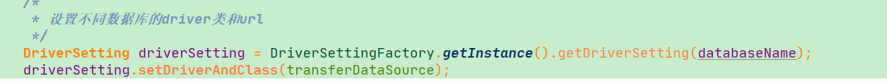
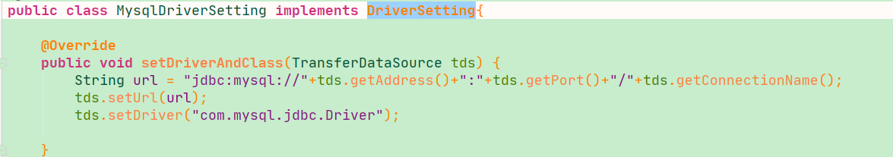
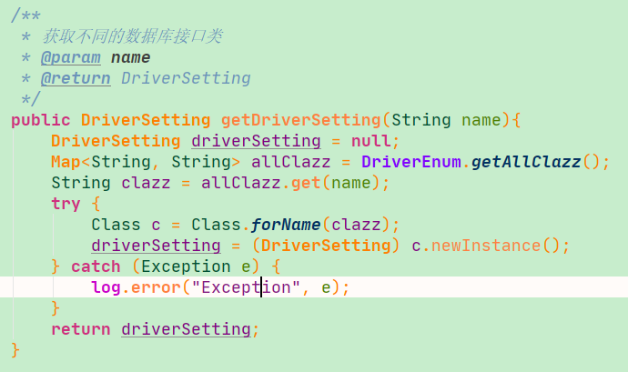
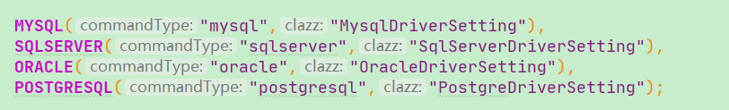

#### 场景

有这样一个业务情况 : 数据源信息配置。数据源是数据库的类型，如mysql ,oracle, sqlserver等，如果我要从根据名称判断可能会有很多if else 

<!--more-->

```java
if(a){	
    //dosomething
}else if(b){	
    //doshomething
}else if(c){	
    //doshomething
} else{	
    ////doshomething
}
```

刚开始条件较少，也就没管那么多直接写的；现在功能多了导致每次新增一个 `else` 条件我都得仔细核对，生怕影响之前的逻辑。

这次终于忍无可忍就把他重构了，重构之后这里的结构如下：



而之前所有的实现逻辑都单独抽取到其他实现类中。




这样每当我需要新增一个 `else` 逻辑，只需要新增一个类实现同一个接口便可完成。每个处理逻辑都互相独立互不干扰。

#### 实现

整体思路如下：

- 定义 `DriverSetting` 接口，其中有一个 `setDriverAndClass` 函数交给具体的业务实现。

- 根据自己的业务，会有多个类实现 `DriverSetting` 接口；这些实现类都会注册到 `Spring Bean` 容器中供之后使用。

- 通过客户端请求，从 Class 中获取一个 `DriverSetting` 实例。

- 执行最终的 `setDriverAndClass` 函数。

  



想实现的目的就是不再有多个判断条件，只需要根据当前名称动态的获取 `DriverSetting` 实例。

最主要的就是 `DriverSettingFactory` 类，他会根据当前客户端命令动态获取 `DriverSetting` 实例。

这样才能满足只需要两行代码就能替换以前复杂的 `if else`，同时也能灵活扩展。

