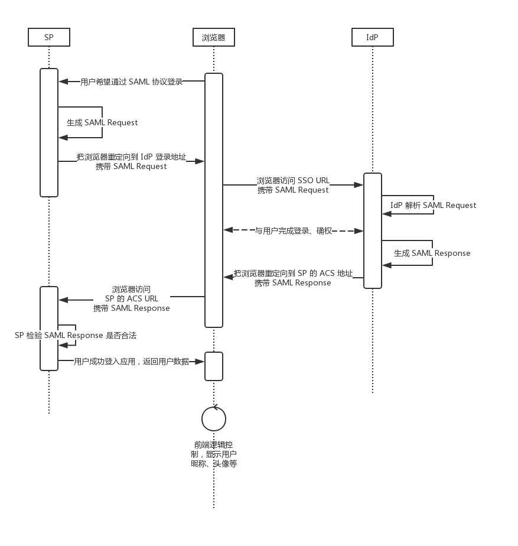
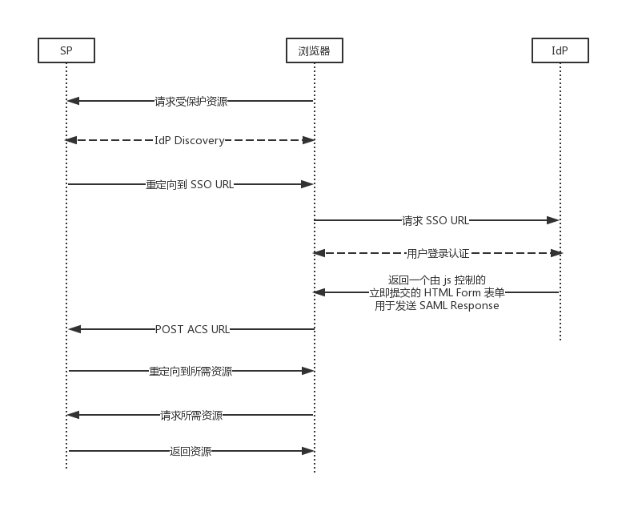
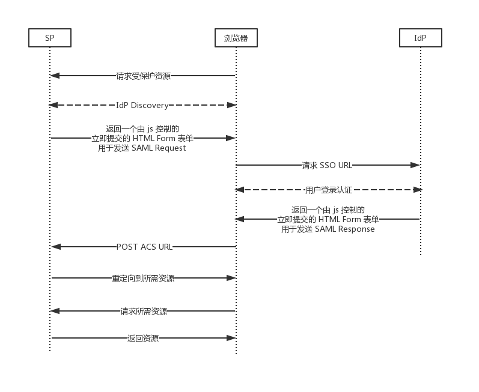
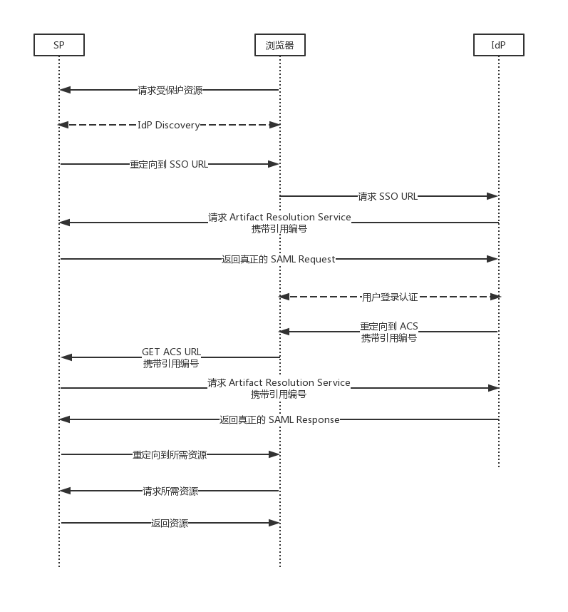

# 理解 SAML 流程

wiki百科:

**安全断言标记语言 2.0** (**SAML 2.0**) 作为 [SAML](https://zh.wikipedia.org/wiki/安全断言标记语言) 的最新标准， 用来在安全域中交换[身份验证](https://zh.wikipedia.org/wiki/认证)（**Authentication**）数据和 [授权](https://zh.wikipedia.org/wiki/授權_(資安))（**Authorization**）数据。SAML 2.0基于[XML](https://zh.wikipedia.org/wiki/XML)协议，使用包含[断言](https://zh.wikipedia.org/wiki/斷言_(程式))（Assertions）的[安全令牌](https://zh.wikipedia.org/wiki/安全令牌)在SAML授权方（即身份提供者，[Identity Provider](https://en.wikipedia.org/wiki/Identity_provider)，缩写为IdP）和SAML消费方（即服务提供者，[Service Provider](https://en.wikipedia.org/wiki/Service_provider)，缩写为SP）之间传递委托人（通常是一个终端用户）的信息。SAML 2.0 可以实现基于网络跨域的[单点登录](https://zh.wikipedia.org/wiki/单点登录)(SSO)， 以便于减少向一个用户分发多个身份验证令牌的管理开销。

本文为读者讲述 SAML 中，SP、IdP、浏览器三个实体之间数据交互的流程。

<!--more-->

## **SAML 协议中涉及到的主体**

使用 SAML 协议进行身份认证时，涉及到以下三个主体

浏览器：SP 和 IdP 借助浏览器互相通信

SP：资源提供方

IdP：身份认证提供方

## **发起 SAML 登录到登录成功的整个过程**

SAML 流程

1. 用户试图登录 SP 提供的应用。
2. SP 生成 SAML Request，通过浏览器重定向，向 IdP 发送 SAML Request。
3. IdP 解析 SAML Request 并将用户重定向到认证页面。
4. 用户在认证页面完成登录。
5. IdP 生成 SAML Response，通过对浏览器重定向，向 SP 的 ACS 地址返回 SAML Response，其中包含 SAML Assertion 用于确定用户身份。
6. SP 对 SAML Response 的内容进行检验。
7. 用户成功登录到 SP 提供的应用。

## **SP 与 IdP 之间通信方式**

SP 与 IdP 之间的通信方式分为 HTTP Redirect Binding、HTTP POST Binding、HTTP Artifact Binding。每种方式在不同的阶段会用不同类型的 HTTP 与对方通信。

### **HTTP Redirect Binding**

SP 通过重定向 GET 请求把 SAML Request 发送到 IdP，IdP 通过立即提交的 Form 表单以 POST 请求的方式将 SAML Response 发到 SP。

### **HTTP POST Binding**

IdP 通过立即提交的 Form 表单以 POST 请求的方式将 SAML Request 发到 SP。IdP 通过立即提交的 Form 表单以 POST 请求的方式将 SAML Response 发到 SP。

### **HTTP Artifact Binding**

SP、IdP 双方只通过浏览器交换 SAML Request、SAML Response 的索引编号，收到编号后，在后端请求对方的 Artifact Resolution Service 接口来获取真正的请求实体内容。从而避免 SAML Request、SAML Response 暴露在前端。

