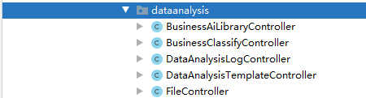

## 行业智库说明

### 功能说明

​		数据分析模板是个人空间下的数据源到数据门户的配置元数据信息。通过数据分析模板导入导出机制，可以实现构建统一的数据分析解决方案。

### 代码文件说明

#### Controller

所有关于数据分析模板和行业智库的controller都在 com.geominfo.bi.controller.dataanalysis包下



```
BusinessAiLibraryController：主要是行业智库的导入过程
BusinessClassifyController：行业智库分类维护信息
DataAnalysisLogController：导入导出日志列表查询
DataAnalysisTemplateController： 数据分析模板导出流程，包含配合前端页面展示所需接口
FileController：图片以及zip文件处理
```

​		导入操作因为用到的主要是t_system_resources表，所以没有再增加额外的service，主要是逻辑上是处理，这里主要说明两个地方 模板保存和导入操作

**模板保存：**

​		说明：接口名称：/dataAnalysis/saveTemp 因为过程中有好几个步骤，直到最后一步才进行提交，所以图片是首先经过base64处理然后提交的时候转成url。

​		主要流程： 增改操作的判断，主要为图片处理上的不同逻辑有稍微不同-->处理数据分析模板流程，从数据门户到数据源用set接收前端的id信息，然后挨个进行独立处理。针对含有文件夹的资源，处理的时候会查询相应的文件夹信息并增加到最终的json数据中，用于数据的构建-->处理完成之后保存数据分析模板。

**行业智库导入：**

​		说明：接口名称：/library/installTemp 

​		主要流程：zip文件和密码校验，不符合条件的则解析失败直接返回，成功的会将内容解析成json数据，流程为：先判断当前工作空间下是否已经包含json中的文件夹数据，不包含先存文件夹到db -->对剩余的初始数据没有的进行新增操作 需要修改的查询到原始结果并保存到allList 内存中-->针对不同类型的数据进行对应的数据处理-->初始化数据集-->将替换的内容更新-->记录日志-->操作成功。