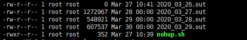

### 切割nohup的日志

编写脚本，每日凌晨将前一天的日志复制到备份文件夹，并按前一天日期进行命名，然后清空原始nohup日志，保持nohup真实的输出日志只记录当天的日志。

<!--more-->

#### 步骤：

**1.创建备份文件夹并授权；**

> mkdir -p /root/authing/log #创建备份文件夹
> chmod -R 777 /root/authing/log #给文件夹授权

**2.创建并编写脚本文件nohup.sh**

```
#!/bin/sh 
#获取前一天的日期 
date=`date -d "yesterday" +%Y_%m_%d`
#复制原始nohup.out到备份目录，并以前一天的日期进行命名 
cp /root/authing/nohup-rest.out  /root/authing/log/$date.out
#清空原始nohup-rest.out中的内容
cat /dev/null > /root/authing/nohup-rest.out
```

**3.凌晨时候定时执行：**

crontab -e

0 0 * * * /root/authing/log/nohup.sh

#### 效果展示

