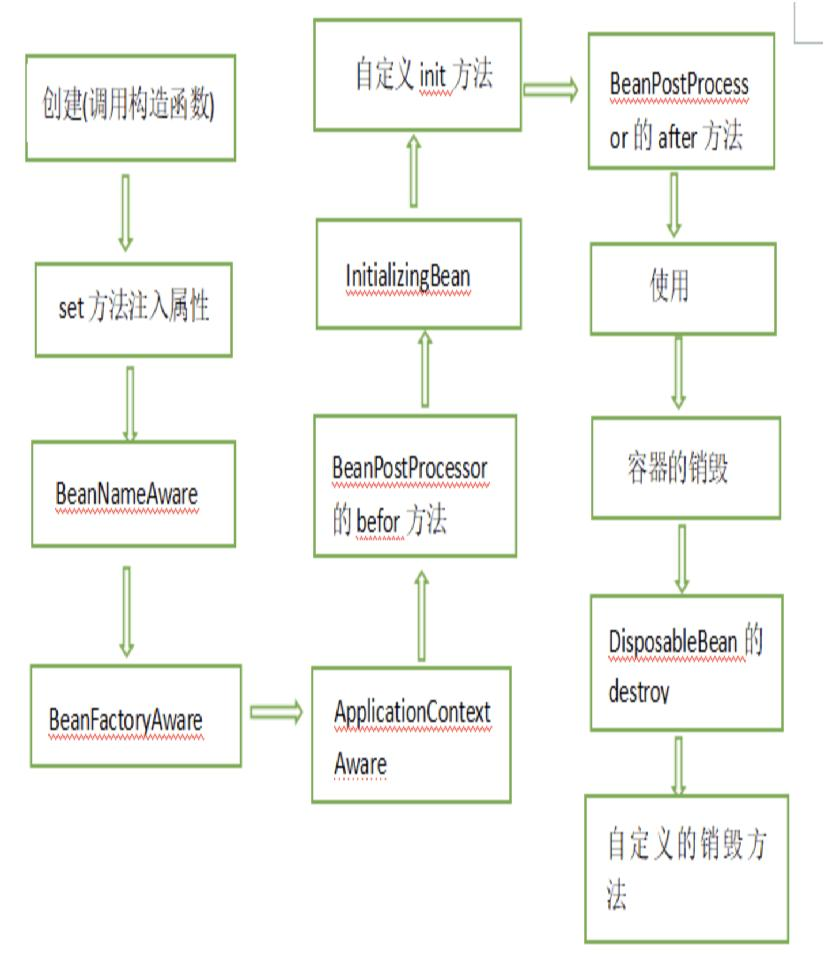

<!--more-->

#### spring bean的生命周期

1. spring调用bean的构造函数(或工厂模式方法)实例化bean

2. spring对bean进行依赖注入将成员变量赋值(set方式)
3. 如果bean实现了BeanNameAware接口，spring将bean的id传给setBeanName()方法；
4. 如果bean实现了BeanFactoryAware接口，spring将调用setBeanFactory方法，将BeanFactory实例传进来；
5. 如果bean实现了ApplicationContextAware接口，它的setApplicationContext()方法将被调用，将应用上下文的引用传入到bean中；
6. 如果bean实现了BeanPostProcessor接口，它的postProcessBeforeInitialization方法将被调用；
7. 如果bean实现了InitializingBean接口，spring将调用它的afterPropertiesSet接口方法，类似的如果bean使用了init-method属性声明了初始化方法，该方法也会被调用；
8. 如果bean实现了BeanPostProcessor接口，它的postProcessAfterInitialization接口方法将被调用；
9. 此时bean已经准备就绪，可以被应用程序使用了，他们将一直驻留在应用上下文中，直到该应用上下文被销毁；
10. 若bean实现了DisposableBean接口，spring将调用它的distroy()接口方法。同样的，如果bean使用了destroy-method属性声明了销毁方法，则该方法被调用；

##### Spring 中常见的创建对象的注解有哪些？

- @Component
- @Controller
- @Service
- @Repository

##### 什么是依赖注入？什么是控制反转(IOC)？ 在 Spring 中，有几种依赖注入方式？

依赖注入是在编译阶段尚未知所需的功能是来自哪个的类的情况下，将其他对象所依赖的功能对象实例化的模式。

即本类引入其他类 （但是不用new  将已有（bean /属性）的注入给你 ）如：将Student 依赖进 User (用User 创建一个student对象就可以了，student相当于User 类的一个成员属性)

控制反转 是将new 实例的过程交给spring ，即将对实例的控制权交给spring

作为被注入对象，要想让IoC容器为其提供服务，并将所需要的被依赖对象送过来，也需要通过某种方式通知对方。在IoC模式中，被注入对象通过构造方法注入和setter方法，接口注入方式注入

##### AOP是什么

AOP 面向切面编程，所谓"切面"，简单说就是那些与业务无关，却为业务模块所共同调用的逻辑或责任封装起来，便于减少系统的重复代码，降低模块之间的耦合度，并有利于未来的可操作性和可维护性。利用AOP可以对业务逻辑的各个部分隔离，从而使的业务逻辑各部分的耦合性降低，提高程序的可重用性，踢开开发效率，主要功能：日志记录，性能统计，安全控制，事务处理，异常处理等。

AOP实现原理是java动态代理，但是jdk的动态代理必须实现接口，所以spring的aop是用cglib这个库实现的，cglis使用里asm这个直接操纵字节码的框架，所以可以做到不使用接口的情况下实现动态代理。

##### 在Spring框架xml配置中共有5种自动装配：

（1）no：默认的方式是不进行自动装配的，通过手工设置ref属性来进行装配bean。

（2）byName：通过bean的名称进行自动装配，如果一个bean的 property 与另一bean 的name 相同，就进行自动装配。 

（3）byType：通过参数的数据类型进行自动装配。

（4）constructor：利用构造函数进行装配，并且构造函数的参数通过byType进行装配。

（5）autodetect：自动探测，如果有构造方法，通过 construct的方式自动装配，否则使用 byType的方式自动装配。

Spring的自动装配：

在spring中，对象无需自己查找或创建与其关联的其他对象，由容器负责把需要相互协作的对象引用赋予各个对象，使用autowire来配置自动装载模式。

##### 什么是Spring MVC ？简单介绍下你对springMVC的理解?

Spring MVC是一个基于Java的实现了MVC设计模式的请求驱动类型的轻量级Web框架，通过把Model，View，Controller分离，将web层进行职责解耦，把复杂的web应用分成逻辑清晰的几部分，简化开发，减少出错，方便组内开发人员之间的配合。

SpringMVC的流程？

（1）用户发送请求至前端控制器DispatcherServlet；
（2） DispatcherServlet收到请求后，调用HandlerMapping处理器映射器，请求获取Handle；
（3）处理器映射器根据请求url找到具体的处理器，生成处理器对象及处理器拦截器(如果有则生成)一并返回给DispatcherServlet；
（4）DispatcherServlet 调用 HandlerAdapter处理器适配器；
（5）HandlerAdapter 经过适配调用 具体处理器(Handler，也叫后端控制器)；
（6）Handler执行完成返回ModelAndView；
（7）HandlerAdapter将Handler执行结果ModelAndView返回给DispatcherServlet；
（8）DispatcherServlet将ModelAndView传给ViewResolver视图解析器进行解析；
（9）ViewResolver解析后返回具体View；
（10）DispatcherServlet对View进行渲染视图（即将模型数据填充至视图中）
（11）DispatcherServlet响应用户。

##### springMVC和struts2的区别有哪些?

（1）springmvc的入口是一个servlet即前端控制器（DispatchServlet），而struts2入口是一个filter过虑器（StrutsPrepareAndExecuteFilter）。

（2）springmvc是基于方法开发(一个url对应一个方法)，请求参数传递到方法的形参，可以设计为单例或多例(建议单例)，struts2是基于类开发，传递参数是通过类的属性，只能设计为多例。

（3）Struts采用值栈存储请求和响应的数据，通过OGNL存取数据，springmvc通过参数解析器是将request请求内容解析，并给方法形参赋值，将数据和视图封装成ModelAndView对象，最后又将ModelAndView中的模型数据通过reques域传输到页面。Jsp视图解析器默认使用jstl。

##### SpringMvc怎么和AJAX相互调用的？

通过Jackson框架就可以把Java里面的对象直接转化成Js可以识别的Json对象。具体步骤如下 ：

（1）加入Jackson.jar

（2）在配置文件中配置json的映射

（3）在接受Ajax方法里面可以直接返回Object,List等,但方法前面要加上@ResponseBody注解。

##### 解决post请求乱码问题：

在web.xml中配置一个CharacterEncodingFilter过滤器，设置成utf-8；

##### SpringMVC常用的注解有哪些？

@RequestMapping：用于处理请求 url 映射的注解，可用于类或方法上。用于类上，则表示类中的所有响应请求的方法都是以该地址作为父路径。

@RequestBody：注解实现接收http请求的json数据，将json转换为java对象。

@ResponseBody：注解实现将conreoller方法返回对象转化为json对象响应给客户。